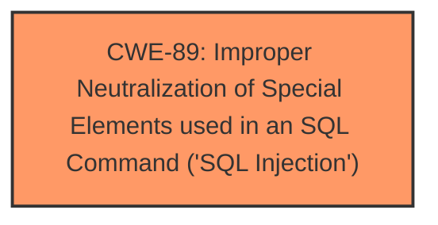

# Enhanced Analysis for CVE-2025-4505

# Summary
| CWE ID | CWE Name | Confidence | CWE Abstraction Level | CWE Vulnerability Mapping Label | CWE-Vulnerability Mapping Notes |
|---|---|---|---|---|---|
| CWE-89 | Improper Neutralization of Special Elements used in an SQL Command ('SQL Injection') | 1.0 | Base | Allowed | Primary CWE |

## Evidence and Confidence

*   **Confidence Score:** 1.0
*   **Evidence Strength:** HIGH

## Relationship Analysis
The primary relationship observed is that CWE-89 is a base-level CWE, making it suitable for direct mapping. There are no child or parent relationships that significantly influence the decision, as the description directly points to SQL Injection. While other CWEs are related in terms of potential causes or impacts, CWE-89 directly addresses the **weakness** described.



## Vulnerability Chain
The vulnerability chain is straightforward:
1.  The root cause is **improper neutralization** of special elements used in an SQL command.
2.  This leads directly to the impact of **SQL Injection**.

## Summary of Analysis
The vulnerability description explicitly mentions "**sql injection**" due to the manipulation of the `categoryname` argument in `/category.php`. The evidence is strong, directly pointing to **SQL Injection**, and the retriever results strongly support CWE-89 as the primary mapping. The description aligns perfectly with the definition of CWE-89, where externally influenced input is used to construct an SQL command without proper neutralization of special elements.

The selection of CWE-89 is at the optimal level of specificity because it directly identifies the **root cause** of the vulnerability. Other CWEs, while potentially related, do not capture the specific **weakness** as accurately as CWE-89.

Relevant CWE Information:

# Enhanced Context (25 CWEs)
The following CWEs were identified as potentially relevant to this vulnerability:

## CWE-89: Improper Neutralization of Special Elements used in an SQL Command ('SQL Injection')
**Abstraction Level**: Base
**Similarity Score**: 0.77
**Source**: dense

**Description**:
The product constructs all or part of an SQL command using externally-influenced input from an upstream component, but it does not neutralize or incorrectly neutralizes special elements that could modify the intended SQL command when it is sent to a downstream component. Without sufficient removal or quoting of SQL syntax in user-controllable inputs, the generated SQL query can cause those inputs to be interpreted as SQL instead of ordinary user data.

**Mapping Guidance**:
- Usage: Allowed
- Rationale: This CWE entry is at the Base level of abstraction, which is a preferred level of abstraction for mapping to the root causes of vulnerabilities.

## CWE-79: Improper Neutralization of Input During Web Page Generation ('Cross-site Scripting')
This was considered because it is a common web vulnerability, but it does not fit the description as the vulnerability is specifically related to **SQL Injection**, not cross-site scripting.

## CWE-434: Unrestricted Upload of File with Dangerous Type
This CWE was not selected as it relates to file uploads, which are not mentioned in the vulnerability description.

## CWE-1336: Improper Neutralization of Special Elements Used in a Template Engine
This CWE was not selected because the vulnerability description does not indicate the use of a template engine.

## CWE-117: Improper Output Neutralization for Logs
This CWE was not selected because the vulnerability description does not indicate any issues related to logging.


## CWE Relationship Analysis

Current CWEs represent these abstraction levels: .


### Vulnerability Chain Analysis

**Chain starting from CWE-89:**
- 89 (Improper Neutralization of Special Elements used in an SQL Command ('SQL Injection')) - ROOT


**Chain starting from CWE-79:**
- 79 (Improper Neutralization of Input During Web Page Generation ('Cross-site Scripting')) - ROOT


### CWE Relationship Diagram

```mermaid
graph TD
    classDef primary fill:#f96,stroke:#333,stroke-width:2px
    classDef secondary fill:#69f,stroke:#333
    classDef tertiary fill:#9e9,stroke:#333
```