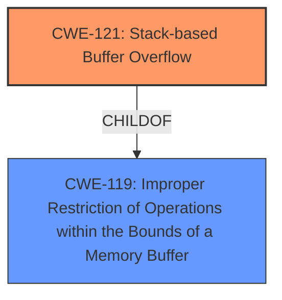

# Analysis for CVE-2025-4544

# Summary
| CWE ID | CWE Name | Confidence | CWE Abstraction Level | CWE Vulnerability Mapping Label | CWE-Vulnerability Mapping Notes |
|---|---|---|---|---|---|
| CWE-121 | Stack-based Buffer Overflow | 1.0 | Variant |  Primary CWE | Allowed |
| CWE-119 | Improper Restriction of Operations within the Bounds of a Memory Buffer | 0.5 | Class | Secondary Candidate | Discouraged |

## Evidence and Confidence

*   **Confidence Score:** 1.0
*   **Evidence Strength:** HIGH

## Relationship Analysis
The primary CWE selected is CWE-121, which is a Variant of CWE-119. CWE-119 is a more general class describing improper memory buffer operation restrictions, while CWE-121 specifically identifies a stack-based buffer overflow. Since the vulnerability description explicitly mentions "stack-based buffer overflow", CWE-121 is the more specific and appropriate choice.

## Vulnerability Chain
The vulnerability chain begins with the **stack-based buffer overflow** (**CWE-121**). The overflow occurs due to the **improper handling of input** when processing the `/ddos.asp` file, leading to potential code execution or denial of service.

## Summary of Analysis
The vulnerability description clearly states a **stack-based buffer overflow** exists when manipulating specific arguments within the `/ddos.asp` file of the D-Link DI-8100 router's jhttpd component. The evidence is strong, and CWE-121 directly addresses this vulnerability type. While CWE-119 is a parent class, CWE-121 provides a more specific and accurate representation of the weakness. The retriever results also listed CWE-121, but with a lower score. However, the description itself clearly identifies the vulnerability as a **stack-based buffer overflow**, so CWE-121 is the most appropriate choice.

Relevant CWE Information:

# Enhanced Context (25 CWEs)
The following CWEs were identified as potentially relevant to this vulnerability:

## CWE-121: Stack-based Buffer Overflow
**Abstraction Level**: Variant
**Similarity Score**: 0.74
**Source**: dense

**Description**:
A stack-based buffer overflow condition is a condition where the buffer being overwritten is allocated on the stack (i.e., is a local variable or, rarely, a parameter to a function).

**Mapping Guidance**:
- Usage: Allowed
- Rationale: This CWE entry is at the Variant level of abstraction, which is a preferred level of abstraction for mapping to the root causes of vulnerabilities.

## CWE-119: Improper Restriction of Operations within the Bounds of a Memory Buffer
**Abstraction Level**: Class
**Similarity Score**: 0.72
**Source**: dense

**Description**:
The product performs operations on a memory buffer, but it reads from or writes to a memory location outside the buffer's intended boundary. This may result in read or write operations on unexpected memory locations that could be linked to other variables, data structures, or internal program data.

**Mapping Guidance**:
- Usage: Discouraged
- Rationale: CWE-119 is commonly misused in low-information vulnerability reports when lower-level CWEs could be used instead, or when more details about the vulnerability are available.

### CWE Analysis and Selection:

*   **CWE-121: Stack-based Buffer Overflow**
    *   **Match:** The vulnerability description explicitly mentions a "**stack-based buffer overflow**". This aligns perfectly with the CWE's description.
    *   **Abstraction:** Variant - This is a desirable level of specificity.
    *   **Usage:** Allowed - The mapping guidance permits its use.
    *   **Decision:** Selected as the primary CWE.
*   **CWE-119: Improper Restriction of Operations within the Bounds of a Memory Buffer**
    *   **Match:** This is a broader class of buffer errors, and a **stack-based buffer overflow** falls under this category.
    *   **Abstraction:** Class - Less specific than CWE-121.
    *   **Usage:** Discouraged - The guidance suggests using lower-level CWEs when possible.
    *   **Decision:** Considered as a secondary candidate because it is a parent of CWE-121 but is not as precise.
*   **CWE-190: Integer Overflow or Wraparound**: This CWE was not selected because the vulnerability description does not indicate any integer overflow or wraparound issues.
*   **CWE-89: Improper Neutralization of Special Elements used in an SQL Command ('SQL Injection')**: This CWE was not selected because the vulnerability description does not indicate any SQL injection issues.
*   **CWE-704: Incorrect Type Conversion or Cast**: This CWE was not selected because the vulnerability description does not indicate any type conversion or casting issues.
*   **CWE-79: Improper Neutralization of Input During Web Page Generation ('Cross-site Scripting')**: This CWE was not selected because the vulnerability description does not indicate any cross-site scripting issues.
*   **CWE-125: Out-of-bounds Read**: This CWE was not selected because the vulnerability description indicates a buffer overflow (write), not a read.
*   **CWE-78: Improper Neutralization of Special Elements used in an OS Command ('OS Command Injection')**: This CWE was not selected because the vulnerability description does not indicate any OS Command Injection issues.
*   **CWE-128: Wrap-around Error**: This CWE was not selected because the vulnerability description does not indicate any wrap-around errors.