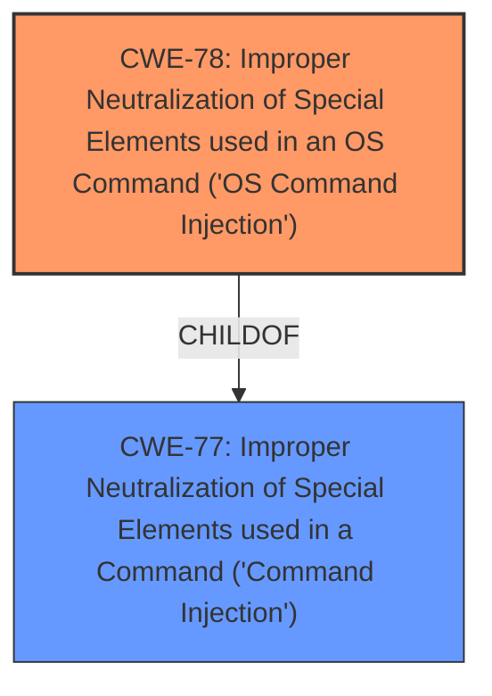

# Enhanced Analysis for CVE-2025-45490

# Summary
| CWE ID | CWE Name | Confidence | CWE Abstraction Level | CWE Vulnerability Mapping Label | CWE-Vulnerability Mapping Notes |
|---|---|---|---|---|---|
| CWE-78 | Improper Neutralization of Special Elements used in an OS Command ('OS Command Injection') | 1.0 | Base | Primary | Allowed |
| CWE-77 | Improper Neutralization of Special Elements used in a Command ('Command Injection') | 0.7 | Class | Secondary | Allowed-with-Review |

## Evidence and Confidence

*   **Confidence Score:** 1.0
*   **Evidence Strength:** HIGH

## Relationship Analysis
The primary CWE is CWE-78, which is a specific type of command injection that targets the operating system. CWE-77 is a more general class of command injection, which makes it a parent of CWE-78. The vulnerability description explicitly mentions a **command injection** vulnerability, and the reference to the DynDNS function suggests interaction with the OS.



## Vulnerability Chain
The vulnerability chain starts with the **improper neutralization** of special elements within the password parameter of the DynDNS function, leading to OS command injection. The chain is:
1.  **Improper Neutralization**: User-supplied input to the `password` parameter is not sanitized.
2.  **Command Injection (CWE-78)**: **Unsanitized input** is used to construct an OS command.
3.  **Execution**: The malicious OS command is executed, leading to potential compromise of the system.

## Summary of Analysis
The initial assessment identified a **command injection** vulnerability in the Linksys E5600 router. The description states that a **command injection** vulnerability exists in the runtime.ddnsStatus DynDNS function via the password parameter.

The Retriever Results listed CWE-77 and CWE-78 as the top candidates. While CWE-77 is a broader category, CWE-78 specifically refers to OS command injection. Since the vulnerability description indicates that the DynDNS function is likely interacting with the operating system, CWE-78 is a more precise classification. The evidence supports the selection of CWE-78 as the primary CWE because it aligns directly with the vulnerability description and the likely interaction with the OS via the DynDNS function. CWE-77 is considered as a secondary CWE because it is the general case of command injection, and CWE-78 is a specific type of CWE-77.

The selection of CWE-78 is at the optimal level of specificity as it is a Base level CWE and accurately reflects the nature of the vulnerability.

Relevant CWE Information:

# Enhanced Context (25 CWEs)
The following CWEs were identified as potentially relevant to this vulnerability:

## CWE-78: Improper Neutralization of Special Elements used in an OS Command ('OS Command Injection')
**Abstraction Level**: Base
**Similarity Score**: 0.71
**Source**: dense

**Description**:
The product constructs all or part of an OS command using externally-influenced input from an upstream component, but it does not neutralize or incorrectly neutralizes special elements that could modify the intended OS command when it is sent to a downstream component.

**Mapping Guidance**:
- Usage: Allowed
- Rationale: This CWE entry is at the Base level of abstraction, which is a preferred level of abstraction for mapping to the root causes of vulnerabilities.

**Relationships**:
- CANFOLLOW -> CWE-184
- CANALSOBE -> CWE-88
- CHILDOF -> CWE-77
- CHILDOF -> CWE-77
- CHILDOF -> CWE-74

### Explanation of Selected CWEs:

*   **CWE-78: Improper Neutralization of Special Elements used in an OS Command ('OS Command Injection')**
    *   **Technical Explanation:** The vulnerability description explicitly mentions a **command injection** vulnerability in the DynDNS function, indicating that an attacker can inject OS commands via the password parameter. The product fails to neutralize special elements in the input, allowing the attacker to modify the intended OS command.
    *   **Security Implications:** This allows an attacker to execute arbitrary commands on the system, potentially leading to complete system compromise.
    *   **Relationship Explanation:** CWE-78 is a child of CWE-77 (Improper Neutralization of Special Elements used in a Command ('Command Injection')), making CWE-77 a more general case.
    *   **Mapping Guidance Influence:** The MITRE mapping guidance allows the usage of CWE-78, as it is at the Base level of abstraction.
    *   **Confidence:** 1.0

### Explanation of Omitted CWEs:

*   **CWE-77: Improper Neutralization of Special Elements used in a Command ('Command Injection')**
    *   While CWE-77 is a valid candidate due to the presence of **command injection**, it's a more general case. CWE-78 is a more specific and accurate representation of the vulnerability, as it explicitly involves OS commands. Therefore, CWE-78 is preferred.
*   **CWE-790: Improper Filtering of Special Elements**
    *   CWE-790 is a Class-level CWE, and the description is too general. The vulnerability description specifies command injection, making CWE-78 a better fit.
*   **CWE-96: Improper Neutralization of Directives in Statically Saved Code ('Static Code Injection')**
    *   This CWE doesn't fit because the vulnerability is related to runtime command injection, not static code injection.
*   **CWE-89: Improper Neutralization of Special Elements used in an SQL Command ('SQL Injection')**
    *   This CWE is not relevant because the vulnerability is about command injection, not SQL injection.
*   **CWE-116: Improper Encoding or Escaping of Output**
    *   This CWE is not relevant because the vulnerability focuses on the lack of neutralization of input, not the encoding/escaping of output.
*   **CWE-74: Improper Neutralization of Special Elements in Output Used by a Downstream Component ('Injection')**
    *   This CWE is too general. The vulnerability involves command injection, and CWE-78 is a more specific match.
*   **CWE-88: Improper Neutralization of Argument Delimiters in a Command ('Argument Injection')**
    *   While argument injection could be a factor, the primary issue is the broader command injection vulnerability.
*   **CWE-259: Use of Hard-coded Password**
    *   This CWE is not relevant as the vulnerability is not about the use of hard-coded passwords.
*   **CWE-184: Incomplete List of Disallowed Inputs**
    *   This CWE is too general. The vulnerability description focuses on command injection, which is more specific.


## CWE Relationship Analysis

Current CWEs represent these abstraction levels: .


### Vulnerability Chain Analysis

**Chain starting from CWE-89:**
- 89 (Improper Neutralization of Special Elements used in an SQL Command ('SQL Injection')) - ROOT


**Chain starting from CWE-116:**
- 116 (Improper Encoding or Escaping of Output) - ROOT


### CWE Relationship Diagram

```mermaid
graph TD
    classDef primary fill:#f96,stroke:#333,stroke-width:2px
    classDef secondary fill:#69f,stroke:#333
    classDef tertiary fill:#9e9,stroke:#333
```