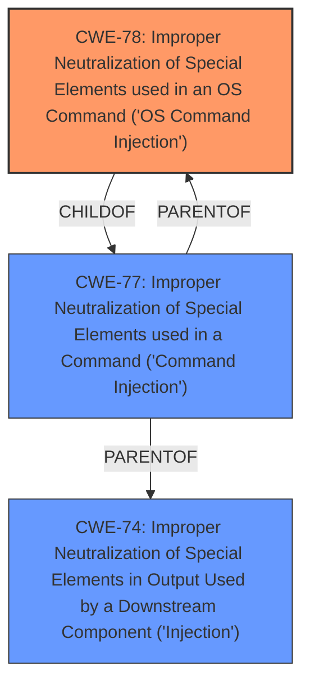

# Analysis for CVE-2025-45491

# Summary
| CWE ID | CWE Name | Confidence | CWE Abstraction Level | CWE Vulnerability Mapping Label | CWE-Vulnerability Mapping Notes |
|---|---|---|---|---|---|
| CWE-78 | Improper Neutralization of Special Elements used in an OS Command ('OS Command Injection') | 1.0 | Base | Primary | Allowed |

## Evidence and Confidence

*   **Confidence Score:** 1.0
*   **Evidence Strength:** HIGH

## Relationship Analysis
The primary relationship that influenced the selection was the ChildOf relationship between CWE-78 and CWE-77. While CWE-77 was the top hit, CWE-78 is more specific, dealing explicitly with OS commands. The vulnerability description explicitly states "**command injection**" in the runtime.ddnsStatus DynDNS function, and the retriever results also listed CWE-78.

## Vulnerability Chain
The vulnerability chain starts with the **improper neutralization** of special elements within the username parameter of the runtime.ddnsStatus DynDNS function, leading directly to OS **command injection**.

## Summary of Analysis
The initial assessment, influenced by the retriever results and the explicit mention of "**command injection**" in the vulnerability description, led to the selection of CWE-78. The description provided the following evidence: "Linksys E5600 v1.1.0.26 was discovered to contain a **command injection** vulnerability in the runtime.ddnsStatus DynDNS function via the username parameter." This statement aligns perfectly with the definition of CWE-78, which involves constructing an OS command using externally-influenced input without proper neutralization.

CWE-77 was considered but deemed less specific. Although CWE-77 is a parent of CWE-78, the evidence clearly points to the vulnerability being an OS command injection. The selection of CWE-78 is at the optimal level of specificity because it accurately reflects the nature of the vulnerability based on the provided evidence.