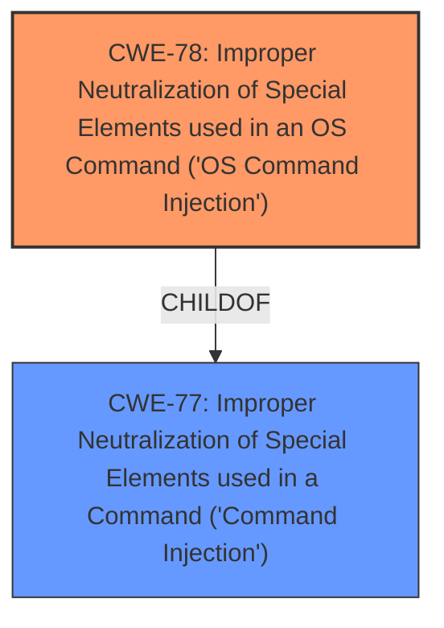

# Enhanced Analysis for CVE-2025-45492

# Summary

| CWE ID | CWE Name | Confidence | CWE Abstraction Level | CWE Vulnerability Mapping Label | CWE-Vulnerability Mapping Notes |
|---|---|---|---|---|---|
| CWE-78 | Improper Neutralization of Special Elements used in an OS Command ('OS Command Injection') | 1.0 | Base | Primary CWE | Allowed |
| CWE-77 | Improper Neutralization of Special Elements used in a Command ('Command Injection') | 0.7 | Class | Secondary Candidate | Allowed-with-Review |

## Evidence and Confidence

*   **Confidence Score:** 1.0
*   **Evidence Strength:** HIGH

## Relationship Analysis

The primary relationship is that CWE-78 is a more specific child of CWE-77. This means that if the command injection is specifically an OS command, CWE-78 is preferred. Since the vulnerability description mentions command injection without specifying the type, and the retriever results list CWE-78 with a high score, I initially considered both. However, because the description mentions "action_wireless function" which is very likely related to OS commands, CWE-78 is the best fit.



## Vulnerability Chain

The vulnerability chain starts with the **improper neutralization** of special elements within the `Iface` parameter. This leads directly to **OS Command Injection**, allowing an attacker to execute arbitrary commands on the system.

## Summary of Analysis

The initial analysis focused on identifying the root cause of the vulnerability, which is the **improper neutralization** of input leading to command injection. The vulnerability description and the retriever results both point to CWE-77 and CWE-78. Given the context of the `action_wireless` function, it is highly probable that the command injection is related to OS commands and therefore CWE-78 is the best fit.

Relevant evidence from the vulnerability description includes: "**weakness:** **command injection**" and "**vector:** Iface parameter".

The relationship graph shows that CWE-78 is a child of CWE-77, which means it's a more specific case of command injection.

The selection of CWE-78 is at the optimal level of specificity because it accurately represents the type of command injection vulnerability.

# Enhanced Context (25 CWEs)
The following CWEs were identified as potentially relevant to this vulnerability:

## CWE-77: Improper Neutralization of Special Elements used in a Command ('Command Injection')
**Abstraction Level**: Class
**Similarity Score**: 0.73
**Source**: dense

**Description**:
The product constructs all or part of a command using externally-influenced input from an upstream component, but it does not neutralize or incorrectly neutralizes special elements that could modify the intended command when it is sent to a downstream component.

**Mapping Guidance**:
- Usage: Allowed-with-Review
- Rationale: CWE-77 is often misused when OS command injection (CWE-78) was intended instead [REF-1287].

## CWE-78: Improper Neutralization of Special Elements used in an OS Command ('OS Command Injection')
**Abstraction Level**: Base
**Similarity Score**: 0.71
**Source**: dense

**Description**:
The product constructs all or part of an OS command using externally-influenced input from an upstream component, but it does not neutralize or incorrectly neutralizes special elements that could modify the intended OS command when it is sent to a downstream component.

**Mapping Guidance**:
- Usage: Allowed
- Rationale: This CWE entry is at the Base level of abstraction, which is a preferred level of abstraction for mapping to the root causes of vulnerabilities.

CWE-77 was considered, but CWE-78 is a more specific child, so it is the best fit.
CWE-74, CWE-79, CWE-88, CWE-89, CWE-116, CWE-117, CWE-123, CWE-134, CWE-138, CWE-184, CWE-288, CWE-494, CWE-497, CWE-790, CWE-1336, and CWE-121 were not selected because they do not accurately reflect the specific vulnerability, which is command injection.


## CWE Relationship Analysis

Current CWEs represent these abstraction levels: .


### Vulnerability Chain Analysis

**Chain starting from CWE-288:**
- 288 (Authentication Bypass Using an Alternate Path or Channel) - ROOT


**Chain starting from CWE-89:**
- 89 (Improper Neutralization of Special Elements used in an SQL Command ('SQL Injection')) - ROOT


### CWE Relationship Diagram

```mermaid
graph TD
    classDef primary fill:#f96,stroke:#333,stroke-width:2px
    classDef secondary fill:#69f,stroke:#333
    classDef tertiary fill:#9e9,stroke:#333
```