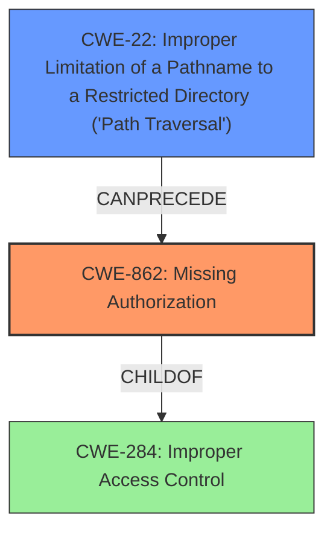

# Analysis Report for CVE-2025-45618

# Vulnerability Analysis Report: CVE-2025-45618

## Description

**Incorrect access control** in the component /admin/sys/datasource/ajaxList of jeeweb-mybatis-springboot v0.0.1.RELEASE allows attackers to access sensitive information via a crafted payload.

## Vulnerability Description Key Phrases

- **Rootcause:** Incorrect access control
- **Impact:** access sensitive information
- **Vector:** crafted payload
- **Attacker:** attackers
- **Product:** jeeweb-mybatis-springboot
- **Version:** v0.0.1.RELEASE
- **Component:** /admin/sys/datasource/ajaxList

## Analysis (with Relationship Data)

# Summary
| CWE ID  | CWE Name                                                                     | Confidence | CWE Abstraction Level | CWE Vulnerability Mapping Label | CWE-Vulnerability Mapping Notes |
| :-------- | :--------------------------------------------------------------------------- | :--------- | :---------------------- | :------------------------------ | :-------------------------------- |
| CWE-862   | Missing Authorization                                                        | 0.9        | Base                    | Primary                         | Allowed                           |
| CWE-22    | Improper Limitation of a Pathname to a Restricted Directory ('Path Traversal') | 0.7        | Base                    | Secondary                       | Allowed                           |

## Evidence and Confidence

*   **Confidence Score:** 0.8
*   **Evidence Strength:** HIGH

## Relationship Analysis
The primary weakness is **CWE-862 Missing Authorization**, which describes the root cause where the application fails to properly authorize access to resources. The secondary weakness is **CWE-22 Improper Limitation of a Pathname to a Restricted Directory ('Path Traversal')**, which is used because the attack vector involves path traversal to bypass authentication. These two CWEs are related in that the path traversal enables the missing authorization, allowing unauthorized access to sensitive information.



## Vulnerability Chain
The vulnerability chain starts with **CWE-22 Improper Limitation of a Pathname to a Restricted Directory ('Path Traversal')**, which allows an attacker to bypass authentication checks. This leads to **CWE-862 Missing Authorization**, where the application fails to properly authorize the request after the authentication bypass. The final impact is unauthorized access to sensitive information.

## Summary of Analysis
The primary CWE is **CWE-862 Missing Authorization** because the root cause of the vulnerability is that the application does not properly check whether the user is authorized to access the resource after the authentication is bypassed due to path traversal (**CWE-22 Improper Limitation of a Pathname to a Restricted Directory ('Path Traversal')**). The "**Incorrect access control**" mentioned in the vulnerability description aligns with **CWE-862**. The vulnerability description and CVE reference summary provide sufficient evidence to support this classification. The guidance clearly distinguishes between authentication and authorization, and since the issue occurs after a bypass of authentication, **CWE-862** is the more appropriate choice.

**CWE-284 Improper Access Control** was considered, but it is a more general CWE, and since we can pinpoint the problem to a missing authorization check after authentication bypass, **CWE-862** is more specific and appropriate.

**CWE-306 Missing Authentication for Critical Function** was considered, but this CWE is more suited when there is no authentication required at all, rather than when an authentication bypass occurs.

**CWE-863 Incorrect Authorization** was considered, but the checks are not performed at all, making **CWE-862** a better fit.

The evidence for **CWE-862** is: "**Incorrect access control** in the component /admin/sys/datasource/ajaxList of jeeweb-mybatis-springboot v0.0.1.RELEASE allows attackers to access sensitive information via a crafted payload."

The evidence for **CWE-22** is: "The vulnerability stems from insufficient input validation and improper handling of path traversal in the `/admin/sys/datasource/ajaxList` API endpoint. Specifically, appending `;/../` to the endpoint allows bypassing authentication."

Relevant CWE Information:

# Enhanced Context (25 CWEs)
The following CWEs were identified as potentially relevant to this vulnerability:

## CWE-41: Improper Resolution of Path Equivalence
**Abstraction Level**: Base
**Similarity Score**: 0.77
**Source**: dense

**Description**:
The product is vulnerable to file system contents disclosure through path equivalence. Path equivalence involves the use of special characters in file and directory names. The associated manipulations are intended to generate multiple names for the same object.

**Mapping Guidance**:
- Usage: Allowed
- Rationale: This CWE entry is at the Base level of abstraction, which is a preferred level of abstraction for mapping to the root causes of vulnerabilities.


## CWE-425: Direct Request ('Forced Browsing')
**Abstraction Level**: Base
**Similarity Score**: 0.77
**Source**: dense

**Description**:
The web application does not adequately enforce appropriate authorization on all restricted URLs, scripts, or files.

**Mapping Guidance**:
- Usage: Allowed
- Rationale: This CWE entry is at the Base level of abstraction, which is a preferred level of abstraction for mapping to the root causes of vulnerabilities.


## CWE-668: Exposure of Resource to Wrong Sphere
**Abstraction Level**: Class
**Similarity Score**: 0.77
**Source**: dense

**Description**:
The product exposes a resource to the wrong control sphere, providing unintended actors with inappropriate access to the resource.

**Mapping Guidance**:
- Usage: Discouraged
- Rationale: CWE-668 is high-level and is often misused as a catch-all when lower-level CWE IDs might be applicable. It is sometimes used for low-information vulnerability reports [REF-1287]. It is a level-1 Class (i.e., a child of a Pillar). It is not useful for trend analysis.


## CWE-639: Authorization Bypass Through User-Controlled Key
**Abstraction Level**: Base
**Similarity Score**: 0.77
**Source**: dense

**Description**:
The system's authorization functionality does not prevent one user from gaining access to another user's data or record by modifying the key value identifying the data.

**Mapping Guidance**:
- Usage: Allowed
- Rationale: This CWE entry is at the Base level of abstraction, which is a preferred level of abstraction for mapping to the root causes of vulnerabilities.


## CWE-74: Improper Neutralization of Special Elements in Output Used by a Downstream Component ('Injection')
**Abstraction Level**: Class
**Similarity Score**: 0.77
**Source**: dense

**Description**:
The product constructs all or part of a command, data structure, or record using externally-influenced input from an upstream component, but it does not neutralize or incorrectly neutralizes special elements that could modify how it is parsed or interpreted when it is sent to a downstream component.

**Mapping Guidance**:
- Usage: Discouraged
- Rationale: CWE-74 is high-level and often misused when lower-level weaknesses are more appropriate.


## CWE-923: Improper Restriction of Communication Channel to Intended Endpoints
**Abstraction Level**: Class
**Similarity Score**: 0.76
**Source**: dense

**Description**:
The product establishes a communication channel to (or from) an endpoint for privileged or protected operations, but it does not properly ensure that it is communicating with the correct endpoint.

**Mapping Guidance**:
- Usage: Allowed-with-Review
- Rationale: This CWE entry is a Class and might have Base-level children that would be more appropriate


## CWE-497: Exposure of Sensitive System Information to an Unauthorized Control Sphere
**Abstraction Level**: Base
**Similarity Score**: 0.76
**Source**: dense

**Description**:
The product does not properly prevent sensitive system-level information from being accessed by unauthorized actors who do not have the same level of access to the underlying system as the product does.

**Mapping Guidance**:
- Usage: Allowed
- Rationale: This CWE entry is at the Base level of abstraction, which is a preferred level of abstraction for mapping to the root causes of vulnerabilities.


## CWE-472: External Control of Assumed-Immutable Web Parameter
**Abstraction Level**: Base
**Similarity Score**: 0.76
**Source**: dense

**Description**:
The web application does not sufficiently verify inputs that are assumed to be immutable but are actually externally controllable, such as hidden form fields.

**Mapping Guidance**:
- Usage: Allowed
- Rationale: This CWE entry is at the Base level of abstraction, which is a preferred level of abstraction for mapping to the root causes of vulnerabilities.


## CWE-807: Reliance on Untrusted Inputs in a Security Decision
**Abstraction Level**: Base
**Similarity Score**: 0.76
**Source**: dense

**Description**:
The product uses a protection mechanism that relies on the existence or values of an input, but the input can be modified by an untrusted actor in a way that bypasses the protection mechanism.

**Mapping Guidance**:
- Usage: Allowed
- Rationale: This CWE entry is at the Base level of abstraction, which is a preferred level of abstraction for mapping to the root causes of vulnerabilities.


## CWE-23: Relative Path


## CWE Relationship Analysis

Current CWEs represent these abstraction levels: .


### Vulnerability Chain Analysis

**Chain starting from CWE-863:**
- 863 (Incorrect Authorization) - ROOT


**Chain starting from CWE-862:**
- 862 (Missing Authorization) - ROOT


### CWE Relationship Diagram

```mermaid
graph TD
    classDef primary fill:#f96,stroke:#333,stroke-width:2px
    classDef secondary fill:#69f,stroke:#333
    classDef tertiary fill:#9e9,stroke:#333
```


*Report generated on 2025-07-15 00:53:32*
