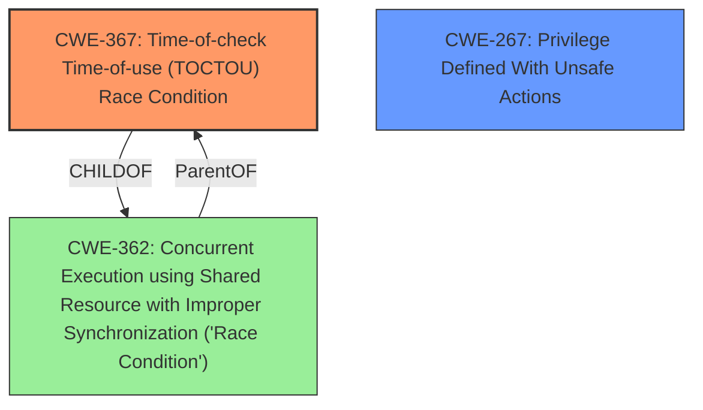

# Analysis for CVE-2025-4598

# Summary
| CWE ID | CWE Name | Confidence | CWE Abstraction Level | CWE Vulnerability Mapping Label | CWE-Vulnerability Mapping Notes |
|---|---|---|---|---|---|
| CWE-367 | Time-of-check Time-of-use (TOCTOU) Race Condition | 0.9 | Base | Primary | Allowed |
| CWE-267 | Privilege Defined With Unsafe Actions | 0.5 | Base | Secondary | Allowed |

## Evidence and Confidence

*   **Confidence Score:** 0.7
*   **Evidence Strength:** MEDIUM

## Relationship Analysis
The primary CWE is CWE-367, which is a Base level CWE that describes a TOCTOU race condition. The vulnerability description explicitly mentions a **race condition** where the state of a resource changes between the check and use, which aligns with CWE-367. The secondary CWE is CWE-267, which relates to privileges being used to perform unsafe actions. In this case, the SUID privilege allows the vulnerable process to access restricted data.

## Vulnerability Chain
The vulnerability chain starts with a **race condition** (CWE-367) in systemd-coredump. This race occurs when an attacker can replace a crashed SUID process with a non-SUID process before systemd-coredump analyzes the /proc/pid/auxv file. If the attacker wins the race, they gain unauthorized access to the original SUID process's coredump file, leading to the exposure of sensitive data (e.g., /etc/shadow content). The vulnerability exploits a **privilege** (CWE-267) associated with SUID processes to access restricted data.

## Summary of Analysis
The primary assessment is based on the evidence that a **race condition** is present in the systemd-coredump utility. The vulnerability description and the CVE reference summary clearly state that a **race condition** allows a local attacker to crash a SUID program and gain read access to the resulting core dump. The Qualys Security Advisory provides detailed analysis and specifically mentions the **lack of protection against the "kill-and-replace" attack**.

The initial analysis considered CWE-362, as it is a Class-level CWE for general race conditions. However, CWE-367 is more specific, as it describes a time-of-check time-of-use race condition, which aligns more closely with the vulnerability description. Additionally, CWE-367 is a Base level CWE, which is preferred over Class level CWEs.

The graph relationships influenced the final selection by showing the parent-child relationship between CWE-362 and CWE-367. While CWE-362 is a broader category, CWE-367 provides a more precise characterization of the race condition.

The selected CWEs are at the optimal level of specificity because CWE-367 directly addresses the TOCTOU **race condition**, and CWE-267 highlights the role of privileges in enabling the vulnerability.

Relevant CWE Information:

**CWE-367: Time-of-check Time-of-use (TOCTOU) Race Condition**

The product checks the state of a resource before using that resource, but the resource's state can change between the check and the use in a way that invalidates the results of the check. This can cause the product to perform invalid actions when the resource is in an unexpected state.

**CWE-267: Privilege Defined With Unsafe Actions**

A particular privilege, role, capability, or right can be used to perform unsafe actions that were not intended, even when it is assigned to the correct entity.