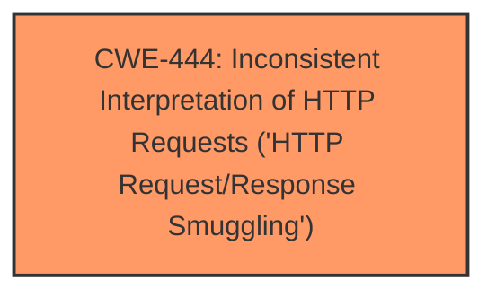

# Analysis for CVE-2025-4600

# Summary
| CWE ID | CWE Name | Confidence | CWE Abstraction Level | CWE Vulnerability Mapping Label | CWE-Vulnerability Mapping Notes |
|---|---|---|---|---|---|
| CWE-444 | Inconsistent Interpretation of HTTP Requests ('HTTP Request/Response Smuggling') | 0.9 | Base | Allowed | Primary CWE. Matches the vulnerability description of **request smuggling** due to **improper handling of chunked-encoded HTTP requests**. |

## Evidence and Confidence

*   **Confidence Score:** 0.9
*   **Evidence Strength:** HIGH

## Relationship Analysis
The primary CWE is CWE-444, which is a Base level CWE. No child CWEs were considered because the description is a direct match.

## Vulnerability Chain
The vulnerability chain starts with **improper handling of chunked-encoded HTTP requests** (CWE-444), leading to **request smuggling**. The ultimate impact is that attackers can craft requests that are misinterpreted by backend servers.

## Summary of Analysis
The vulnerability description clearly states a **request smuggling** vulnerability due to **improper handling of chunked-encoded HTTP requests**. This aligns directly with CWE-444, "Inconsistent Interpretation of HTTP Requests ('HTTP Request/Response Smuggling')".

The description says: "A **request smuggling** vulnerability existed in the Google Cloud Classic Application Load Balancer due to **improper handling of chunked-encoded HTTP requests**."

The Retriever Results also lists CWE-444 as the top candidate.

CWE-444 is at the Base level of abstraction, which is a preferred level.

CWE-20 "Improper Input Validation" was considered but rejected. The description is more specific than just general input validation issues.

Relevant CWE Information:

# Enhanced Context (25 CWEs)
The following CWEs were identified as potentially relevant to this vulnerability:

## CWE-444: Inconsistent Interpretation of HTTP Requests ('HTTP Request/Response Smuggling')
**Abstraction Level**: Base
**Similarity Score**: 0.77
**Source**: dense

**Description**:
The product acts as an intermediary HTTP agent
         (such as a proxy or firewall) in the data flow between two
         entities such as a client and server, but it does not
         interpret malformed HTTP requests or responses in ways that
         are consistent with how the messages will be processed by
         those entities that are at the ultimate destination.

**Mapping Guidance**:
- Usage: Allowed
- Rationale: This CWE entry is at the Base level of abstraction, which is a preferred level of abstraction for mapping to the root causes of vulnerabilities.