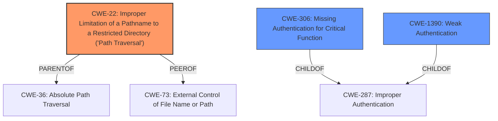

# Analysis Report for CVE-2025-4603

# Vulnerability Analysis Report: CVE-2025-4603

## Description

The eMagicOne Store Manager for WooCommerce plugin for WordPress is vulnerable to arbitrary file deletion due to **insufficient file path validation** in the delete_file() function in all versions up to, and including, 1.2.5. This makes it possible for unauthenticated attackers to delete arbitrary files on the server, which can easily lead to remote code execution when the right file is deleted (such as wp-config.php). This is only exploitable by unauthenticated attackers in **default configurations** where the the **default password** is left as 11, or where the attacker gains access to the credentials.

## Vulnerability Description Key Phrases

- **Rootcause:** ['insufficient file path validation', 'default configurations', 'default password']
- **Impact:** ["['arbitrary file deletion'", "'remote code execution']"]
- **Attacker:** unauthenticated attackers
- **Product:** eMagicOne Store Manager for WooCommerce plugin for WordPress
- **Version:** up to and including 1.2.5
- **Component:** delete_file() function

## Analysis (with Relationship Data)

# Summary
| CWE ID | CWE Name | Confidence | CWE Abstraction Level | CWE Vulnerability Mapping Label | CWE-Vulnerability Mapping Notes |
|---|---|---|---|---|---|
| CWE-22 | Improper Limitation of a Pathname to a Restricted Directory ('Path Traversal') | 0.9 | Base | Allowed | Primary CWE |
| CWE-306 | Missing Authentication for Critical Function | 0.7 | Base | Allowed | Secondary Candidate |
| CWE-1390 | Weak Authentication | 0.7 | Class | Allowed-with-Review | Secondary Candidate |

## Evidence and Confidence

*   **Confidence Score:** 0.8
*   **Evidence Strength:** HIGH

## Relationship Analysis
The primary CWE is CWE-22, which is a base-level CWE describing path traversal. It has parent relationships to higher level classes such as CWE-36 and peer relationships with CWE-73 (External Control of File Name or Path). CWE-306 and CWE-1390 are considered as they relate to the authentication aspects of the vulnerability, with the unauthenticated attacker being able to exploit the path traversal.



## Vulnerability Chain
The vulnerability chain starts with **insufficient file path validation** (CWE-22), potentially combined with **missing authentication** (CWE-306) or **weak authentication** (CWE-1390) due to **default configurations** or **default password**, leading to **arbitrary file deletion** and potentially **remote code execution**.
  - The primary root cause is the **insufficient file path validation** (CWE-22)
  - The secondary issues are **missing authentication** or **weak authentication** as an unauthenticated attacker can trigger the **arbitrary file deletion**.
  - The impact is **arbitrary file deletion** leading to **remote code execution**.

## Summary of Analysis
The primary weakness is the **insufficient file path validation** in the `delete_file()` function, which allows unauthenticated attackers to delete arbitrary files. This maps directly to CWE-22 (Improper Limitation of a Pathname to a Restricted Directory). Because the vulnerability is triggered by unauthenticated users, the **missing authentication** aspect is important but secondary. The vulnerability is also exploitable by unauthenticated attackers if they gain access to the credentials due to default password.

The initial analysis considered CWE-306 (Missing Authentication for Critical Function) and CWE-1390 (Weak Authentication) because the vulnerability is exploitable by unauthenticated attackers. However, the root cause is the **insufficient file path validation** (CWE-22). The **missing authentication** only allows the attacker to reach the vulnerable code.

The evidence is clear from the vulnerability description: "The eMagicOne Store Manager for WooCommerce plugin for WordPress is vulnerable to arbitrary file deletion due to **insufficient file path validation** in the delete_file() function... This makes it possible for unauthenticated attackers to delete arbitrary files on the server..."

The selected CWEs are at the optimal level of specificity. CWE-22 is a Base level CWE that accurately describes the **insufficient file path validation**. CWE-306 and CWE-1390 are added as secondary issues as they highlight the lack of authentication that exacerbates the path traversal vulnerability.


## CWE Relationship Analysis

Current CWEs represent these abstraction levels: .


### Vulnerability Chain Analysis

**Chain starting from CWE-1390:**
- 1390 (Weak Authentication) - ROOT


**Chain starting from CWE-22:**
- 22 (Improper Limitation of a Pathname to a Restricted Directory ('Path Traversal')) - ROOT


### CWE Relationship Diagram

```mermaid
graph TD
    classDef primary fill:#f96,stroke:#333,stroke-width:2px
    classDef secondary fill:#69f,stroke:#333
    classDef tertiary fill:#9e9,stroke:#333
```


*Report generated on 2025-07-15 00:55:39*
