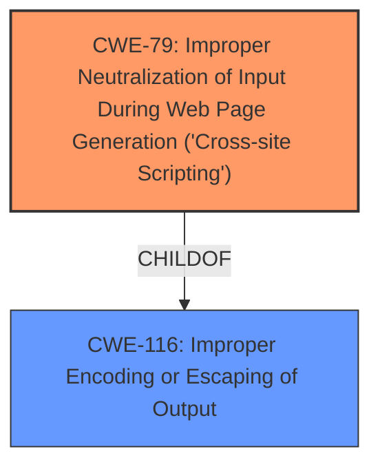

# Raw Analyzer Response for CVE-2025-46340

# Summary
| CWE ID | CWE Name | Confidence | CWE Abstraction Level | CWE Vulnerability Mapping Label | CWE-Vulnerability Mapping Notes |
|---|---|---|---|---|---|
| CWE-79 | Improper Neutralization of Input During Web Page Generation ('Cross-site Scripting') | 1.0 | Base | Allowed | Primary CWE. The application fails to neutralize user-controllable input before placing it in a web page. |
| CWE-116 | Improper Encoding or Escaping of Output | 0.7 | Class | Allowed-with-Review | Secondary candidate. The application fails to properly encode or escape output, leading to potential injection issues. |

## Evidence and Confidence

*   **Confidence Score:** 0.9
*   **Evidence Strength:** HIGH

## Relationship Analysis
The primary CWE is CWE-79, which is a Base level CWE, and it is related to CWE-116. CWE-79 focuses on improper neutralization of input, while CWE-116 is a more general class describing improper encoding or escaping of output. The relationship is that improper encoding or escaping of output (CWE-116) can lead to cross-site scripting (CWE-79) if the output is used in a web page.

## Vulnerability Chain
The vulnerability chain starts with an **oversight in the validation** of URLs, leading to the possibility of injecting arbitrary CSS. The chain can be described as: **Improper Input Validation** -> **Improper Output Neutralization** -> **Cross-site Scripting**. Specifically, the `UrlPreviewService` doesn't properly validate URLs, which allows an attacker to inject CSS. Then `MkUrlPreview` doesn't escape CSS when applying a `background-image`, resulting in arbitrary styles being applied to the preview element. The root cause is the **oversight in validation**.

## Summary of Analysis
Based on the vulnerability description and the provided information, the primary weakness is CWE-79, Improper Neutralization of Input During Web Page Generation ('Cross-site Scripting'). The application fails to neutralize user-controllable input (the URL) before placing it in a web page, allowing for the injection of arbitrary CSS. This is supported by the statement that `MkUrlPreview` doesn't escape CSS when applying a `background-image` property.

CWE-116, Improper Encoding or Escaping of Output, is considered as a secondary candidate because the **failure to escape CSS** can be seen as a form of improper encoding or escaping of output. However, CWE-79 is a more specific fit because it directly addresses the cross-site scripting vulnerability.

The choice of CWE-79 is at the optimal level of specificity because it directly describes the weakness, the **lack of neutralization of input**, that leads to the XSS vulnerability.

Other CWEs Considered:

*   CWE-20: Improper Input Validation - While there is an input validation issue, the more specific CWE-79 is more relevant.
*   CWE-93: Improper Neutralization of CRLF Sequences ('CRLF Injection') - This is not relevant as the vulnerability is about CSS injection, not CRLF injection.
*   CWE-113: Improper Neutralization of CRLF Sequences in HTTP Headers ('HTTP Request/Response Splitting') - Similar to CWE-93, this is not relevant to the vulnerability.
*   CWE-451: User Interface (UI) Misrepresentation of Critical Information - This could be a consequence of the vulnerability, as the attacker can create a fake error message. However, the root cause is the lack of input neutralization, making CWE-79 a better fit.
*   CWE-74: Improper Neutralization of Special Elements in Output Used by a Downstream Component ('Injection') - While this is a general injection weakness, CWE-79 is a more specific fit for XSS.