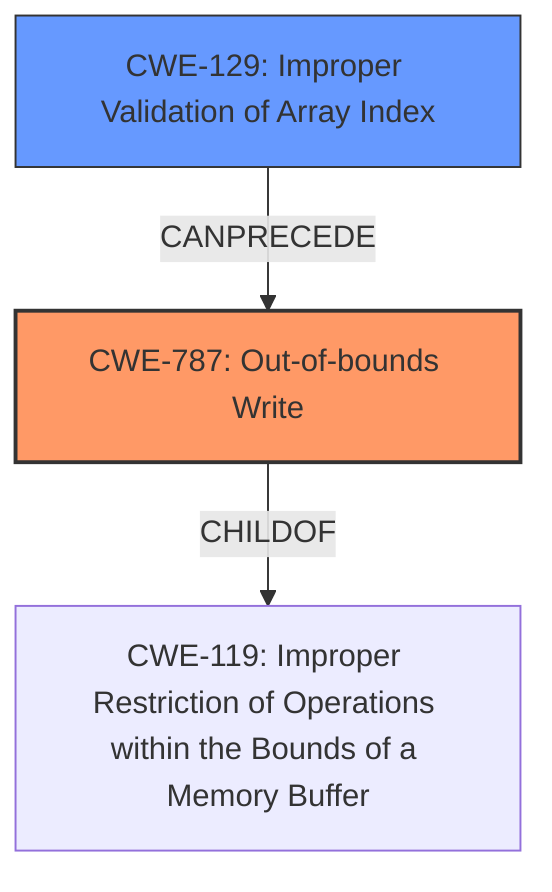

# Analysis Report for CVE-2025-46399

# Vulnerability Analysis Report: CVE-2025-46399

## Description

A flaw was found in fig2dev. This vulnerability allows availability via local input manipulation via genge_itp_spline function.

## Vulnerability Description Key Phrases

- **Impact:** availability
- **Vector:** local input manipulation
- **Product:** fig2dev
- **Component:** genge_itp_spline function

## Analysis (with Relationship Data)

# Summary
| CWE ID | CWE Name | Confidence | CWE Abstraction Level | CWE Vulnerability Mapping Label | CWE-Vulnerability Mapping Notes |
|---|---|---|---|---|---|
| CWE-787 | Out-of-bounds Write | 0.8 | Base | Allowed | Primary CWE. Root cause of the vulnerability is likely an out-of-bounds write due to improper handling or validation of input, leading to a buffer overflow in the `genge_itp_spline` function and causing a segmentation fault. |
| CWE-129 | Improper Validation of Array Index | 0.6 | Variant | Allowed | Secondary candidate. The issue in `genge_itp_spline` function might be related to **improper validation of array index**, which can lead to out-of-bounds write. |

## Evidence and Confidence

*   **Confidence Score:** 0.7
*   **Evidence Strength:** MEDIUM

## Relationship Analysis
The primary CWE is CWE-787, which is a base-level CWE. CWE-787 is a child of CWE-119 (Improper Restriction of Operations within the Bounds of a Memory Buffer).
CWE-129 (Improper Validation of Array Index) is a variant and is related to out-of-bounds access. It can precede CWE-787 if an invalid array index leads to an out-of-bounds write.



## Vulnerability Chain
The vulnerability chain starts with local input manipulation that leads to **improper handling of the input** within the `genge_itp_spline` function. This **improper handling** results in an **out-of-bounds write**, ultimately causing a segmentation fault and denial of service.

## Summary of Analysis
The analysis indicates that the vulnerability in `fig2dev` is caused by a flaw in the `genge_itp_spline` function, which allows local input manipulation to trigger a segmentation fault, leading to a denial-of-service (DoS).

The primary cause appears to be related to how the function handles input, resulting in memory corruption.

Given the information, CWE-787 (Out-of-bounds Write) is the most appropriate primary CWE because the root cause of the vulnerability is an out-of-bounds write caused by **improper** input handling.

CWE-129 (Improper Validation of Array Index) is considered as a secondary candidate because the input manipulation might lead to an **improper validation of the array index**.

Other considered CWEs and why they were not selected:

*   CWE-125 (Out-of-bounds Read): While an out-of-bounds read could be present, the primary impact and root cause described points towards an out-of-bounds write leading to a segmentation fault, rather than just reading sensitive information.
*   CWE-79 (Improper Neutralization of Input During Web Page Generation ('Cross-site Scripting')): Not applicable as the vulnerability doesn't involve web page generation or cross-site scripting.
*   CWE-93 (Improper Neutralization of CRLF Sequences ('CRLF Injection')): Not relevant as the vulnerability is not related to CRLF injection.
*   CWE-252 (Unchecked Return Value): There is no mention of unchecked return values.
*   CWE-113 (Improper Neutralization of CRLF Sequences in HTTP Headers ('HTTP Request/Response Splitting')): Not relevant as the vulnerability is not related to HTTP header manipulation.
*   CWE-824 (Access of Uninitialized Pointer): There is no mention of access of uninitialized pointers.

The selection of CWE-787 and CWE-129 is based on the evidence provided, particularly the segmentation fault and local input manipulation. The relationship graph shows that CWE-129 can precede CWE-787, further solidifying the selection.
The selected CWEs are at the optimal level of specificity because they accurately represent the weakness based on the provided evidence.


## CWE Relationship Analysis

Current CWEs represent these abstraction levels: .


### Vulnerability Chain Analysis

**Chain starting from CWE-93:**
- 93 (Improper Neutralization of CRLF Sequences ('CRLF Injection')) - ROOT


**Chain starting from CWE-125:**
- 125 (Out-of-bounds Read) - ROOT


### CWE Relationship Diagram

```mermaid
graph TD
    classDef primary fill:#f96,stroke:#333,stroke-width:2px
    classDef secondary fill:#69f,stroke:#333
    classDef tertiary fill:#9e9,stroke:#333
```


*Report generated on 2025-07-15 01:11:35*
