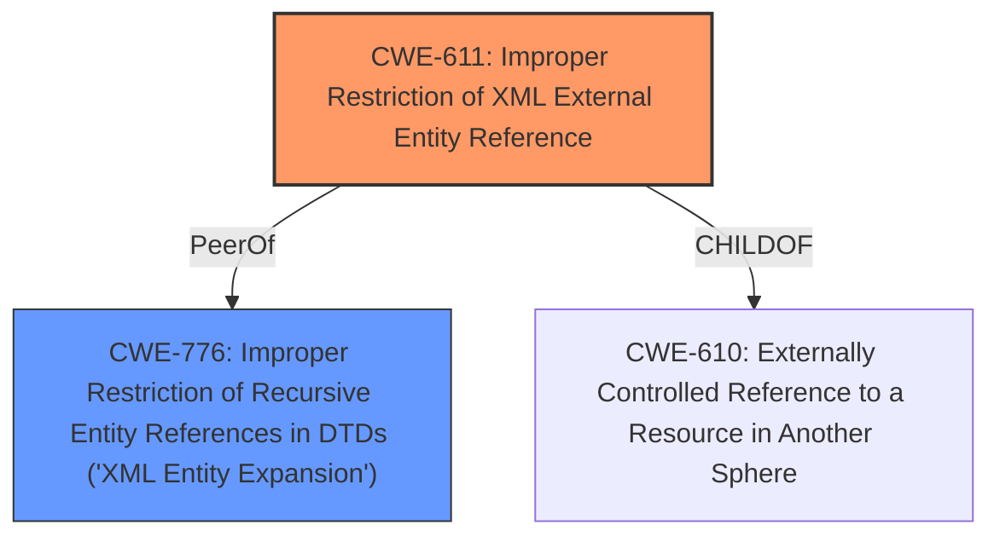

# Enhanced Analysis for CVE-2025-4641

# Summary

| CWE ID  | CWE Name                                                                             | Confidence | CWE Abstraction Level | CWE Vulnerability Mapping Label | CWE-Vulnerability Mapping Notes |
| :-------- | :----------------------------------------------------------------------------------- | :--------- | :---------------------- | :------------------------------ | :-------------------------------- |
| CWE-611 | Improper Restriction of XML External Entity Reference                               | 1.0        | Base                    | Primary                         | Allowed                          |
| CWE-776 | Improper Restriction of Recursive Entity References in DTDs ('XML Entity Expansion') | 0.7        | Base                    | Secondary                       | Allowed                          |

## Evidence and Confidence

*   **Confidence Score:** 0.9
*   **Evidence Strength:** HIGH

## Relationship Analysis

The primary relationship that impacts the decision is that CWE-776 is a related weakness to CWE-611, as both involve improper handling of XML entities. CWE-611 is more specific to external entities, while CWE-776 focuses on recursive entities within DTDs. Given that the vulnerability description mentions "XML External Entity Reference", CWE-611 is the more direct and appropriate choice. The relationship suggests that both weaknesses could potentially be present, but the description emphasizes the external entity aspect, making CWE-611 the primary concern.



## Vulnerability Chain

The vulnerability chain starts with the **improper restriction of XML external entity references** (CWE-611). This leads to the potential for an attacker to inject malicious XML that can access local files or perform SSRF attacks, resulting in data serialization external entities blowup.

## Summary of Analysis

The initial analysis strongly points to CWE-611 as the primary weakness. The vulnerability description explicitly mentions "**Improper Restriction of XML External Entity Reference**", and the CVE Reference Links Content Summary confirms that the root cause is an XXE vulnerability due to the `loadXML()` function not being properly configured to prevent the processing of external entities. The fix mentioned involves setting the `FEATURE_SECURE_PROCESSING` flag, which directly relates to mitigating XXE attacks.

While CWE-776 (Improper Restriction of Recursive Entity References in DTDs) is also a possibility, the emphasis on "external" entities makes CWE-611 the more accurate and specific choice. CWE-776 could be a secondary concern, but the primary focus is on the external entity aspect.

The retriever results also support this, with CWE-611 having the highest score.

The evidence from the vulnerability description and the CVE reference links content summary is sufficient to confidently classify this vulnerability as CWE-611.

Relevant CWE Information:

# Enhanced Context (25 CWEs)

The following CWEs were identified as potentially relevant to this vulnerability:

## CWE-611: Improper Restriction of XML External Entity Reference
**Abstraction Level**: Base
**Similarity Score**: 0.80
**Source**: dense

**Description**:
The product processes an XML document that can contain XML entities with URIs that resolve to documents outside of the intended sphere of control, causing the product to embed incorrect documents into its output.

**Mapping Guidance**:
- Usage: Allowed
- Rationale: This CWE entry is at the Base level of abstraction, which is a preferred level of abstraction for mapping to the root causes of vulnerabilities.

## CWE-776: Improper Restriction of Recursive Entity References in DTDs ('XML Entity Expansion')
**Abstraction Level**: Base
**Similarity Score**: 0.73
**Source**: dense

**Description**:
The product uses XML documents and allows their structure to be defined with a Document Type Definition (DTD), but it does not properly control the number of recursive definitions of entities.

**Mapping Guidance**:
- Usage: Allowed
- Rationale: This CWE entry is at the Base level of abstraction, which is a preferred level of abstraction for mapping to the root causes of vulnerabilities.

## CWE-611: Improper Restriction of XML External Entity Reference
**Abstraction Level**: Base
**Similarity Score**: 973.91
**Source**: sparse

**Description**:
The product processes an XML document that can contain XML entities with URIs that resolve to documents outside of the intended sphere of control, causing the product to embed incorrect documents into its output.

**Mapping Guidance**:
- Usage: Allowed
- Rationale: This CWE entry is at the Base level of abstraction, which is a preferred level of abstraction for mapping to the root causes of vulnerabilities.

## CWE-776: Improper Restriction of Recursive Entity References in DTDs ('XML Entity Expansion')
**Abstraction Level**: Base
**Similarity Score**: 910.31
**Source**: sparse

**Description**:
The product uses XML documents and allows their structure to be defined with a Document Type Definition (DTD), but it does not properly control the number of recursive definitions of entities.

**Mapping Guidance**:
- Usage: Allowed
- Rationale: This CWE entry is at the Base level of abstraction, which is a preferred level of abstraction for mapping to the root causes of vulnerabilities.

CWE-125, CWE-123, CWE-134, CWE-415, CWE-416, CWE-502, CWE-643, CWE-825, CWE-822, CWE-823, CWE-824, CWE-364, CWE-674, CWE-138, CWE-610, CWE-668, CWE-497, CWE-212, CWE-79, CWE-425, and CWE-120 were considered, but they do not accurately represent the vulnerability described. They address different types of weaknesses, such as out-of-bounds reads, format string vulnerabilities, double frees, deserialization issues, XPath injection, and buffer overflows, which are not the primary issues in this case.


## CWE Relationship Analysis

Current CWEs represent these abstraction levels: .


### Vulnerability Chain Analysis

**Chain starting from CWE-611:**
- 611 (Improper Restriction of XML External Entity Reference) - ROOT


**Chain starting from CWE-416:**
- 416 (Use After Free) - ROOT


### CWE Relationship Diagram

```mermaid
graph TD
    classDef primary fill:#f96,stroke:#333,stroke-width:2px
    classDef secondary fill:#69f,stroke:#333
    classDef tertiary fill:#9e9,stroke:#333
```