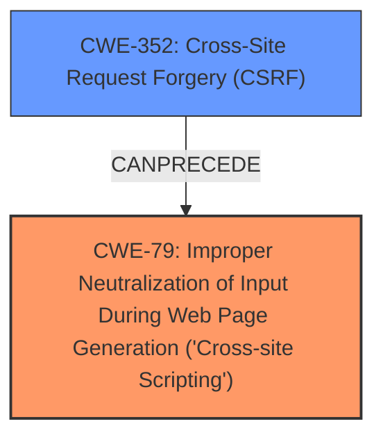

# Analysis for CVE-2025-46435

# Summary
| CWE ID | CWE Name | Confidence | CWE Abstraction Level | CWE Vulnerability Mapping Label | CWE-Vulnerability Mapping Notes |
|---|---|---|---|---|---|
| CWE-79 | Improper Neutralization of Input During Web Page Generation ('Cross-site Scripting') | 1.0 | Base | Allowed | Primary CWE. The application does not neutralize user-controllable input before placing it in a web page served to other users, leading to XSS. |
| CWE-352 | Cross-Site Request Forgery (CSRF) | 0.9 | Compound | Allowed | Secondary CWE. The vulnerability is exploitable because of a CSRF **weakness** that allows a malicious actor to force higher privileged users to execute unwanted actions. |

## Evidence and Confidence

*   **Confidence Score:** 0.95
*   **Evidence Strength:** HIGH

## Relationship Analysis
The primary relationship to consider is that CWE-352 [Cross-Site Request Forgery (CSRF)] allows for a malicious actor to force a higher privileged user to execute unwanted actions, which, in this case, leads to Stored XSS (CWE-79 [Improper Neutralization of Input During Web Page Generation ('Cross-site Scripting')]). CWE-79 is at the Base level of abstraction, making it a preferred choice.

## Vulnerability Chain
The vulnerability chain starts with the **weakness** of **Cross-Site Request Forgery (CSRF)** (CWE-352 [Cross-Site Request Forgery (CSRF)]). This allows an attacker to force a privileged user to perform actions that inject malicious scripts. The scripts are then improperly neutralized, leading to **Stored XSS** (CWE-79 [Improper Neutralization of Input During Web Page Generation ('Cross-site Scripting')]).

## Summary of Analysis
The vulnerability description explicitly mentions "Cross-Site Request Forgery (CSRF) vulnerability" and "Stored XSS". The retriever results also list CWE-79 [Improper Neutralization of Input During Web Page Generation ('Cross-site Scripting')] and CWE-352 [Cross-Site Request Forgery (CSRF)] as top candidates. The analysis is strongly based on the provided evidence, especially the **Vulnerability Description Key Phrases** and **CVE Reference Links Content Summary**.

-   *"Cross-Site Request Forgery (CSRF) vulnerability in Yash Binani Time Based Greeting allows Stored XSS."*
-   *"Cross Site Request Forgery (CSRF) - allows a malicious actor to force higher privileged users to execute unwanted actions under their current authentication."*

CWE-79 [Improper Neutralization of Input During Web Page Generation ('Cross-site Scripting')] is chosen because the application does not properly neutralize user-controllable input before it's placed in a web page, leading to the stored XSS.

CWE-352 [Cross-Site Request Forgery (CSRF)] is a secondary contributing factor, as the CSRF **weakness** allows attackers to force users to perform actions that lead to the XSS.

Both CWEs are at appropriate levels of specificity. CWE-79 [Improper Neutralization of Input During Web Page Generation ('Cross-site Scripting')] is a Base CWE, and CWE-352 [Cross-Site Request Forgery (CSRF)] is a Compound CWE that represents a combination of weaknesses.