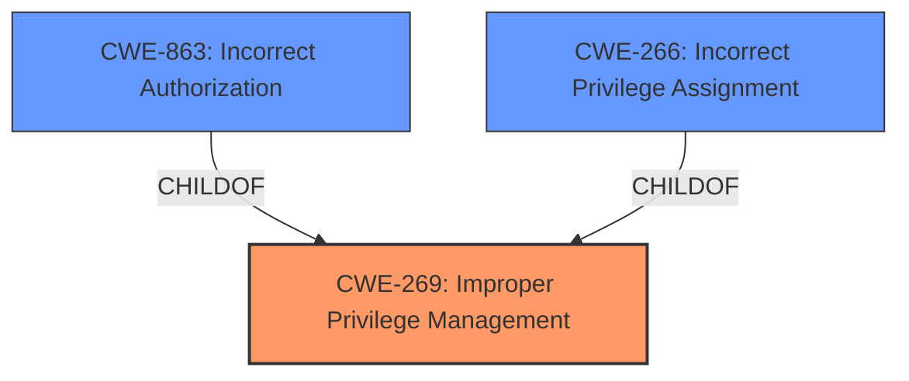

# Analysis Report for CVE-2025-4649

# Vulnerability Analysis Report: CVE-2025-4649

## Description

**Improper Privilege Management** vulnerability in Centreon web allows Privilege Escalation. ACL are not correctly taken into account in the display of the event logs page. This page requiring, high privileges, will display all available logs. This issue affects web from 24.10.3 before 24.10.4, from 24.04.09 before 24.04.10, from 23.10.19 before 23.10.21, from 23.04.24 before 23.04.26.

## Vulnerability Description Key Phrases

- **Rootcause:** Improper Privilege Management
- **Impact:** Privilege Escalation
- **Product:** Centreon web
- **Version:** 24.10.3 before 24.10.4, 24.04.09 before 24.04.10, 23.10.19 before 23.10.21, 23.04.24 before 23.04.26
- **Component:** event logs page

## Analysis (with Relationship Data)

# Summary

| CWE ID  | CWE Name                                                      | Confidence | CWE Abstraction Level | CWE Vulnerability Mapping Label | CWE-Vulnerability Mapping Notes |
| ------- | ------------------------------------------------------------- | ---------- | --------------------- | ----------------------------- | ------------------------------- |
| CWE-269 | Improper Privilege Management                                 | 0.9        | Class                 | Primary                       | Discouraged                    |
| CWE-863 | Incorrect Authorization                                      | 0.7        | Class                 | Secondary                      | Allowed-with-Review           |
| CWE-266 | Incorrect Privilege Assignment                                | 0.6        | Base                  | Secondary                      | Allowed                         |

## Evidence and Confidence

*   **Confidence Score:** 0.8
*   **Evidence Strength:** HIGH

## Relationship Analysis

The primary relationship considered was the hierarchical one, focusing on finding the most specific CWE to represent the **improper privilege management**. While CWE-269 is a Class-level CWE, the evidence supports its selection as the primary weakness. CWE-863 (Incorrect Authorization) and CWE-266 (Incorrect Privilege Assignment) are related but represent more specific aspects of the overall **privilege management** issue.



## Vulnerability Chain

The vulnerability chain starts with **improper privilege management**, which leads to **privilege escalation** and unauthorized access to event logs.

1.  **Root Cause:** **Improper Privilege Management** (CWE-269) - The core issue is that the system doesn't properly manage privileges.
2.  **Weakness:** Incorrect Authorization (CWE-863) - ACLs are not correctly taken into account.
3.  **Impact:** Privilege Escalation - Users with high privileges can view all available logs.

## Summary of Analysis

The initial analysis focused on identifying the root cause of the vulnerability. The provided evidence, especially the "Vulnerability Description Key Phrases" and "CVE Reference Links Content Summary", points to **improper privilege management**. Although CWE-269 is a Class-level CWE and is often misused, the information at hand doesn't point to a more specific Base or Variant CWE. The vulnerability description explicitly mentions **"Improper Privilege Management"** and the CVE summary indicates that "ACLs (Access Control Lists) are not correctly taken into account when displaying the 'event logs' page." This indicates that the core problem is at a higher level of abstraction related to general privilege handling, which makes CWE-269 the most appropriate primary CWE. Further, this is the weakness that led to the incorrect authorization.

The MITRE guidance for Privileges vs Permissions was helpful in confirming that the issue is indeed related to privilege management rather than just permissions. The Retriever Results also highlight CWE-269 as a relevant CWE.

I am overriding the general mapping guidance that discourages the use of CWE-269 because the provided evidence aligns directly with its description and the available information does not allow for a more specific classification.

Relevant CWE Information:

# Enhanced Context (25 CWEs)

## CWE-266: Incorrect Privilege Assignment
**Abstraction Level**: Base
**Similarity Score**: 0.80
**Source**: dense

**Description**:
A product incorrectly assigns a privilege to a particular actor, creating an unintended sphere of control for that actor.

**Mapping Guidance**:
- Usage: Allowed
- Rationale: This CWE entry is at the Base level of abstraction, which is a preferred level of abstraction for mapping to the root causes of vulnerabilities.

## CWE-267: Privilege Defined With Unsafe Actions
**Abstraction Level**: Base
**Similarity Score**: 0.80
**Source**: dense

**Description**:
A particular privilege, role, capability, or right can be used to perform unsafe actions that were not intended, even when it is assigned to the correct entity.

**Mapping Guidance**:
- Usage: Allowed
- Rationale: This CWE entry is at the Base level of abstraction, which is a preferred level of abstraction for mapping to the root causes of vulnerabilities.

## CWE-274: Improper Handling of Insufficient Privileges
**Abstraction Level**: Base
**Similarity Score**: 0.79
**Source**: dense

**Description**:
The product does not handle or incorrectly handles when it has insufficient privileges to perform an operation, leading to resultant weaknesses.

**Mapping Guidance**:
- Usage: Discouraged
- Rationale: This CWE entry could be deprecated in a future version of CWE.

## CWE-280: Improper Handling of Insufficient Permissions or Privileges
**Abstraction Level**: Base
**Similarity Score**: 0.78
**Source**: dense

**Description**:
The product does not handle or incorrectly handles when it has insufficient privileges to access resources or functionality as specified by their permissions. This may cause it to follow unexpected code paths that may leave the product in an invalid state.

**Mapping Guidance**:
- Usage: Allowed
- Rationale: This CWE entry is at the Base level of abstraction, which is a preferred level of abstraction for mapping to the root causes of vulnerabilities.

## CWE-668: Exposure of Resource to Wrong Sphere
**Abstraction Level**: Class
**Similarity Score**: 0.77
**Source**: dense

**Description**:
The product exposes a resource to the wrong control sphere, providing unintended actors with inappropriate access to the resource.

**Mapping Guidance**:
- Usage: Discouraged
- Rationale: CWE-668 is high-level and is often misused as a catch-all when lower-level CWE IDs might be applicable. It is sometimes used for low-information vulnerability reports [REF-1287]. It is a level-1 Class (i.e., a child of a Pillar). It is not useful for trend analysis.

## CWE-276: Incorrect Default Permissions
**Abstraction Level**: Base
**Similarity Score**: 0.76
**Source**: dense

**Description**:
During installation, installed file permissions are set to allow anyone to modify those files.

**Mapping Guidance**:
- Usage: Allowed
- Rationale: This CWE entry is at the Base level of abstraction, which is a preferred level of abstraction for mapping to the root causes of vulnerabilities.

## CWE-212: Improper Removal of Sensitive Information Before Storage or Transfer
**Abstraction Level**: Base
**Similarity Score**: 0.76
**Source**: dense

**Description**:
The product stores, transfers, or shares a resource that contains sensitive information, but it does not properly remove that information before the product makes the resource available to unauthorized actors.

**Mapping Guidance**:
- Usage: Allowed
- Rationale: This CWE entry is at the Base level of abstraction, which is a preferred level of abstraction for mapping to the root causes of vulnerabilities.

## CWE-472: External Control of Assumed-Immutable Web Parameter
**Abstraction Level**: Base
**Similarity Score**: 0.76
**Source**: dense

**Description**:
The web application does not sufficiently verify inputs that are assumed to be immutable but are actually externally controllable, such as hidden form fields.

**Mapping Guidance**:
- Usage: Allowed
- Rationale: This CWE entry is at the Base level of abstraction, which is a preferred level of abstraction for mapping to the root causes of vulnerabilities.

## CWE-497: Exposure of Sensitive System Information to an Unauthorized Control Sphere
**Abstraction Level**: Base
**Similarity Score**: 0.76
**Source**: dense

**Description**:
The product does not properly prevent sensitive system-level information from being accessed by unauthorized actors who do not have the same level of access to the underlying system as the product does.

**Mapping Guidance**:
- Usage: Allowed
- Rationale: This CWE entry is at the Base level of abstraction, which is a preferred level of abstraction for mapping to the root causes of vulnerabilities.

## CWE-269: Improper Privilege Management
**Abstraction Level**: Class
**Similarity Score**: 0.76
**Source**: dense

**Description**:
The product does not properly assign, modify, track, or check privileges for an actor, creating an unintended sphere of control for that actor.

**Mapping Guidance**:
- Usage: Discouraged
- Rationale: CWE-269 is commonly misused. It can be conflated with "privilege escalation," which is a technical impact that is listed in many low-information vulnerability reports [REF-1287]. It is not useful for trend analysis.

## CWE-863: Incorrect Authorization
**Abstraction Level**: Class
**Similarity Score**: 1660.16
**Source**: sparse

**Description**:
The product performs an authorization check when an actor attempts to access a resource or perform an action, but it does not correctly perform the check.

**Mapping Guidance**:


## CWE Relationship Analysis

Current CWEs represent these abstraction levels: .


### Vulnerability Chain Analysis

**Chain starting from CWE-274:**
- 274 (Improper Handling of Insufficient Privileges) - ROOT


**Chain starting from CWE-863:**
- 863 (Incorrect Authorization) - ROOT


### CWE Relationship Diagram

```mermaid
graph TD
    classDef primary fill:#f96,stroke:#333,stroke-width:2px
    classDef secondary fill:#69f,stroke:#333
    classDef tertiary fill:#9e9,stroke:#333
```


*Report generated on 2025-07-15 01:16:23*
