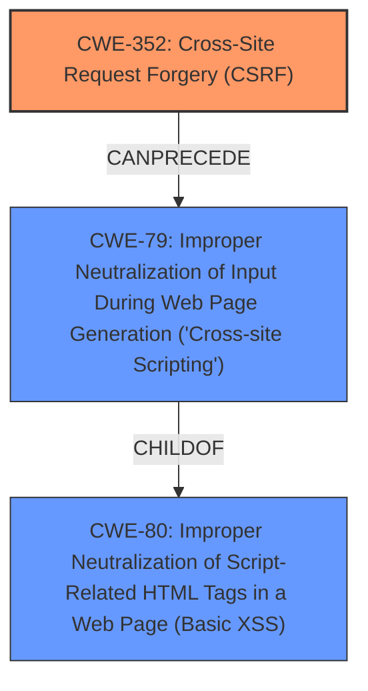

# Enhanced Analysis for CVE-2025-46514

# Summary
| CWE ID | CWE Name | Confidence | CWE Abstraction Level | CWE Vulnerability Mapping Label | CWE-Vulnerability Mapping Notes |
|---|---|---|---|---|---|
| CWE-352 | Cross-Site Request Forgery (CSRF) | 1.0 | Compound | Allowed | Primary CWE |
| CWE-79 | Improper Neutralization of Input During Web Page Generation ('Cross-site Scripting') | 1.0 | Base | Allowed | Secondary Candidate |

## Evidence and Confidence

*   **Confidence Score:** 1.0
*   **Evidence Strength:** HIGH

## Relationship Analysis
The primary relationship to consider is that CSRF (CWE-352) can lead to other vulnerabilities, in this case, Stored XSS (CWE-79). CWE-352 is a compound weakness, while CWE-79 is a base weakness. There is a potential chain relationship where a successful CSRF attack could be a prerequisite for triggering a Stored XSS vulnerability.



## Vulnerability Chain
1.  **Root Cause:** **Cross-Site Request Forgery (CSRF)** (**CWE-352**) allows an attacker to induce a user to perform actions against a web application in which they are currently authenticated.
2.  **Weakness:** The CSRF leads to Stored XSS.
3.  **Impact:** Stored XSS (**CWE-79**) allows the attacker to inject malicious scripts into the web application, which are then executed by other users.

## Summary of Analysis
The vulnerability description clearly states that there is a **Cross-Site Request Forgery (CSRF)** vulnerability that allows Stored XSS. The primary weakness is the CSRF, which allows an attacker to force a user to perform actions. This action then results in Stored XSS.

The evidence for this is the **Vulnerability Description Key Phrases**:
*   **weakness:** **Cross-Site Request Forgery (CSRF), XSS**

Given the provided information, assigning **CWE-352 Cross-Site Request Forgery (CSRF)** as the primary CWE is the most appropriate choice. The Stored XSS is a secondary effect, directly enabled by the CSRF.

The retriever results also list **CWE-79 Improper Neutralization of Input During Web Page Generation ('Cross-site Scripting')** as the top result. However, the vulnerability description explicitly states CSRF allows for Stored XSS, making the CSRF the root cause.

**CWE-352** is at the Compound level of abstraction, which is acceptable as it describes the overall vulnerability of Cross-Site Request Forgery.
**CWE-79** is at the Base level of abstraction, which is the preferred level.

Final Conclusion:
*   Primary CWE: **CWE-352 Cross-Site Request Forgery (CSRF)**
*   Secondary CWE: **CWE-79 Improper Neutralization of Input During Web Page Generation ('Cross-site Scripting')**

Relevant CWE Information:


## CWE Relationship Analysis

Current CWEs represent these abstraction levels: .


### Vulnerability Chain Analysis

**Chain starting from CWE-352:**
- 352 (Cross-Site Request Forgery (CSRF)) - ROOT


**Chain starting from CWE-79:**
- 79 (Improper Neutralization of Input During Web Page Generation ('Cross-site Scripting')) - ROOT


### CWE Relationship Diagram

```mermaid
graph TD
    classDef primary fill:#f96,stroke:#333,stroke-width:2px
    classDef secondary fill:#69f,stroke:#333
    classDef tertiary fill:#9e9,stroke:#333
```