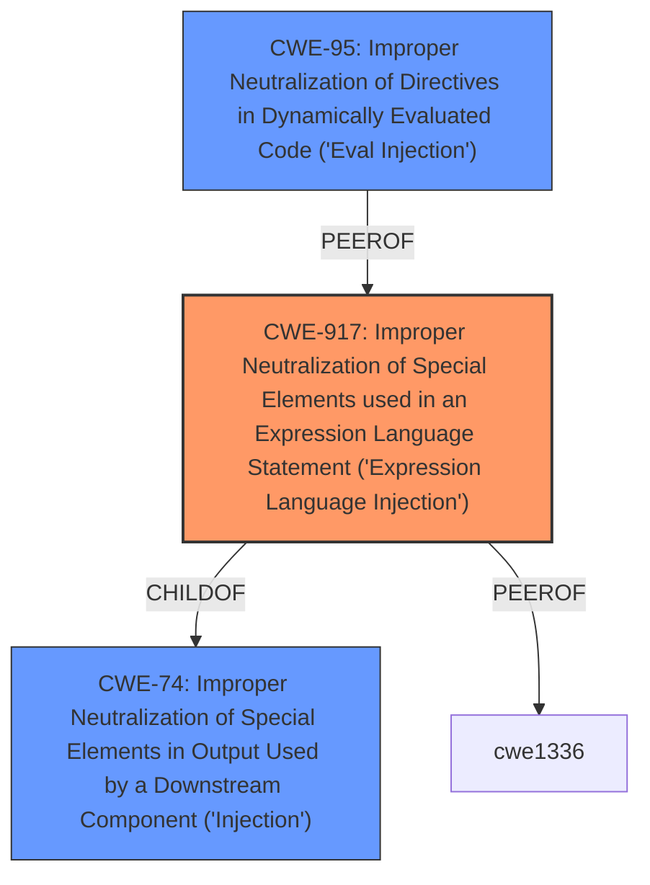

# Analysis Report for CVE-2025-46566

# Vulnerability Analysis Report: CVE-2025-46566

## Description

DataEase is an open-source BI tool alternative to Tableau. Prior to version 2.10.9, authenticated users can complete RCE through the backend JDBC link. This issue has been patched in version 2.10.9.

## Vulnerability Description Key Phrases

- **Component:** backend JDBC link
- **Product:** DataEase
- **Impact:** complete RCE, remote code execution
- **Attacker:** authenticated users
- **Version:** prior to 2.10.9

## Analysis (with Relationship Data)

# Summary
| CWE ID | CWE Name | Confidence | CWE Abstraction Level | CWE Vulnerability Mapping Label | CWE-Vulnerability Mapping Notes |
|---|---|---|---|---|---|
| CWE-917 | Improper Neutralization of Special Elements used in an Expression Language Statement ('Expression Language Injection') | 0.9 | Base | Allowed | Primary CWE. The root cause is the lack of proper neutralization of special elements in the JDBC connection string, leading to expression language injection. |
| CWE-74 | Improper Neutralization of Special Elements in Output Used by a Downstream Component ('Injection') | 0.7 | Class | Discouraged | Secondary. Injection is a high-level category, but relevant since the JDBC connection string is passed to a downstream component. |
| CWE-95 | Improper Neutralization of Directives in Dynamically Evaluated Code ('Eval Injection') | 0.6 | Variant | Allowed | Secondary. While RCE is achieved, the mechanism is not directly through `eval()` but through a related code injection. |

## Evidence and Confidence

*   **Confidence Score:** 0.8
*   **Evidence Strength:** HIGH

## Relationship Analysis
The primary relationship that influenced the CWE selection is the hierarchical relationship between CWE-74 (Injection) and its child CWE-917 (Expression Language Injection). Since the vulnerability involves **improper neutralization** of special elements within an expression language statement (JDBC connection string), CWE-917 is the more specific and appropriate choice.



## Vulnerability Chain
The vulnerability chain starts with the **improper neutralization** of special elements in the JDBC connection string (CWE-917), leading to the injection of malicious code (CWE-74). This results in remote code execution (RCE).
  - **Root Cause:** CWE-917 (Improper Neutralization of Special Elements used in an Expression Language Statement)
  - **Weakness:** CWE-74 (Improper Neutralization of Special Elements in Output Used by a Downstream Component ('Injection'))
  - **Impact:** RCE (Remote Code Execution)

## Summary of Analysis
The analysis is primarily based on the provided vulnerability description and the CVE reference link summary, which clearly indicates a lack of keyword filtering in the Dataease software concerning the connection of redshift-jdbc. The key phrase from the CVE reference summary is "...allows for the exploitation of a Remote Code Execution (RCE) vulnerability within the vulnerable redshift-jdbc version (v2.1.0.1)..." and "...construct a malicious JDBC connection string with a payload to trigger the vulnerability...".

CWE-917 is chosen as the primary CWE because it accurately reflects the root cause: the software **does not properly neutralize** special elements in an expression language statement (JDBC connection string). This allows an attacker to inject malicious code and achieve RCE. The "socketFactory" parameter in the JDBC connection string is used to load a malicious XML file, demonstrating the expression language injection.

CWE-74 is considered as a secondary CWE because it represents a broader class of injection vulnerabilities. While it's not as specific as CWE-917, it highlights the general nature of the vulnerability.

CWE-95 is considered as a secondary CWE because it is related to code injection, but the mechanism is not directly through `eval()`, but through a related injection vector using `socketFactory`.

The selected CWEs are at the optimal level of specificity because CWE-917 accurately describes the root cause, while CWE-74 and CWE-95 provide additional context about the type of vulnerability.

Relevant CWE Information:

# Enhanced Context (25 CWEs)
The following CWEs were identified as potentially relevant to this vulnerability:

## CWE-917: Improper Neutralization of Special Elements used in an Expression Language Statement ('Expression Language Injection')
**Abstraction Level**: Base
**Similarity Score**: 0.76
**Source**: dense

**Description**:
The product constructs all or part of an expression language (EL) statement in a framework such as a Java Server Page (JSP) using externally-influenced input from an upstream component, but it **does not neutralize** or incorrectly neutralizes special elements that could modify the intended EL statement before it is executed.

**Mapping Guidance**:
- Usage: Allowed
- Rationale: This CWE entry is at the Base level of abstraction, which is a preferred level of abstraction for mapping to the root causes of vulnerabilities.

## CWE-74: Improper Neutralization of Special Elements in Output Used by a Downstream Component ('Injection')
**Abstraction Level**: Class
**Similarity Score**: 0.75
**Source**: dense

**Description**:
The product constructs all or part of a command, data structure, or record using externally-influenced input from an upstream component, but it **does not neutralize** or incorrectly neutralizes special elements that could modify how it is parsed or interpreted when it is sent to a downstream component.

**Mapping Guidance**:
- Usage: Discouraged
- Rationale: CWE-74 is high-level and often misused when lower-level weaknesses are more appropriate.

## CWE-95: Improper Neutralization of Directives in Dynamically Evaluated Code ('Eval Injection')
**Abstraction Level**: Variant
**Similarity Score**: 705.10
**Source**: sparse

**Description**:
The product receives input from an upstream component, but it **does not neutralize** or incorrectly neutralizes code syntax before using the input in a dynamic evaluation call (e.g. "eval").

**Mapping Guidance**:
- Usage: Allowed
- Rationale: This CWE entry is at the Variant level of abstraction, which is a preferred level of abstraction for mapping to the root causes of vulnerabilities.


## CWE Relationship Analysis

Current CWEs represent these abstraction levels: .


### Vulnerability Chain Analysis

**Chain starting from CWE-917:**
- 917 (Improper Neutralization of Special Elements used in an Expression Language Statement ('Expression Language Injection')) - ROOT


**Chain starting from CWE-74:**
- 74 (Improper Neutralization of Special Elements in Output Used by a Downstream Component ('Injection')) - ROOT


### CWE Relationship Diagram

```mermaid
graph TD
    classDef primary fill:#f96,stroke:#333,stroke-width:2px
    classDef secondary fill:#69f,stroke:#333
    classDef tertiary fill:#9e9,stroke:#333
```


*Report generated on 2025-07-15 01:23:44*
