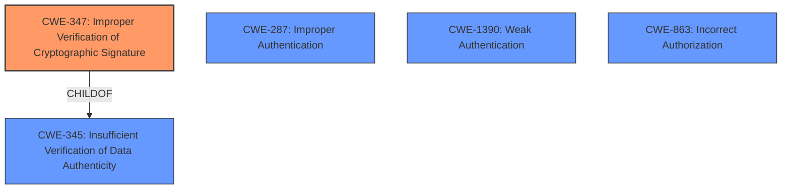

# Analysis Report for CVE-2025-46572

# Vulnerability Analysis Report: CVE-2025-46572

## Description

passport-wsfed-saml2 provides passport strategy for both WS-fed and SAML2 protocol. A vulnerability present starting in version 3.0.5 up to and including version 4.6.3 allows an attacker to impersonate any user during SAML authentication by crafting a SAMLResponse. This can be done by using a valid SAML object that was signed by the configured IdP. Users are affected specifically when the service provider is using passport-wsfed-saml2 and a valid SAML document signed by the Identity Provider can be obtained. Version 4.6.4 contains a fix for the vulnerability.

## Vulnerability Description Key Phrases

- **Impact:** impersonate any user
- **Vector:** crafting a SAMLResponse
- **Attacker:** attacker
- **Product:** passport-wsfed-saml2
- **Version:** 3.0.5 to 4.6.3

## Analysis (with Relationship Data)

# Summary
| CWE ID  | CWE Name                                         | Confidence | CWE Abstraction Level | CWE Vulnerability Mapping Label | CWE-Vulnerability Mapping Notes |
| :-------- | :----------------------------------------------- | :--------- | :-------------------- | :------------------------------ | :------------------------------ |
| CWE-347   | Improper Verification of Cryptographic Signature | 0.9        | Base                  | Allowed                       | Primary CWE                     |
| CWE-287   | Improper Authentication                          | 0.6        | Class                 | Discouraged                     | Secondary Candidate             |
| CWE-1390  | Weak Authentication                              | 0.5        | Class                 | Allowed-with-Review             | Secondary Candidate             |
| CWE-863   | Incorrect Authorization                          | 0.4        | Class                 | Allowed-with-Review             | Secondary Candidate             |

## Evidence and Confidence

*   **Confidence Score:** 0.8
*   **Evidence Strength:** HIGH

## Relationship Analysis

The primary CWE is CWE-347, which focuses on the **improper verification of cryptographic signatures**. This is directly related to the vulnerability where the SAML response signature is not properly validated, allowing an attacker to craft a malicious response. CWE-347 is a child of CWE-345, Insufficient Verification of Data Authenticity, indicating a broader class of data validation issues. CWE-287 Improper Authentication, CWE-1390 Weak Authentication and CWE-863 Incorrect Authorization were considered as alternative high level classifications, however, CWE-347 provides a more specific root cause.



## Vulnerability Chain

The vulnerability chain starts with the **improper verification of the cryptographic signature** (CWE-347). This leads to the ability to **impersonate any user** during SAML authentication. The root cause is the flawed signature validation.

## Summary of Analysis

The primary assessment focuses on **CWE-347 Improper Verification of Cryptographic Signature** as the root cause. The vulnerability description explicitly states that an attacker can impersonate any user by crafting a SAMLResponse and using a valid SAML object signed by the configured IdP. This directly implies that the signature verification is either missing or flawed. The evidence "This vulnerability allows an attacker to impersonate any user during SAML authentication by crafting a SAMLResponse. This can be done by using a valid SAML object that was signed by the configured IdP." strongly supports this.

**CWE-347** is at the Base level of abstraction, providing a more specific and accurate representation of the vulnerability compared to higher-level classes such as **CWE-287 Improper Authentication**, **CWE-1390 Weak Authentication** and **CWE-863 Incorrect Authorization**. The retriever results also list CWE-347 as a relevant candidate, further solidifying its selection.

Relevant CWE Information:

# Enhanced Context (25 CWEs)
The following CWEs were identified as potentially relevant to this vulnerability:

## CWE-303: Incorrect Implementation of Authentication Algorithm
**Abstraction Level**: Base
**Similarity Score**: 0.75
**Source**: dense

**Description**:
The requirements for the product dictate the use of an established authentication algorithm, but the implementation of the algorithm is incorrect.

**Mapping Guidance**:
- Usage: Allowed
- Rationale: This CWE entry is at the Base level of abstraction, which is a preferred level of abstraction for mapping to the root causes of vulnerabilities.


## CWE-1390: Weak Authentication
**Abstraction Level**: Class
**Similarity Score**: 0.74
**Source**: dense

**Description**:
The product uses an authentication mechanism to restrict access to specific users or identities, but the mechanism does not sufficiently prove that the claimed identity is correct.

**Mapping Guidance**:
- Usage: Allowed-with-Review
- Rationale: This CWE entry is a Class and might have Base-level children that would be more appropriate


## CWE-668: Exposure of Resource to Wrong Sphere
**Abstraction Level**: Class
**Similarity Score**: 0.74
**Source**: dense

**Description**:
The product exposes a resource to the wrong control sphere, providing unintended actors with inappropriate access to the resource.

**Mapping Guidance**:
- Usage: Discouraged
- Rationale: CWE-668 is high-level and is often misused as a catch-all when lower-level CWE IDs might be applicable. It is sometimes used for low-information vulnerability reports [REF-1287]. It is a level-1 Class (i.e., a child of a Pillar). It is not useful for trend analysis.


## CWE-1391: Use of Weak Credentials
**Abstraction Level**: Class
**Similarity Score**: 0.73
**Source**: dense

**Description**:
The product uses weak credentials (such as a default key or hard-coded password) that can be calculated, derived, reused, or guessed by an attacker.

**Mapping Guidance**:
- Usage: Allowed-with-Review
- Rationale: This CWE entry is a Class and might have Base-level children that would be more appropriate


## CWE-472: External Control of Assumed-Immutable Web Parameter
**Abstraction Level**: Base
**Similarity Score**: 0.73
**Source**: dense

**Description**:
The web application does not sufficiently verify inputs that are assumed to be immutable but are actually externally controllable, such as hidden form fields.

**Mapping Guidance**:
- Usage: Allowed
- Rationale: This CWE entry is at the Base level of abstraction, which is a preferred level of abstraction for mapping to the root causes of vulnerabilities.


## CWE-204: Observable Response Discrepancy
**Abstraction Level**: Base
**Similarity Score**: 0.73
**Source**: dense

**Description**:
The product provides different responses to incoming requests in a way that reveals internal state information to an unauthorized actor outside of the intended control sphere.

**Mapping Guidance**:
- Usage: Allowed
- Rationale: This CWE entry is at the Base level of abstraction, which is a preferred level of abstraction for mapping to the root causes of vulnerabilities.


## CWE-807: Reliance on Untrusted Inputs in a Security Decision
**Abstraction Level**: Base
**Similarity Score**: 0.73
**Source**: dense

**Description**:
The product uses a protection mechanism that relies on the existence or values of an input, but the input can be modified by an untrusted actor in a way that bypasses the protection mechanism.

**Mapping Guidance**:
- Usage: Allowed
- Rationale: This CWE entry is at the Base level of abstraction, which is a preferred level of abstraction for mapping to the root causes of vulnerabilities.


## CWE-497: Exposure of Sensitive System Information to an Unauthorized Control Sphere
**Abstraction Level**: Base
**Similarity Score**: 0.73
**Source**: dense

**Description**:
The product does not properly prevent sensitive system-level information from being accessed by unauthorized actors who do not have the same level of access to the underlying system as the product does.

**Mapping Guidance**:
- Usage: Allowed
- Rationale: This CWE entry is at the Base level of abstraction, which is a preferred level of abstraction for mapping to the root causes of vulnerabilities.


## CWE-703: Improper Check or Handling of Exceptional Conditions
**Abstraction Level**: Pillar
**Similarity Score**: 0.73
**Source**: dense

**Description**:
The product does not properly anticipate or handle exceptional conditions that rarely occur during normal operation of the product.

**Mapping Guidance**:
- Usage: Discouraged
- Rationale: This CWE entry is extremely high-level, a Pillar.


## CWE-345: Insufficient Verification of Data Authenticity
**Abstraction Level**: Class
**Similarity Score**: 0.73
**Source**: dense

**Description**:
The product does not sufficiently verify the origin or authenticity of data, in a way that causes it to accept invalid data.

**Mapping Guidance**:
- Usage: Discouraged
- Rationale: This CWE entry is a level-1 Class (i.e., a child of a Pillar). It might have lower-level children that would be more appropriate


## CWE-347: Improper Verification of Cryptographic Signature
**Abstraction Level**: Base
**Similarity Score**: 1465.79
**Source**: sparse

**Description**:
The product does not verify, or incorrectly


## CWE Relationship Analysis

Current CWEs represent these abstraction levels: .


### Vulnerability Chain Analysis

**Chain starting from CWE-1390:**
- 1390 (Weak Authentication) - ROOT


**Chain starting from CWE-863:**
- 863 (Incorrect Authorization) - ROOT


### CWE Relationship Diagram

```mermaid
graph TD
    classDef primary fill:#f96,stroke:#333,stroke-width:2px
    classDef secondary fill:#69f,stroke:#333
    classDef tertiary fill:#9e9,stroke:#333
```


*Report generated on 2025-07-15 01:24:05*
