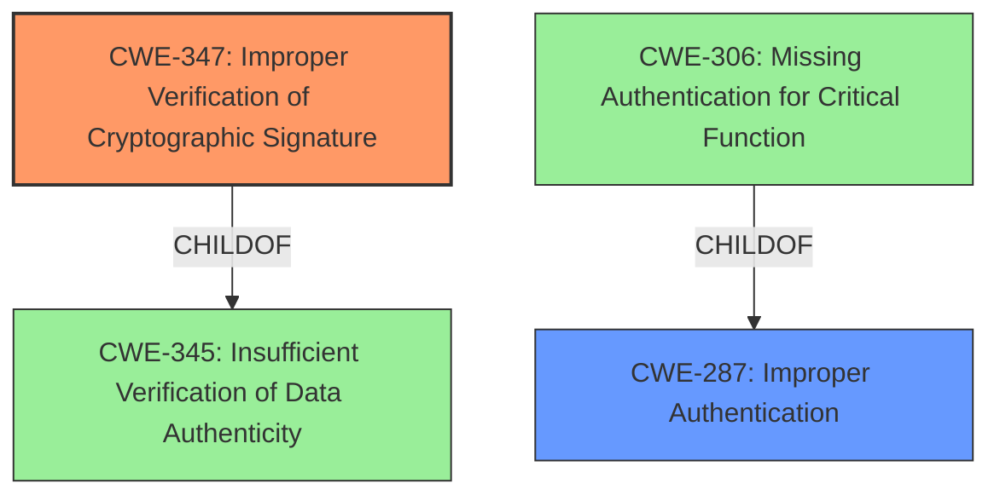

# Raw Analyzer Response for CVE-2025-46573

# Summary
| CWE ID | CWE Name | Confidence | CWE Abstraction Level | CWE Vulnerability Mapping Label | CWE-Vulnerability Mapping Notes |
|---|---|---|---|---|---|
| CWE-347 | Improper Verification of Cryptographic Signature | 0.8 | Base | Allowed | Primary CWE: The vulnerability stems from the application's failure to properly verify the cryptographic signature of the SAML response, allowing attackers to tamper with the message. |
| CWE-287 | Improper Authentication | 0.6 | Class | Discouraged | Secondary Candidate: The vulnerability ultimately leads to improper authentication, as an attacker can impersonate any user due to the signature verification failure. |

## Evidence and Confidence

*   **Confidence Score:** 0.7
*   **Evidence Strength:** MEDIUM

## Relationship Analysis

The primary CWE is CWE-347, which is a child of CWE-345 (Insufficient Verification of Data Authenticity). CWE-287 (Improper Authentication) is a parent of CWE-306 (Missing Authentication for Critical Function). While the vulnerability doesn't involve missing authentication, the end result is that the application fails to properly authenticate users, making CWE-287 relevant, but less specific than CWE-347.

## Vulnerability Chain

The vulnerability chain starts with the **improper verification of the cryptographic signature** (CWE-347). This allows an attacker to tamper with a valid SAML response. By adding attributes to the response, the attacker can **impersonate any user** during SAML authentication. The vulnerability leads to **improper authentication** (CWE-287) as the application trusts a tampered SAML response.

## Summary of Analysis

The primary weakness is the **improper verification of the cryptographic signature** in the SAML response (CWE-347). The "CVE Reference Links Content Summary" clearly states that the root cause allows an attacker to **impersonate any user during SAML authentication by tampering with a valid SAML response**. The ability to tamper with the SAML response, due to the **improper signature verification**, is the core issue.

CWE-287 is a possible, but less specific, classification. The ultimate impact is an authentication bypass, but the root cause lies in the signature verification. The provided guidance highlights that if the root cause is known it is best to choose that CWE.

The confidence in CWE-347 is high because the description explicitly mentions tampering with a valid SAML response and the root cause of the vulnerability.

Relevant CWE Information:

# Enhanced Context (25 CWEs)
The following CWEs were identified as potentially relevant to this vulnerability:

## CWE-303: Incorrect Implementation of Authentication Algorithm
**Abstraction Level**: Base
**Similarity Score**: 0.74
**Source**: dense

**Description**:
The requirements for the product dictate the use of an established authentication algorithm, but the implementation of the algorithm is incorrect.

**Mapping Guidance**:
- Usage: Allowed
- Rationale: This CWE entry is at the Base level of abstraction, which is a preferred level of abstraction for mapping to the root causes of vulnerabilities.

**NOT USED:** While related to authentication, the issue isn't with the implementation of the authentication algorithm itself but rather the verification of the SAML response's signature.

## CWE-472: External Control of Assumed-Immutable Web Parameter
**Abstraction Level**: Base
**Similarity Score**: 0.73
**Source**: dense

**Description**:
The web application does not sufficiently verify inputs that are assumed to be immutable but are actually externally controllable, such as hidden form fields.

**Mapping Guidance**:
- Usage: Allowed
- Rationale: This CWE entry is at the Base level of abstraction, which is a preferred level of abstraction for mapping to the root causes of vulnerabilities.

**NOT USED:** While the SAML response is being tampered with, this CWE is more related to web parameters, and SAML is XML/protocol based.

## CWE-1390: Weak Authentication
**Abstraction Level**: Class
**Similarity Score**: 0.73
**Source**: dense

**Description**:
The product uses an authentication mechanism to restrict access to specific users or identities, but the mechanism does not sufficiently prove that the claimed identity is correct.

**Mapping Guidance**:
- Usage: Allowed-with-Review
- Rationale: This CWE entry is a Class and might have Base-level children that would be more appropriate

**NOT USED:** This is too high-level, CWE-287 is a better choice here.

## CWE-807: Reliance on Untrusted Inputs in a Security Decision
**Abstraction Level**: Base
**Similarity Score**: 0.73
**Source**: dense

**Description**:
The product uses a protection mechanism that relies on the existence or values of an input, but the input can be modified by an untrusted actor in a way that bypasses the protection mechanism.

**Mapping Guidance**:
- Usage: Allowed
- Rationale: This CWE entry is at the Base level of abstraction, which is a preferred level of abstraction for mapping to the root causes of vulnerabilities.

**NOT USED:** While the application relies on the SAML response, CWE-347 is more specific to the signature verification aspect.

## CWE-1391: Use of Weak Credentials
**Abstraction Level**: Class
**Similarity Score**: 0.73
**Source**: dense

**Description**:
The product uses weak credentials (such as a default key or hard-coded password) that can be calculated, derived, reused, or guessed by an attacker.

**Mapping Guidance**:
- Usage: Allowed-with-Review
- Rationale: This CWE entry is a Class and might have Base-level children that would be more appropriate

**NOT USED:** Not related to this issue.

## CWE-204: Observable Response Discrepancy
**Abstraction Level**: Base
**Similarity Score**: 0.73
**Source**: dense

**Description**:
The product provides different responses to incoming requests in a way that reveals internal state information to an unauthorized actor outside of the intended control sphere.

**Mapping Guidance**:
- Usage: Allowed
- Rationale: This CWE entry is at the Base level of abstraction, which is a preferred level of abstraction for mapping to the root causes of vulnerabilities.

**NOT USED:** Not related to this issue.

## CWE-613: Insufficient Session Expiration
**Abstraction Level**: Base
**Similarity Score**: 0.73
**Source**: dense

**Description**:
According to WASC, "Insufficient Session Expiration is when a web site permits an attacker to reuse old session credentials or session IDs for authorization."

**Mapping Guidance**:
- Usage: Allowed
- Rationale: This CWE entry is at the Base level of abstraction, which is a preferred level of abstraction for mapping to the root causes of vulnerabilities.

**NOT USED:** Not related to this issue.

## CWE-668: Exposure of Resource to Wrong Sphere
**Abstraction Level**: Class
**Similarity Score**: 0.73
**Source**: dense

**Description**:
The product exposes a resource to the wrong control sphere, providing unintended actors with inappropriate access to the resource.

**Mapping Guidance**:
- Usage: Discouraged
- Rationale: CWE-668 is high-level and is often misused as a catch-all when lower-level CWE IDs might be applicable. It is sometimes used for low-information vulnerability reports [REF-1287]. It is a level-1 Class (i.e., a child of a Pillar). It is not useful for trend analysis.

**NOT USED:** Too high level.

## CWE-497: Exposure of Sensitive System Information to an Unauthorized Control Sphere
**Abstraction Level**: Base
**Similarity Score**: 0.72
**Source**: dense

**Description**:
The product does not properly prevent sensitive system-level information from being accessed by unauthorized actors who do not have the same level of access to the underlying system as the product does.

**Mapping Guidance**:
- Usage: Allowed
- Rationale: This CWE entry is at the Base level of abstraction, which is a preferred level of abstraction for mapping to the root causes of vulnerabilities.

**NOT USED:** Not related to this issue.

## CWE-345: Insufficient Verification of Data Authenticity
**Abstraction Level**: Class
**Similarity Score**: 0.72
**Source**: dense

**Description**:
The product does not sufficiently verify the origin or