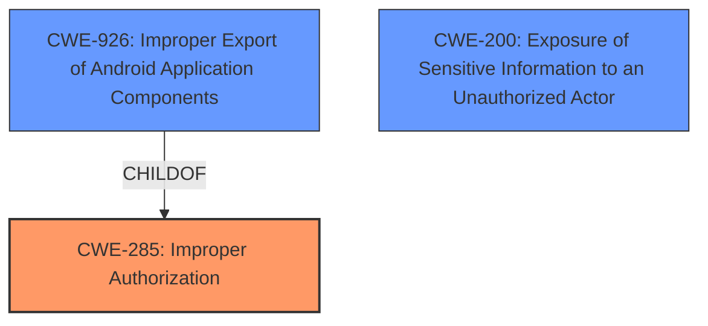

# Analysis Report for CVE-2025-46589

# Vulnerability Analysis Report: CVE-2025-46589

## Description

Vulnerability of unauthorized access in the app lock module Impact Successful exploitation of this vulnerability will affect integrity and confidentiality.

## Vulnerability Description Key Phrases

- **Impact:** ['unauthorized access', 'affect integrity']
- **Component:** app lock module

## Analysis (with Relationship Data)

# Summary

| CWE ID  | CWE Name                                                                 | Confidence | CWE Abstraction Level | CWE Vulnerability Mapping Label | CWE-Vulnerability Mapping Notes |
| :-------- | :----------------------------------------------------------------------- | :--------- | :---------------------- | :------------------------------ | :------------------------------ |
| CWE-285   | Improper Authorization                                                     | 0.75       | Class                   | Primary                         | Discouraged                   |
| CWE-926   | Improper Export of Android Application Components                        | 0.65       | Variant                 | Secondary                       | Allowed                       |
| CWE-200   | Exposure of Sensitive Information to an Unauthorized Actor | 0.50       | Class                   | Secondary                         | Discouraged                   |

## Evidence and Confidence

*   **Confidence Score:** 0.70
*   **Evidence Strength:** MEDIUM

## Relationship Analysis

The primary relationship influencing the CWE selection is the hierarchical structure, particularly the parent-child relationship. CWE-285 is a class-level CWE with several more specific child CWEs. While the information isn't detailed enough to pinpoint a specific child, the general description of **improper authorization** makes CWE-285 a reasonable choice. CWE-926 is a variant of CWE-285 and is related to Android applications, which could be relevant given the context of an "app lock module". CWE-200 represents a potential impact of the **improper authorization**.



## Vulnerability Chain

The vulnerability chain starts with the **improper authorization** (CWE-285) in the app lock module, which leads to unauthorized access. A consequence of this unauthorized access is the potential exposure of sensitive information (CWE-200), impacting integrity and confidentiality.

## Summary of Analysis

The initial assessment, based on the provided evidence, points to CWE-285 (Improper Authorization) as the primary weakness. The vulnerability description mentions "unauthorized access," which directly aligns with the definition of CWE-285: "The product does not perform or incorrectly performs an authorization check when an actor attempts to access a resource or perform an action."

The CVE Reference Links Content Summary confirms the root cause as "Unauthorized access in the app lock module" and highlights that successful exploitation will affect integrity and confidentiality. This reinforces the relevance of CWE-285.

CWE-926 is included as a secondary candidate because the vulnerability is in an "app lock module", and this CWE is specific to Android applications.

CWE-200 is included as a secondary candidate as a potential impact since the description notes the impact affects "integrity and confidentiality".

The selection of CWE-285 is at the Class level due to the limited information available. A more specific Base or Variant CWE might be appropriate with more detailed information about the specific authorization failure.

Relevant CWE Information:

# Enhanced Context (25 CWEs)
The following CWEs were identified as potentially relevant to this vulnerability:

## CWE-203: Observable Discrepancy
**Abstraction Level**: Base
**Similarity Score**: 0.73
**Source**: dense

**Description**:
The product behaves differently or sends different responses under different circumstances in a way that is observable to an unauthorized actor, which exposes security-relevant information about the state of the product, such as whether a particular operation was successful or not.

**Mapping Guidance**:
- Usage: Allowed
- Rationale: This CWE entry is at the Base level of abstraction, which is a preferred level of abstraction for mapping to the root causes of vulnerabilities.

*Not Selected:* This CWE relates to observable differences in behavior that expose information. While related to security, it doesn't directly address the **improper authorization** issue, so it is not selected.

## CWE-345: Insufficient Verification of Data Authenticity
**Abstraction Level**: Class
**Similarity Score**: 0.71
**Source**: dense

**Description**:
The product does not sufficiently verify the origin or authenticity of data, in a way that causes it to accept invalid data.

**Mapping Guidance**:
- Usage: Discouraged
- Rationale: This CWE entry is a level-1 Class (i.e., a child of a Pillar). It might have lower-level children that would be more appropriate

*Not Selected:* While data authenticity could be related, the primary issue seems to be **improper authorization**, not necessarily the acceptance of invalid data.

## CWE-451: User Interface (UI) Misrepresentation of Critical Information
**Abstraction Level**: Class
**Similarity Score**: 0.71
**Source**: dense

**Description**:
The user interface (UI) does not properly represent critical information to the user, allowing the information - or its source - to be obscured or spoofed. This is often a component in phishing attacks.

**Mapping Guidance**:
- Usage: Allowed-with-Review
- Rationale: This CWE entry is a Class and might have Base-level children that would be more appropriate

*Not Selected:* This is specific to UI misrepresentation, which isn't the focus of the vulnerability description.

## CWE-667: Improper Locking
**Abstraction Level**: Class
**Similarity Score**: 0.71
**Source**: dense

**Description**:
The product does not properly acquire or release a lock on a resource, leading to unexpected resource state changes and behaviors.

**Mapping Guidance**:
- Usage: Allowed-with-Review
- Rationale: This CWE entry is a Class and might have Base-level children that would be more appropriate

*Not Selected:* This CWE relates to locking mechanisms, which are not mentioned in the vulnerability description.

## CWE-755: Improper Handling of Exceptional Conditions
**Abstraction Level**: Class
**Similarity Score**: 0.70
**Source**: dense

**Description**:
The product does not handle or incorrectly handles an exceptional condition.

**Mapping Guidance**:
- Usage: Discouraged
- Rationale: This CWE entry is a level-1 Class (i.e., a child of a Pillar). It might have lower-level children that would be more appropriate

*Not Selected:* Too general; the description points towards **improper authorization**, not a general failure to handle exceptions.

## CWE-305: Authentication Bypass by Primary Weakness
**Abstraction Level**: Base
**Similarity Score**: 0.70
**Source**: dense

**Description**:
The authentication algorithm is sound, but the implemented mechanism can be bypassed as the result of a separate weakness that is primary to the authentication error.

**Mapping Guidance**:
- Usage: Allowed
- Rationale: This CWE entry is at the Base level of abstraction, which is a preferred level of abstraction for mapping to the root causes of vulnerabilities.

*Not Selected:* The description refers to authorization not authentication.

## CWE-303: Incorrect Implementation of Authentication Algorithm
**Abstraction Level**: Base
**Similarity Score**: 0.70
**Source**: dense

**Description**:
The requirements for the product dictate the use of an established authentication algorithm, but the implementation of the algorithm is incorrect.

**Mapping Guidance**:
- Usage: Allowed
- Rationale: This CWE entry is at the Base level of abstraction, which is a preferred level of abstraction for mapping to the root causes of vulnerabilities.

*Not Selected:* The description refers to authorization not authentication.

## CWE-248: Uncaught Exception
**Abstraction Level**: Base
**Similarity Score**: 0.70
**Source**: dense

**Description**:
An exception is thrown from a function, but it is not caught.

**Mapping Guidance**:
- Usage: Allowed
- Rationale: This CWE entry is at the Base level of abstraction, which is a preferred level of abstraction for mapping to the root causes of vulnerabilities.

*Not Selected:* Too general; the description points towards **improper authorization**, not a general failure to handle exceptions.

## CWE-267: Privilege Defined With Unsafe Actions
**Abstraction Level**: Base
**Similarity Score**: 0.70
**Source**: dense

**Description**:
A particular privilege, role, capability, or right can be used to perform unsafe actions that were not intended, even when it is assigned to the correct entity.

**Mapping Guidance**:
- Usage: Allowed
- Rationale: This CWE entry is at the Base level of abstraction, which is a preferred level of abstraction for mapping to the root causes of vulnerabilities.

*Not Selected:* Could be related to authorization, but the description is too general.

## CWE-287: Improper Authentication
**Abstraction Level**: Class
**Similarity Score**: 0.70
**Source**: dense

**Description**:
When an actor claims to have a given identity, the product does not prove or insufficiently proves that the claim is correct.

**Mapping Guidance**:
- Usage


## CWE Relationship Analysis

Current CWEs represent these abstraction levels: .


### Vulnerability Chain Analysis

**Chain starting from CWE-305:**
- 305 (Authentication Bypass by Primary Weakness) - ROOT


**Chain starting from CWE-203:**
- 203 (Observable Discrepancy) - ROOT


### CWE Relationship Diagram

```mermaid
graph TD
    classDef primary fill:#f96,stroke:#333,stroke-width:2px
    classDef secondary fill:#69f,stroke:#333
    classDef tertiary fill:#9e9,stroke:#333
```


*Report generated on 2025-07-15 01:27:01*
