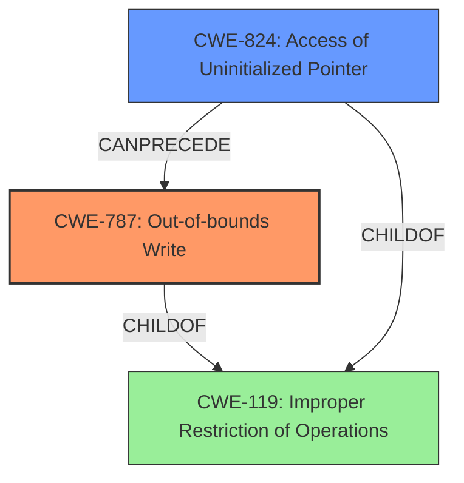

# Raw Analyzer Response for CVE-2025-46613

# Summary
| CWE ID | CWE Name | Confidence | CWE Abstraction Level | CWE Vulnerability Mapping Label | CWE-Vulnerability Mapping Notes |
|---|---|---|---|---|---|
| CWE-787 | Out-of-bounds Write | 0.9 | Base | Allowed | Primary CWE: The **memory corruption** occurs due to writing outside the intended memory region. |
| CWE-824 | Access of Uninitialized Pointer | 0.7 | Base | Allowed | Secondary CWE: The vulnerability involves accessing arguments after the parent stack frame is unavailable, which can lead to accessing uninitialized memory. |

## Evidence and Confidence

*   **Confidence Score:** 0.8
*   **Evidence Strength:** HIGH

## Relationship Analysis
The primary weakness is an out-of-bounds write (CWE-787), stemming from a thread accessing function arguments after the stack frame has been destroyed. This can be further related to accessing uninitialized memory (CWE-824) if the accessed memory is reused.

## Vulnerability Chain
1.  **Root Cause:** Passing thread arguments using a stack-allocated array, leading to potential access after the parent stack frame is destroyed.
2.  **Weakness:** Potential **memory corruption** if the thread accesses the arguments after the parent stack frame is no longer valid. This can lead to accessing uninitialized memory if the memory region is reused.
3.  **Impact:** Thread crashes, segmentation faults, and denial of service.

## Summary of Analysis
The primary vulnerability is **memory corruption** due to a thread potentially accessing function arguments from a stack-allocated array after the parent stack frame is no longer valid. This maps directly to CWE-787 (Out-of-bounds Write) because the thread may be writing to or reading from memory locations outside the intended boundary. A secondary aspect is the potential for CWE-824 (Access of Uninitialized Pointer) if the memory region is reused after the stack frame is invalidated.

The vulnerability description clearly indicates that the **thread may access handleConnections arguments after the parent stack frame becomes unavailable**. The CVE Reference Links Content Summary reinforces this by stating that "The vulnerability stems from passing thread arguments to `handleConnections()` using a stack-allocated array. This is unsafe because the thread may access the arguments after the parent stack frame has been destroyed or overwritten, leading to invalid memory access."

CWE-787 is selected as the primary CWE because the core issue is writing to memory outside of the intended bounds. The fix involves heap-allocating the thread arguments, which prevents the issue of the stack frame becoming unavailable.

CWE-824 is considered as a secondary CWE because if the thread accesses the memory region after the stack frame is invalidated and the memory is reused, it could lead to accessing uninitialized memory.

The other CWEs from the retriever results were considered but not selected because they did not directly address the root cause. For example, CWE-119 is too general, and CWE-401 (Missing Release of Memory after Effective Lifetime) is not directly related to the immediate cause of the memory corruption. CWE-1284 (Improper Validation of Specified Quantity in Input) and CWE-125 (Out-of-bounds Read) are less relevant because the problem is not necessarily about validating the quantity of input or reading out-of-bounds, but about writing to invalid memory locations due to stack frame invalidation.