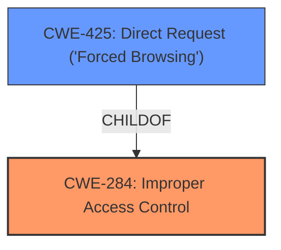

# Analysis Report for CVE-2025-46631

# Vulnerability Analysis Report: CVE-2025-46631

## Description

**Improper access controls** in the web management portal of the Tenda RX2 Pro 16.03.30.14 allows an unauthenticated remote attacker to enable telnet access to the routers OS by sending a /goform/telnet web request.

## Vulnerability Description Key Phrases

- **Rootcause:** Improper access controls
- **Impact:** enable telnet access to the routers OS
- **Vector:** /goform/telnet web request
- **Attacker:** unauthenticated remote attacker
- **Product:** Tenda RX2 Pro
- **Version:** 16.03.30.14
- **Component:** web management portal

## Analysis (with Relationship Data)

# Summary
| CWE ID | CWE Name | Confidence | CWE Abstraction Level | CWE Vulnerability Mapping Label | CWE-Vulnerability Mapping Notes |
|---|---|---|---|---|---|
| CWE-284 | Improper Access Control | 0.9 | Pillar | Allowed | Primary CWE |
| CWE-425 | Direct Request ('Forced Browsing') | 0.7 | Base | Allowed | Secondary Candidate |

## Evidence and Confidence

*   **Confidence Score:** 0.8
*   **Evidence Strength:** MEDIUM

## Relationship Analysis
The primary CWE identified is CWE-284, which is a Pillar-level weakness. CWE-425 is a child of CWE-284 and represents a more specific case of access control issues related to direct requests. The relationships show that CWE-425 could be a more precise classification.



## Vulnerability Chain
The vulnerability chain starts with **improper access controls** (CWE-284), leading to the ability for an unauthenticated attacker to directly request a specific resource (/goform/telnet), resulting in enabling telnet access to the router's OS.

## Summary of Analysis
The initial assessment identified CWE-284 as the primary weakness due to the explicit mention of "**improper access controls**" in the vulnerability description. The Retriever results also list CWE-284 as the top candidate. However, CWE-425 (Direct Request) is a child of CWE-284 and more accurately describes the vulnerability, since the attacker directly requests a resource without proper authorization.

The evidence supports the selection of CWE-284 as the root cause, with CWE-425 as a more specific instance of this weakness.

Relevant CWE Information:

# Enhanced Context (25 CWEs)

## CWE-284: Improper Access Control
**Abstraction Level**: Pillar
**Similarity Score**: 0.261 (sparse)
**Description**: The product does not adequately restrict actors from performing actions or accessing resources when the actors have not been granted permission.
**Mapping Guidance**: Discouraged because it's a high-level category and lower-level CWEs might be more applicable.

## CWE-425: Direct Request ('Forced Browsing')
**Abstraction Level**: Base
**Similarity Score**: 0.245 (sparse), 411.82 (sparse), 2.43 (graph)
**Description**: The web application does not adequately enforce appropriate authorization on all restricted URLs, scripts, or files.
**Mapping Guidance**: Allowed because it is at the Base level of abstraction.

CWEs Considered but Not Used:

*   **CWE-78:** Improper Neutralization of Special Elements used in an OS Command ('OS Command Injection') - Not applicable because the vulnerability is primarily about access control, not command injection.
*   **CWE-287:** Improper Authentication - Authentication is not mentioned as being bypassed, only access control.
*   **CWE-121:** Stack-based Buffer Overflow - Not applicable because the vulnerability is about access control, not memory corruption.
*   **CWE-285:** Improper Authorization - Similar to CWE-284, but less directly supported by the vulnerability description.
*   **CWE-20:** Improper Input Validation - Not applicable because the vulnerability is about access control, not input validation.
*   **CWE-119:** Improper Restriction of Operations within the Bounds of a Memory Buffer - Not applicable because the vulnerability is about access control, not memory corruption.
*   **CWE-259:** Use of Hard-coded Password - Not applicable because the vulnerability is about access control, not hardcoded passwords.
*   **CWE-184:** Incomplete List of Disallowed Inputs - This is related to input validation, not access control.


## CWE Relationship Analysis

Current CWEs represent these abstraction levels: .


### Vulnerability Chain Analysis

**Chain starting from CWE-121:**
- 121 (Stack-based Buffer Overflow) - ROOT


**Chain starting from CWE-184:**
- 184 (Incomplete List of Disallowed Inputs) - ROOT


### CWE Relationship Diagram

```mermaid
graph TD
    classDef primary fill:#f96,stroke:#333,stroke-width:2px
    classDef secondary fill:#69f,stroke:#333
    classDef tertiary fill:#9e9,stroke:#333
```


*Report generated on 2025-07-15 01:31:22*
