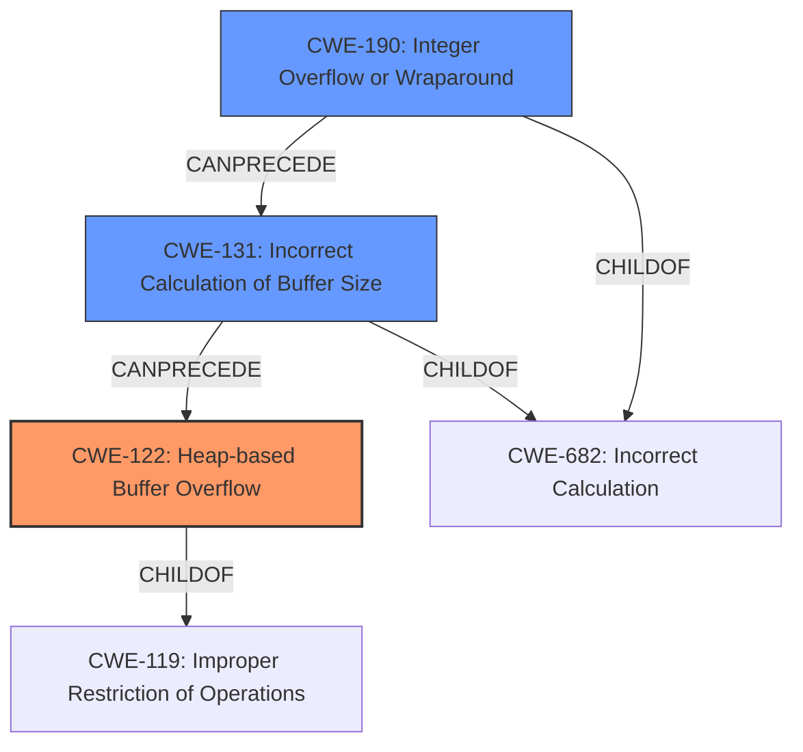

# Analysis Report for CVE-2025-46687

# Vulnerability Analysis Report: CVE-2025-46687

## Description

quickjs-ng through 0.9.0 has a **missing length check** in JS_ReadString for a string, leading to a **heap-based buffer overflow**. QuickJS before 2025-04-26 is also affected.

## Vulnerability Description Key Phrases

- **Rootcause:** missing length check
- **Weakness:** heap-based buffer overflow
- **Product:** QuickJS
- **Version:** before 2025-04-26

## Analysis (with Relationship Data)

# Summary

| CWE ID  | CWE Name                                                                   | Confidence | CWE Abstraction Level | CWE Vulnerability Mapping Label | CWE-Vulnerability Mapping Notes |
| ------- | -------------------------------------------------------------------------- | ---------- | --------------------- | ------------------------------- | ------------------------------- |
| CWE-122 | Heap-based Buffer Overflow                                                  | 0.9        | Variant               | Primary                         | Allowed                       |
| CWE-190 | Integer Overflow or Wraparound                                            | 0.8        | Base                  | Secondary                       | Allowed                       |
| CWE-131 | Incorrect Calculation of Buffer Size                                        | 0.7        | Base                  | Secondary                       | Allowed                       |

## Evidence and Confidence

*   **Confidence Score:** 0.8
*   **Evidence Strength:** HIGH

## Relationship Analysis

The primary weakness is a heap-based buffer overflow (CWE-122), which is a variant of the more general class of buffer overflows. This overflow is caused by an integer overflow (CWE-190) during the calculation of the buffer size, leading to an incorrect buffer size calculation (CWE-131). The integer overflow precedes the incorrect calculation, which in turn precedes the heap-based buffer overflow.



## Vulnerability Chain

The vulnerability chain begins with an integer overflow (CWE-190) during the calculation of the buffer size. This leads to an incorrect buffer size calculation (CWE-131), which subsequently results in a heap-based buffer overflow (CWE-122). The overflow can then lead to arbitrary code execution due to memory corruption.

*   **CWE-190:** Integer Overflow or Wraparound (Root Cause)
*   **CWE-131:** Incorrect Calculation of Buffer Size
*   **CWE-122:** Heap-based Buffer Overflow (Impact)

## Summary of Analysis

The primary vulnerability is a heap-based buffer overflow (CWE-122), resulting from an integer overflow (CWE-190) and subsequent incorrect buffer size calculation (CWE-131).

Evidence:
*   Vulnerability Description: "... **missing length check** in JS_ReadString for a string, leading to a **heap-based buffer overflow**."
*   CVE Reference Links Content Summary:
    *   "**Root cause:** Missing length check and bad size calculation in `JS_ReadString` when reading string data from bytecode. Specifically, an integer overflow occurs in the `get_leb128` function, leading to an incorrect length being used for memory allocation."
    *   "**Weaknesses/vulnerabilities present:** Integer overflow, heap buffer overflow."
    *   "**Root cause:** Integer overflow in the LEB128 parsing within `JS_ReadBigInt`, leading to an undersized buffer allocation."

The selection of CWE-122 is based on the clear statement of a heap-based buffer overflow in the vulnerability description and supporting details in the CVE reference. The integer overflow (CWE-190) and incorrect buffer size calculation (CWE-131) are contributing factors, and are included as secondary CWEs, because they represent the root causes leading to the overflow.

The chosen CWEs are at the optimal level of specificity because CWE-122 is a Variant that accurately describes the heap-based nature of the buffer overflow. CWE-190 and CWE-131 are Base level CWEs that represent the root causes.

Other CWEs Considered but Not Used:

*   CWE-119: Improper Restriction of Operations within the Bounds of a Memory Buffer - This is a Class-level CWE that is too general. CWE-122, a variant of CWE-119, provides a more specific classification.
*   CWE-120: Buffer Copy without Checking Size of Input ('Classic Buffer Overflow') - This CWE is too specific as the overflow is not necessarily caused by a buffer copy operation.
*   CWE-125: Out-of-bounds Read and CWE-787: Out-of-bounds Write - These CWEs describe the symptom of the overflow, not the root cause.
*   CWE-1284: Improper Validation of Specified Quantity in Input - While related to the missing length check, the integer overflow and incorrect calculation are more direct causes of the overflow.
*   CWE-193: Off-by-one Error - Not applicable as the error is not an off-by-one error.
*   CWE-197: Numeric Truncation Error - Not applicable, as the error is an integer overflow, not truncation.
*   CWE-130: Improper Handling of Length Parameter Inconsistency - Not applicable, as the primary issue is the incorrect calculation of the buffer size due to the integer overflow.
*   CWE-674: Uncontrolled Recursion - Not related to this vulnerability.
*   CWE-128: Wrap-around Error - Although similar to CWE-190, CWE-190 is a more direct match for the integer overflow condition.


## CWE Relationship Analysis

Current CWEs represent these abstraction levels: .


### Vulnerability Chain Analysis

**Chain starting from CWE-1284:**
- 1284 (Improper Validation of Specified Quantity in Input) - ROOT


**Chain starting from CWE-130:**
- 130 (Improper Handling of Length Parameter Inconsistency) - ROOT


### CWE Relationship Diagram

```mermaid
graph TD
    classDef primary fill:#f96,stroke:#333,stroke-width:2px
    classDef secondary fill:#69f,stroke:#333
    classDef tertiary fill:#9e9,stroke:#333
```


*Report generated on 2025-07-15 01:33:33*
