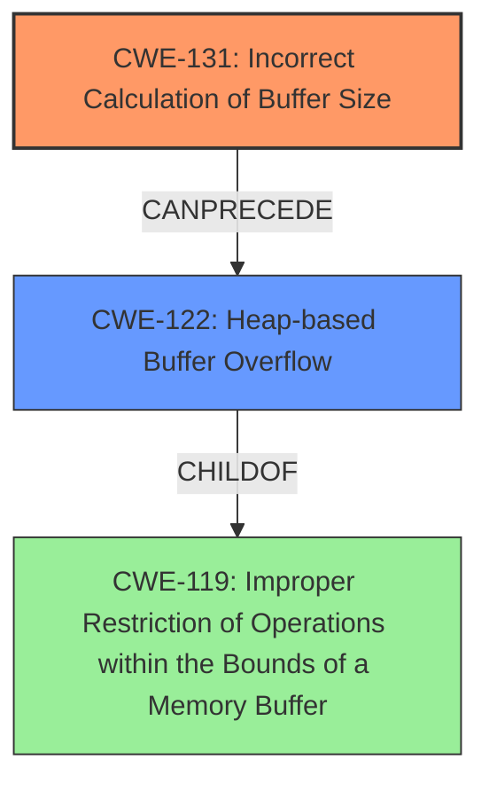

# Enhanced Analysis for CVE-2025-46688

# Summary
| CWE ID | CWE Name | Confidence | CWE Abstraction Level | CWE Vulnerability Mapping Label | CWE-Vulnerability Mapping Notes |
|---|---|---|---|---|---|
| CWE-131 | Incorrect Calculation of Buffer Size | 0.9 | Base | Primary CWE | Allowed |
| CWE-122 | Heap-based Buffer Overflow | 0.8 | Variant | Secondary Candidate | Allowed |

## Evidence and Confidence

*   **Confidence Score:** 0.85
*   **Evidence Strength:** HIGH

## Relationship Analysis
The primary relationship identified is that **CWE-131 (Incorrect Calculation of Buffer Size)** can precede **CWE-122 (Heap-based Buffer Overflow)**. **CWE-131** is the root cause, leading to the buffer overflow. The analysis also considered **CWE-119 (Improper Restriction of Operations within the Bounds of a Memory Buffer)**, but it was deemed too general. **CWE-131** is a base level CWE, while **CWE-122** is a variant, providing a good balance of specificity.



## Vulnerability Chain
The vulnerability chain starts with an **incorrect size calculation** (**CWE-131**), which results in a buffer being allocated too small. Subsequently, when data is written to this undersized buffer, a **heap-based buffer overflow** (**CWE-122**) occurs.

## Summary of Analysis
The initial analysis focused on the **incorrect size calculation** as the root cause, leading to a **heap-based buffer overflow**. The evidence from the vulnerability description and CVE reference links supports this. The graph relationships highlight that **CWE-131** can lead to **CWE-122**. The final selection of **CWE-131** and **CWE-122** are at the optimal level of specificity, with **CWE-131** being the primary cause and **CWE-122** as the resulting vulnerability.

The vulnerability description states: "quickjs-ng through 0.9.0 has an **incorrect size calculation** in JS_ReadBigInt for a BigInt, leading to a **heap-based buffer overflow**." The CVE reference links content summary also mentions "Incorrect size calculation in `JS_ReadBigInt` leading to a smaller buffer allocation than required." This clearly indicates that the incorrect size calculation is the root cause.

**CWE-119** was considered but not used because it is too general. The retriever results also discourage its use.

Relevant CWE Information:

# Enhanced Context (25 CWEs)
The following CWEs were identified as potentially relevant to this vulnerability:

## CWE-131: Incorrect Calculation of Buffer Size
**Abstraction Level**: Base
**Similarity Score**: 0.70
**Source**: dense

**Description**:
The product does not correctly calculate the size to be used when allocating a buffer, which could lead to a buffer overflow.

**Mapping Guidance**:
- Usage: Allowed
- Rationale: This CWE entry is at the Base level of abstraction, which is a preferred level of abstraction for mapping to the root causes of vulnerabilities.

## CWE-122: Heap-based Buffer Overflow
**Abstraction Level**: Variant
**Similarity Score**: 0.69
**Source**: dense

**Description**:
A heap overflow condition is a buffer overflow, where the buffer that can be overwritten is allocated in the heap portion of memory, generally meaning that the buffer was allocated using a routine such as malloc().

**Mapping Guidance**:
- Usage: Allowed
- Rationale: This CWE entry is at the Variant level of abstraction, which is a preferred level of abstraction for mapping to the root causes of vulnerabilities.

## CWE-119: Improper Restriction of Operations within the Bounds of a Memory Buffer
**Abstraction Level**: class
**Similarity Score**: 2.55
**Source**: graph

**Description**:
CWE-119: Improper Restriction of Operations within the Bounds of a Memory Buffer

**Mapping Guidance**:
- Usage: Discouraged
- Rationale: CWE-119 is commonly misused in low-information vulnerability reports when lower-level CWEs could be used instead, or when more details about the vulnerability are available.

**Relationships**:
- CHILDOF -> CWE-118
- CHILDOF -> CWE-20
- PARENTOF -> CWE-120
- PARENTOF -> CWE-123
- PARENTOF -> CWE-125

## CWE-131: Incorrect Calculation of Buffer Size

**CWE-131 (Incorrect Calculation of Buffer Size)**: The vulnerability involves an **incorrect size calculation** within the `JS_ReadBigInt` function, leading to a buffer being smaller than required. This matches the description of **CWE-131**, which states that the product does not correctly calculate the size to be used when allocating a buffer, potentially leading to a buffer overflow. The security implication is a potential buffer overflow, which can lead to arbitrary code execution. This is the primary root cause. Confidence: 0.9

## CWE-122: Heap-based Buffer Overflow

**CWE-122 (Heap-based Buffer Overflow)**: The vulnerability culminates in a **heap-based buffer overflow**. This aligns with the description of **CWE-122**, which is a buffer overflow where the affected buffer resides in the heap. The security impact is the potential for arbitrary code execution due to memory corruption in the heap. This is a secondary weakness resulting from the incorrect size calculation. Confidence: 0.8

## CWE-119: Improper Restriction of Operations within the Bounds of a Memory Buffer
**CWE-119** was considered, but it's a very broad class. The vulnerability details provide enough information to pinpoint the root cause as **CWE-131** and the resulting overflow as **CWE-122**, making **CWE-119** less suitable. Its usage is also discouraged by the mapping guidance.


## CWE Relationship Analysis

Current CWEs represent these abstraction levels: .


### Vulnerability Chain Analysis

**Chain starting from CWE-123:**
- 123 (Write-what-where Condition) - ROOT


**Chain starting from CWE-125:**
- 125 (Out-of-bounds Read) - ROOT


### CWE Relationship Diagram

```mermaid
graph TD
    classDef primary fill:#f96,stroke:#333,stroke-width:2px
    classDef secondary fill:#69f,stroke:#333
    classDef tertiary fill:#9e9,stroke:#333
```