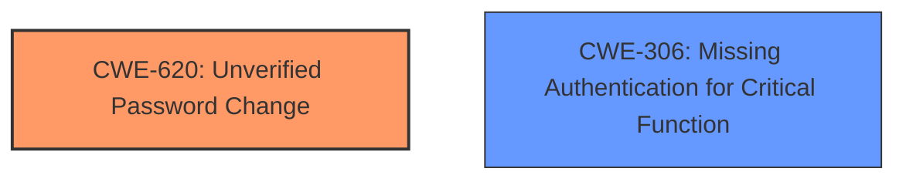

# Analysis Report for CVE-2025-46742

# Vulnerability Analysis Report: CVE-2025-46742

## Description

Users who were required to change their password could still access system information before changing their password

## Vulnerability Description Key Phrases

- **Impact:** still access system information

## Analysis (with Relationship Data)

# Summary
| CWE ID | CWE Name | Confidence | CWE Abstraction Level | CWE Vulnerability Mapping Label | CWE-Vulnerability Mapping Notes |
|---|---|---|---|---|---|
| CWE-620 | Unverified Password Change | 0.9 | Base | Allowed | Primary CWE: The system allows users to access information before verifying that they have successfully changed their password. |
| CWE-306 | Missing Authentication for Critical Function | 0.7 | Base | Allowed | Secondary Candidate: Access to system information should require authentication even after a password change request. |

## Evidence and Confidence

*   **Confidence Score:** 0.8
*   **Evidence Strength:** MEDIUM

## Relationship Analysis
The primary CWE is CWE-620, Unverified Password Change, which is a base-level CWE. CWE-306, Missing Authentication for Critical Function, is a related CWE that could also apply. CWE-620 is a more specific description of the **root cause**, which is that the system doesn't verify the password change before allowing access.



## Vulnerability Chain
The chain of events is as follows:
1.  User requests password change.
2.  The system **fails to verify** the password change (CWE-620).
3.  User gains access to system information without proper authentication (CWE-306).

## Summary of Analysis
The analysis is based on the provided vulnerability description, which states that users who were required to change their password could still access system information before changing their password. The most relevant CWE is CWE-620, Unverified Password Change, because it directly addresses the **root cause** of the vulnerability. CWE-306, Missing Authentication for Critical Function, is also relevant because it describes the resulting lack of authentication. The evidence is sufficient to support the mapping to CWE-620 as the primary weakness.

CWEs considered but not used:

*   CWE-1188: Initialization of a Resource with an Insecure Default - While potentially related, the description doesn't suggest the issue stems from an insecure default configuration.
*   CWE-256: Plaintext Storage of a Password - Irrelevant as there is no mention of passwords being stored in plaintext.
*   CWE-522: Insufficiently Protected Credentials - Irrelevant as there is no mention of credentials being transmitted or stored insecurely.
*   CWE-1390: Weak Authentication - While applicable in a broad sense, CWE-620 and CWE-306 are more specific to the vulnerability.
*   CWE-863: Incorrect Authorization - Authorization isn't the primary issue here; it's the lack of authentication following a password change request.
*   CWE-287: Improper Authentication - Similar to CWE-1390, it's too general.
*   CWE-260: Password in Configuration File - Not relevant as there is no mention of passwords in configuration files.
*   CWE-290: Authentication Bypass by Spoofing - Not relevant, the issue is not spoofing.


## CWE Relationship Analysis

Current CWEs represent these abstraction levels: .


### Vulnerability Chain Analysis

**Chain starting from CWE-1390:**
- 1390 (Weak Authentication) - ROOT


**Chain starting from CWE-863:**
- 863 (Incorrect Authorization) - ROOT


### CWE Relationship Diagram

```mermaid
graph TD
    classDef primary fill:#f96,stroke:#333,stroke-width:2px
    classDef secondary fill:#69f,stroke:#333
    classDef tertiary fill:#9e9,stroke:#333
```


*Report generated on 2025-07-15 01:36:42*
