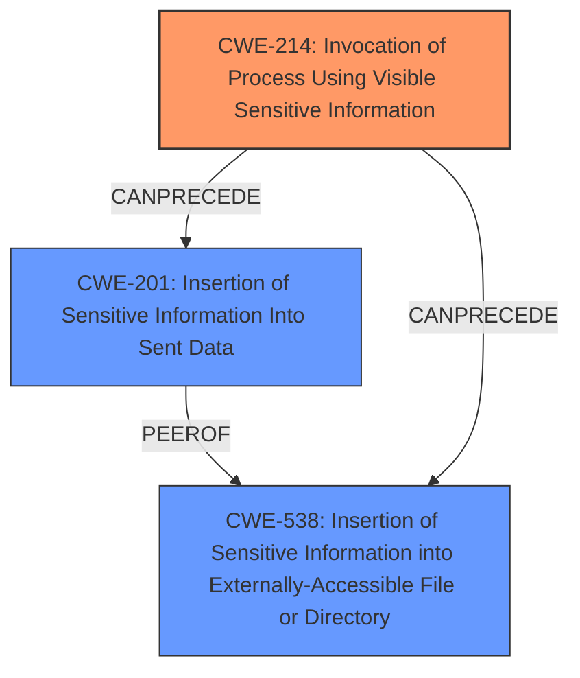

# Analysis Report for CVE-2025-46820

# Vulnerability Analysis Report: CVE-2025-46820

## Description

phpgt/Dom provides access to modern DOM APIs. Versions of phpgt/Dom prior to 4.1.8 expose the GITHUB_TOKEN in the Dom workflow run artifact. The ci.yml workflow file uses actions/upload-artifact@v4 to upload the build artifact. This artifact is a zip of the current directory, which includes the automatically generated .git/config file containing the runs GITHUB_TOKEN. Seeing as the artifact can be downloaded prior to the end of the workflow, there is a few seconds where an attacker can extract the token from the artifact and use it with the GitHub API to push malicious code or rewrite release commits in your repository. Any downstream user of the repository may be affected, but the token should only be valid for the duration of the workflow run, limiting the time during which exploitation could occur. Version 4.1.8 fixes the issue.

## Vulnerability Description Key Phrases

- **Component:** Dom workflow run artifact
- **Weakness:** GITHUB_TOKEN exposure
- **Product:** phpgt/Dom
- **Impact:** ['push malicious code', 'rewrite release commits']
- **Version:** prior to 4.1.8

## Analysis (with Relationship Data)

# Summary

| CWE ID | CWE Name | Confidence | CWE Abstraction Level | CWE Vulnerability Mapping Label | CWE-Vulnerability Mapping Notes |
|---|---|---|---|---|---|
| CWE-214 | Invocation of Process Using Visible Sensitive Information | 0.9 | Base | Allowed | Primary CWE: The root cause is the exposure of the GITHUB_TOKEN due to it being included in the artifact. |
| CWE-201 | Insertion of Sensitive Information Into Sent Data | 0.7 | Base | Allowed | Secondary Candidate: The **GITHUB_TOKEN** is sent to the artifact which is transferred. |
| CWE-538 | Insertion of Sensitive Information into Externally-Accessible File or Directory | 0.7 | Base | Allowed | Secondary Candidate: The **GITHUB_TOKEN** is inserted into a file in a directory that is made externally accessible. |

## Evidence and Confidence

*   **Confidence Score:** 0.9
*   **Evidence Strength:** HIGH

## Relationship Analysis
The primary CWE is CWE-214, which identifies the core issue of exposing sensitive information in a process. CWE-201 and CWE-538 are related in that they describe the sensitive information being sent or stored in an externally accessible location, leading to potential compromise. The abstraction levels are base, reflecting a detailed and specific mapping of the vulnerability.



## Vulnerability Chain
The vulnerability chain starts with the **GITHUB_TOKEN exposure** (CWE-214) due to the inclusion of the `.git/config` file in the artifact. This leads to the sensitive information being sent (CWE-201) and stored externally (CWE-538). The final impact is the potential for an attacker to push malicious code or rewrite release commits.

## Summary of Analysis
The analysis identified the primary weakness as the **GITHUB_TOKEN exposure** in the Dom workflow run artifact. The assessment is based on the provided evidence, including the vulnerability description and CVE reference summary, which highlight the root cause and impact. The graph relationships show how the weaknesses are connected, with CWE-214 leading to CWE-201 and CWE-538. The selected CWEs are at the optimal level of specificity, accurately reflecting the vulnerability's characteristics.

The vulnerability description states, "Versions of phpgt/Dom prior to 4.1.8 expose the GITHUB_TOKEN in the Dom workflow run artifact." This directly supports the selection of CWE-214 as the primary weakness. The description also mentions that the artifact is uploaded, suggesting the potential for external access, which is related to CWE-538.

Other CWEs Considered:

*   CWE-79 (Improper Neutralization of Input During Web Page Generation ('Cross-site Scripting')): This CWE is not relevant because the vulnerability does not involve improper neutralization of input.
*   CWE-59 (Improper Link Resolution Before File Access ('Link Following')): This CWE is not relevant because the vulnerability does not involve symbolic links or file access issues.
*   CWE-434 (Unrestricted Upload of File with Dangerous Type): This CWE is not relevant because the vulnerability is not related to uploading dangerous file types.
*   CWE-78 (Improper Neutralization of Special Elements used in an OS Command ('OS Command Injection')): This CWE is not relevant because the vulnerability does not involve OS command injection.


## CWE Relationship Analysis

Current CWEs represent these abstraction levels: .


### Vulnerability Chain Analysis

**Chain starting from CWE-59:**
- 59 (Improper Link Resolution Before File Access ('Link Following')) - ROOT


**Chain starting from CWE-79:**
- 79 (Improper Neutralization of Input During Web Page Generation ('Cross-site Scripting')) - ROOT


### CWE Relationship Diagram

```mermaid
graph TD
    classDef primary fill:#f96,stroke:#333,stroke-width:2px
    classDef secondary fill:#69f,stroke:#333
    classDef tertiary fill:#9e9,stroke:#333
```


*Report generated on 2025-07-15 01:39:45*
