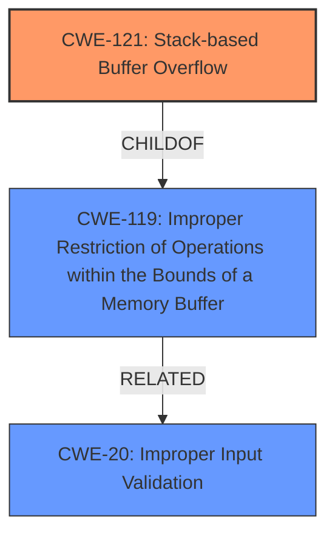

# Analysis Report for CVE-2025-46836

# Vulnerability Analysis Report: CVE-2025-46836

## Description

net-tools is a collection of programs that form the base set of the NET-3 networking distribution for the Linux operating system. Inn versions up to and including 2.10, the Linux network utilities (like ifconfig) from the net-tools package do not properly validate the structure of /proc files when showing interfaces. `get_name()` in `interface.c` copies interface labels from `/proc/net/dev` into a fixed 16-byte stack buffer without bounds checking, leading to possible arbitrary code execution or crash. The known attack path does not require privilege but also does not provide privilege escalation in this scenario. A patch is available and expected to be part of version 2.20.

## Vulnerability Description Key Phrases

- **Component:** Linux network utilities (like ifconfig) from the net-tools package
- **Rootcause:** improper validation of /proc files structure
- **Vector:** stack buffer overflow
- **Product:** net-tools
- **Impact:** arbitrary code execution, crash, privilege escalation
- **Version:** up to and including 2.10

## Analysis (with Relationship Data)

# Summary
| CWE ID   | CWE Name                                                                                                                                | Confidence | CWE Abstraction Level | CWE Vulnerability Mapping Label | CWE-Vulnerability Mapping Notes |
| :------- | :-------------------------------------------------------------------------------------------------------------------------------------- | :--------- | :---------------------- | :------------------------------ | :------------------------------ |
| CWE-121  | CWE-121: Stack-based Buffer Overflow                                                                                                     | 0.9        | Base                    | Primary                         | Allowed                         |
| CWE-119  | CWE-119: Improper Restriction of Operations within the Bounds of a Memory Buffer                                                         | 0.7        | Class                   | Secondary                       | Discouraged                     |
| CWE-20   | CWE-20: Improper Input Validation                                                                                                       | 0.6        | Class                   | Secondary                       | Discouraged                     |

## Evidence and Confidence

*   **Confidence Score:** 0.8
*   **Evidence Strength:** HIGH

## Relationship Analysis
The primary CWE is CWE-121, which is a specific type of buffer overflow that occurs on the stack. It is a child of CWE-119, which represents a more general class of buffer handling issues. CWE-119 is also related to CWE-20 as improper input validation can lead to buffer overflows.



## Vulnerability Chain
The vulnerability chain starts with **improper validation of /proc files structure** (CWE-20), which leads to a stack buffer overflow (CWE-121) due to copying interface labels without bounds checking. This can then result in arbitrary code execution or a crash.

## Summary of Analysis
The analysis indicates that the primary weakness is a stack-based buffer overflow (CWE-121). This is due to the `get_name()` function copying interface labels from `/proc/net/dev` into a fixed-size buffer without proper bounds checking. The vulnerability description and CVE details explicitly mention this. The **root cause** is the **improper validation** of the `/proc` files structure (CWE-20), which allows overly long interface names to be processed.

*   **CWE-121: Stack-based Buffer Overflow**
    *   The vulnerability description states that `get_name()` copies data into a fixed 16-byte stack buffer without bounds checking, directly leading to a stack buffer overflow.
    *   The CVE reference summary confirms the presence of a stack-based buffer overflow.
    *   This is a base-level CWE and accurately describes the specific type of buffer overflow.
    *   Confidence: 0.9

*   **CWE-119: Improper Restriction of Operations within the Bounds of a Memory Buffer**
    *   This CWE is a more general class that includes buffer overflows. While accurate, CWE-121 is more specific.
    *   CWE-119 is a Class, which makes CWE-121 the better choice since it's a Base.
    *   Confidence: 0.7

*   **CWE-20: Improper Input Validation**
    *   The vulnerability stems from the lack of validation of the `/proc` files structure, which allows overly long interface names to be processed.
    *   The vulnerability description key phrases mention "**improper validation of /proc files structure**"
    *   Confidence: 0.6

Other CWEs Considered but Not Used:

*   CWE-770, CWE-789, CWE-1284, CWE-1325: These relate to resource allocation issues, but the core problem is the lack of bounds checking during the copy operation, not the allocation itself.
*   CWE-125: Out-of-bounds Read: This is not the primary issue, although it could be a consequence of the overflow. The main problem is writing beyond the buffer's boundaries.
*   CWE-22: Improper Limitation of a Pathname to a Restricted Directory ('Path Traversal'): This is not relevant as the vulnerability does not involve path traversal.
*   CWE-78: Improper Neutralization of Special Elements used in an OS Command ('OS Command Injection'): This is not relevant as the vulnerability does not involve OS command injection.
*   CWE-863, CWE-269, CWE-285, CWE-266, CWE-250: These relate to privilege management issues, but the vulnerability is a buffer overflow and not a privilege issue.


## CWE Relationship Analysis

Current CWEs represent these abstraction levels: .


### Vulnerability Chain Analysis

**Chain starting from CWE-863:**
- 863 (Incorrect Authorization) - ROOT


**Chain starting from CWE-121:**
- 121 (Stack-based Buffer Overflow) - ROOT


### CWE Relationship Diagram

```mermaid
graph TD
    classDef primary fill:#f96,stroke:#333,stroke-width:2px
    classDef secondary fill:#69f,stroke:#333
    classDef tertiary fill:#9e9,stroke:#333
```


*Report generated on 2025-07-15 01:40:26*
