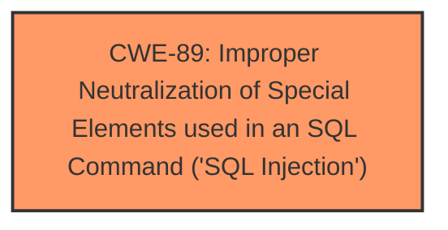

# Raw Analyzer Response for CVE-2025-4704

# Summary
| CWE ID | CWE Name | Confidence | CWE Abstraction Level | CWE Vulnerability Mapping Label | CWE-Vulnerability Mapping Notes |
|---|---|---|---|---|---|
| CWE-89 | Improper Neutralization of Special Elements used in an SQL Command ('SQL Injection') | 1.0 | Base | Primary | Allowed |

## Evidence and Confidence

*   **Confidence Score:** 1.0
*   **Evidence Strength:** HIGH

## Relationship Analysis
The primary relationship that influenced the decision was the direct match of the vulnerability description to **CWE-89**, which is a Base level CWE. The retriever results also strongly suggested **CWE-89** as the primary candidate. There are no child relationships that would provide a more specific classification in this case.

## Vulnerability Chain
The vulnerability chain consists of a single step:

1.  **Root Cause:** **CWE-89** - Improper Neutralization of Special Elements used in an SQL Command ('SQL Injection') due to the manipulation of the `editid` argument.

## Summary of Analysis
The analysis is based on the explicit statement in the vulnerability description and the CVE Reference Links Content Summary, which identifies **SQL injection** as the root cause. The CVE Reference Links Content Summary states: "The root cause lies in the fact that attackers can inject malicious code via the parameter "editid". This input is then directly utilized in SQL queries without undergoing proper sanitization or validation processes."

**CWE-89** is the most appropriate and specific CWE because the vulnerability directly involves the **improper neutralization** of special elements used in an SQL command. The retriever results also strongly support this classification, with **CWE-89** having the highest score.

Other CWEs Considered:
*   **CWE-79 (Improper Neutralization of Input During Web Page Generation ('Cross-site Scripting'))**: While input is involved, the core issue is related to SQL, not web page generation.
*   **CWE-434 (Unrestricted Upload of File with Dangerous Type)**: Not relevant as the vulnerability is not about file uploads.
*   **CWE-1336 (Improper Neutralization of Special Elements Used in a Template Engine)**: Not relevant as the vulnerability doesn't involve a template engine.
*   **CWE-73 (External Control of File Name or Path)**: Not relevant as the vulnerability doesn't involve file names or paths.

Relevant CWE Information:
**CWE-89: Improper Neutralization of Special Elements used in an SQL Command ('SQL Injection')**
**Abstraction Level**: Base
**Similarity Score**: 1.000

**Description**:
The product constructs all or part of an SQL command using externally-influenced input from an upstream component, but it does not neutralize or incorrectly neutralizes special elements that could modify the intended SQL command when it is sent to a downstream component. Without sufficient removal or quoting of SQL syntax in user-controllable inputs, the generated SQL query can cause those inputs to be interpreted as SQL instead of ordinary user data.

**Mapping Guidance**:
- Usage: Allowed
- Rationale: This CWE entry is at the Base level of abstraction, which is a preferred level of abstraction for mapping to the root causes of vulnerabilities.