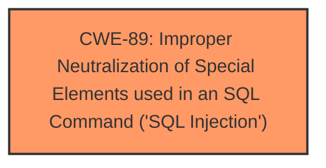

# Raw Analyzer Response for CVE-2025-4705

# Summary

| CWE ID | CWE Name | Confidence | CWE Abstraction Level | CWE Vulnerability Mapping Label | CWE-Vulnerability Mapping Notes |
|---|---|---|---|---|---|
| CWE-89 | Improper Neutralization of Special Elements used in an SQL Command ('SQL Injection') | 1.0 | Base | Allowed | Primary CWE |

## Evidence and Confidence

*   **Confidence Score:** 1.0
*   **Evidence Strength:** HIGH

## Relationship Analysis
The primary relationship that influenced the decision was the direct match of the vulnerability to the definition of CWE-89. There were no child or parent relationships that significantly altered the selection, as CWE-89 at the Base level is the most specific and appropriate classification.

## Vulnerability Chain
The vulnerability chain consists of a single step: **improper neutralization** leading directly to **SQL injection**.

## Summary of Analysis
The initial analysis identified **SQL Injection** as the primary **weakness**, which directly corresponds to CWE-89. The evidence from the CVE Reference Links Content Summary clearly states that the **/admin/view-incomingvehicle-detail.php** file has an **SQL injection** vulnerability due to insufficient validation of the "viewid" parameter. This aligns perfectly with the CWE-89 description, which involves constructing an SQL command using externally-influenced input without proper neutralization. The suggested mitigation of employing prepared statements and parameter binding further validates this classification.

The retriever results also strongly support this mapping, with CWE-89 having the highest score. The mapping guidance for CWE-89 indicates that its usage is "Allowed" and it is at the Base level of abstraction, making it an appropriate choice.

Other CWEs were considered but ultimately deemed less relevant. For example, CWE-79 (Cross-site Scripting) was considered, but the vulnerability specifically involves **SQL injection**, not the improper neutralization of input for web page generation. Similarly, CWE-434 (Unrestricted Upload of File with Dangerous Type) and CWE-1336 (Improper Neutralization of Special Elements Used in a Template Engine) were not applicable because the vulnerability does not involve file uploads or template engine usage.

The final decision is based on the direct evidence of **SQL injection** in the vulnerability description and CVE reference, as well as the strong support from the retriever results and mapping guidance for CWE-89.