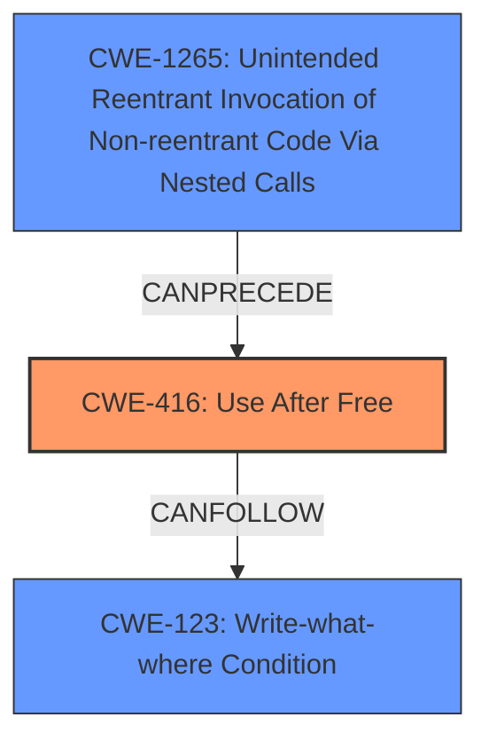

# Analysis Report for CVE-2025-47154

# Vulnerability Analysis Report: CVE-2025-47154

## Description

LibJS in Ladybird before f5a6704 **mishandles the freeing of the vector that arguments_list references**, leading to a **use-after-free**, and allowing remote attackers to execute arbitrary code via a crafted .js file. NOTE the GitHub README says Ladybird is in a pre-alpha state, and only suitable for use by developers.

## Vulnerability Description Key Phrases

- **Rootcause:** mishandles the freeing of the vector that arguments_list references
- **Weakness:** use-after-free
- **Impact:** execute arbitrary code
- **Vector:** crafted .js file
- **Attacker:** remote attackers
- **Product:** LibJS in Ladybird
- **Version:** before f5a6704

## Analysis (with Relationship Data)

# Summary
| CWE ID | CWE Name | Confidence | CWE Abstraction Level | CWE Vulnerability Mapping Label | CWE-Vulnerability Mapping Notes |
|---|---|---|---|---|---|
| CWE-416 | Use After Free | 1.0 | Variant | Primary | Allowed |

## Evidence and Confidence

*   **Confidence Score:** 1.0
*   **Evidence Strength:** HIGH

## Relationship Analysis
The primary CWE selected is CWE-416, Use After Free. This is a variant-level CWE which is a preferred level of abstraction. The graph relationships show CWE-416 can be preceded by several other CWEs, including CWE-1265 (Unintended Reentrant Invocation of Non-reentrant Code Via Nested Calls). The relationships also show it can lead to CWE-123 (Write-what-where Condition) and others.



## Vulnerability Chain
The vulnerability chain starts with **mishandling the freeing of the vector** referenced by `arguments_list`, leading to **CWE-416: Use After Free**, and ultimately allowing remote attackers to execute arbitrary code.

## Summary of Analysis
The vulnerability description clearly indicates a **use-after-free** condition. The key phrase "mishandles the freeing of the vector that arguments_list references" directly points to this type of memory management error. The CVE Reference Links Content Summary confirms this, stating the root cause is a use-after-free vulnerability on the interpreter’s argument buffer.

The Retriever Results also strongly suggest CWE-416 as the primary candidate, with a score of 1.0.

I considered other CWEs, such as CWE-415 (Double Free), but the evidence clearly points to a **use-after-free** rather than a double free. The description explicitly mentions reusing memory after it has been freed, aligning perfectly with CWE-416.

The abstraction level of CWE-416 (Variant) is appropriate, as it represents a specific type of memory management error.
I am very confident in this assessment (confidence score: 1.0) due to the explicit mention of **use-after-free** in the vulnerability description and supporting evidence.
The selected CWE is at the optimal level of specificity, providing a detailed representation of the underlying weakness.

Relevant CWE Information:
# Enhanced Context (25 CWEs)
The following CWEs were identified as potentially relevant to this vulnerability:

## CWE-416: Use After Free
**Abstraction Level**: Variant
**Similarity Score**: 0.70
**Source**: dense

**Description**:
The product reuses or references memory after it has been freed. At some point afterward, the memory may be allocated again and saved in another pointer, while the original pointer references a location somewhere within the new allocation. Any operations using the original pointer are no longer valid because the memory "belongs" to the code that operates on the new pointer.

**Mapping Guidance**:
- Usage: Allowed
- Rationale: This CWE entry is at the Variant level of abstraction, which is a preferred level of abstraction for mapping to the root causes of vulnerabilities.


## CWE Relationship Analysis

Current CWEs represent these abstraction levels: .


### Vulnerability Chain Analysis

**Chain starting from CWE-1265:**
- 1265 (Unintended Reentrant Invocation of Non-reentrant Code Via Nested Calls) - ROOT


**Chain starting from CWE-123:**
- 123 (Write-what-where Condition) - ROOT


### CWE Relationship Diagram

```mermaid
graph TD
    classDef primary fill:#f96,stroke:#333,stroke-width:2px
    classDef secondary fill:#69f,stroke:#333
    classDef tertiary fill:#9e9,stroke:#333
```


*Report generated on 2025-07-15 01:47:20*
