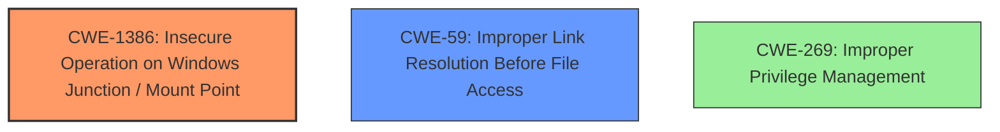

# Analysis for CVE-2025-47161

# Summary

| CWE ID  | CWE Name                                                                   | Confidence | CWE Abstraction Level | CWE Vulnerability Mapping Label | CWE-Vulnerability Mapping Notes |
| :-------- | :------------------------------------------------------------------------- | :--------- | :-------------------- | :------------------------------ | :---------------------------- |
| CWE-1386 | Insecure Operation on Windows Junction / Mount Point                        | 0.75       | Base                  | Allowed                         | Primary CWE                   |
| CWE-59  | Improper Link Resolution Before File Access ('Link Following') | 0.6       | Base                  | Allowed                         | Secondary Candidate                   |
| CWE-269  | Improper Privilege Management                   | 0.2       | Class                  | Discouraged                        | Secondary Candidate                   |

## Evidence and Confidence

*   **Confidence Score:** 0.7
*   **Evidence Strength:** LOW

## Relationship Analysis

The primary CWE, CWE-1386, is a base-level weakness that directly addresses the insecure operation on Windows Junction/Mount Points. CWE-59, a parent of several more specific weaknesses related to link resolution, is a less precise but relevant alternative. CWE-269 is a class-level weakness and is too general, with more specific children being more appropriate.

## Vulnerability Chain

The vulnerability chain starts with the **insecure operation on Windows Junction/Mount Points (CWE-1386)**, potentially leading to improper link resolution (CWE-59) and culminating in elevation of privilege.

## Summary of Analysis

Based on the limited evidence, the primary weakness appears to stem from an **insecure operation on Windows Junction/Mount Points (CWE-1386)**. This can lead to an elevation of privilege, as indicated in the vulnerability description.

The choice of CWE-1386 is based on its specificity and direct relevance to the "Windows Junction / Mount Point" aspect of the vulnerability. While the vulnerability description is sparse, the inclusion of this technology makes CWE-1386 the most appropriate choice among the candidates.

The **improper link resolution (CWE-59)** is possible because Junctions and Mount Points are links.

Other CWEs were considered but deemed less suitable:

*   CWE-22 and CWE-23: While related to path traversal, they are less specific than CWE-1386 in the context of Windows Junctions/Mount Points.
*   CWE-269, CWE-266, CWE-267: These relate to privilege management but are less directly tied to the specific mechanism of the vulnerability (Windows Junctions/Mount Points).
*   CWE-732: Incorrect Permission Assignment for Critical Resource is too general.
*   CWE-426: Untrusted Search Path is not relevant as there's no mention of search paths in the description.

Relevant CWE Information:

# Enhanced Context (25 CWEs)
The following CWEs were identified as potentially relevant to this vulnerability:

## CWE-1386: Insecure Operation on Windows Junction / Mount Point
**Abstraction Level**: Base
**Similarity Score**: 0.541
**Source**: dense

**Description**:
The application performs an operation on a Windows junction or mount point in an insecure manner, which could cause unintended code to be executed, or other unexpected behavior.

**Mapping Guidance**:
- Usage: Allowed
- Rationale: This CWE entry is at the Base level of abstraction, which is a preferred level of abstraction for mapping to the root causes of vulnerabilities.

# Complete CWE Specifications

CWE-65: Windows Hard Link

CWE-59: Improper Link Resolution Before File Access ('Link Following')

CWE-23: Relative Path Traversal

CWE-295: Improper Certificate Validation

CWE-1285: Improper Validation of Specified Index, Position, or Offset in Input

CWE-732: Incorrect Permission Assignment for Critical Resource

CWE-131: Incorrect Calculation of Buffer Size

CWE-426: Untrusted Search Path

CWE-1386: Insecure Operation on Windows Junction / Mount Point

CWE-22: Improper Limitation of a Pathname to a Restricted Directory ('Path Traversal')