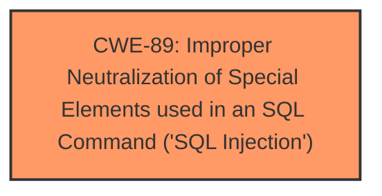

# Enhanced Analysis for CVE-2025-4717

# Summary

| CWE ID | CWE Name | Confidence | CWE Abstraction Level | CWE Vulnerability Mapping Label | CWE-Vulnerability Mapping Notes |
|---|---|---|---|---|---|
| CWE-89 | Improper Neutralization of Special Elements used in an SQL Command ('SQL Injection') | 1.0 | Base | Allowed | Primary CWE |

## Evidence and Confidence

*   **Confidence Score:** 1.0
*   **Evidence Strength:** HIGH

## Relationship Analysis
The primary relationship observed is that of CWE-89 standing alone as the direct and most specific classification for this vulnerability. There are no clear parent-child or chain relationships that influence this decision, as the description directly points to **SQL Injection** as the root cause.



## Vulnerability Chain
The vulnerability chain is straightforward:
1.  **Root Cause:** **Improper neutralization** of special elements used in SQL commands (**SQL Injection** - CWE-89) via the `fullname` parameter.
2.  **Impact:** Unauthorized database access, data leakage, data tampering, potential system control.

## Summary of Analysis
The initial analysis strongly suggests CWE-89 as the primary weakness, and a critical review of the supporting evidence solidifies this assessment. The vulnerability description explicitly mentions **SQL injection** due to the manipulation of the `fullname` argument in the `/visitors-form.php` file. The CVE Reference Links Content Summary confirms this, stating that attackers can inject malicious code via the `fullname` parameter, which is then directly used in SQL queries without proper sanitization or validation.

The graph relationships do not alter this conclusion; the evidence directly supports CWE-89. The abstraction level is optimal, as CWE-89 is a Base-level CWE, providing a specific description of the **SQL injection** vulnerability.

Relevant CWE Information:

# Enhanced Context (25 CWEs)
The following CWEs were identified as potentially relevant to this vulnerability:

## CWE-89: Improper Neutralization of Special Elements used in an SQL Command ('SQL Injection')
**Abstraction Level**: Base
**Similarity Score**: 1.00
**Source**: dense, sparse, graph

**Description**:
The product constructs all or part of an SQL command using externally-influenced input from an upstream component, but it does not neutralize or incorrectly neutralizes special elements that could modify the intended SQL command when it is sent to a downstream component. Without sufficient removal or quoting of SQL syntax in user-controllable inputs, the generated SQL query can cause those inputs to be interpreted as SQL instead of ordinary user data.

**Mapping Guidance**:
- Usage: Allowed
- Rationale: This CWE entry is at the Base level of abstraction, which is a preferred level of abstraction for mapping to the root causes of vulnerabilities.

## CWE-79: Improper Neutralization of Input During Web Page Generation ('Cross-site Scripting')
**Abstraction Level**: Base
**Similarity Score**: 0.42
**Source**: sparse, graph

**Description**:
The product does not neutralize or incorrectly neutralizes user-controllable input before it is placed in output that is used as a web page that is served to other users.

**Mapping Guidance**:
- Usage: Allowed
- Rationale: This CWE entry is at the Base level of abstraction, which is a preferred level of abstraction for mapping to the root causes of vulnerabilities.

## CWE-434: Unrestricted Upload of File with Dangerous Type
**Abstraction Level**: Base
**Similarity Score**: 0.35
**Source**: sparse, graph

**Description**:
The product allows the upload or transfer of dangerous file types that are automatically processed within its environment.

**Mapping Guidance**:
- Usage: Allowed
- Rationale: This CWE entry is at the Base level of abstraction, which is a preferred level of abstraction for mapping to the root causes of vulnerabilities.

**CWEs Considered but Not Used:**

*   **CWE-79: Improper Neutralization of Input During Web Page Generation ('Cross-site Scripting')**: While input neutralization is a general concern, the specific vulnerability is related to SQL commands, not web page generation. Thus, CWE-79 is not appropriate.
*   **CWE-434: Unrestricted Upload of File with Dangerous Type**: This CWE is irrelevant as the vulnerability does not involve file uploads.
*   **CWE-1336: Improper Neutralization of Special Elements Used in a Template Engine**: This CWE is not applicable as the vulnerability doesn't involve template engines.
*   **CWE-352: Cross-Site Request Forgery (CSRF)**: This is not relevant as the attack vector and description don't involve CSRF.
*   **CWE-80: Improper Neutralization of Script-Related HTML Tags in a Web Page (Basic XSS)**: Similar to CWE-79, this is related to XSS, not SQL injection.
*   **CWE-117: Improper Output Neutralization for Logs**: The vulnerability is not related to log outputs but directly to SQL command construction.
*   **CWE-472: External Control of Assumed-Immutable Web Parameter**: While the `fullname` parameter is externally controlled, the core issue is **improper neutralization** in SQL, not the external control itself.
*   **CWE-73: External Control of File Name or Path**: The vulnerability is not related to file name or path manipulation, making this CWE irrelevant.


## CWE Relationship Analysis

Current CWEs represent these abstraction levels: .


### Vulnerability Chain Analysis

**Chain starting from CWE-89:**
- 89 (Improper Neutralization of Special Elements used in an SQL Command ('SQL Injection')) - ROOT


**Chain starting from CWE-80:**
- 80 (Improper Neutralization of Script-Related HTML Tags in a Web Page (Basic XSS)) - ROOT


### CWE Relationship Diagram

```mermaid
graph TD
    classDef primary fill:#f96,stroke:#333,stroke-width:2px
    classDef secondary fill:#69f,stroke:#333
    classDef tertiary fill:#9e9,stroke:#333
```