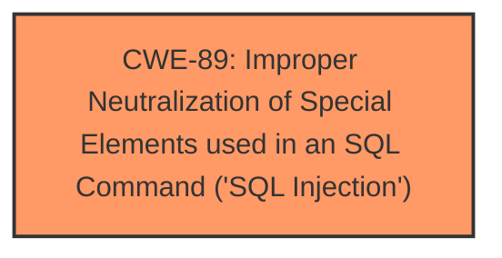

# Analysis for CVE-2025-4722

# Summary
| CWE ID | CWE Name | Confidence | CWE Abstraction Level | CWE Vulnerability Mapping Label | CWE-Vulnerability Mapping Notes |
|---|---|---|---|---|---|
| CWE-89 | Improper Neutralization of Special Elements used in an SQL Command ('SQL Injection') | 1.0 | Base | Primary | Allowed |

## Evidence and Confidence

*   **Confidence Score:** 1.0
*   **Evidence Strength:** HIGH

## Relationship Analysis
The primary identified CWE is CWE-89, which is a Base level CWE. There are no direct parent or child relationships significantly influencing this selection given the clear evidence of **SQL Injection**. While other CWEs exist, they represent either broader categories or different attack vectors. CWE-89 directly aligns with the vulnerability description and is the most specific and relevant choice.

## Vulnerability Chain
The vulnerability chain is straightforward:
1.  **Root Cause:** **Improper neutralization** of special elements in the `Name` argument in `/edit_profile.php`, leading to CWE-89 (**SQL Injection**).
2.  **Impact:** Unauthorized database access, sensitive data leakage, data tampering, comprehensive system control, and even service interruption.

## Summary of Analysis
The vulnerability is a clear case of **SQL injection** due to **improper neutralization** of input within an SQL query.

Evidence:
*   Vulnerability Description: "The manipulation of the argument Name leads to **sql injection**."
*   CVE Reference Links Content Summary: "Attackers inject malicious code from the parameter 'name‘ and use it directly in SQL queries without the need for appropriate cleaning or validation.", "Weaknesses/vulnerabilities present: SQL injection"

The retriever results strongly support CWE-89 as the primary CWE, with a score of 1.0 based on alternate terms. The provided evidence directly confirms the presence of **SQL injection**, making CWE-89 the most appropriate and specific classification.

Other considered CWEs:

*   CWE-79 (Improper Neutralization of Input During Web Page Generation ('Cross-site Scripting')): While also related to input neutralization, this is specific to Cross-Site Scripting (XSS) vulnerabilities, which is not the case here.
*   CWE-434 (Unrestricted Upload of File with Dangerous Type): This CWE is not relevant as the vulnerability is not related to file uploads.
*   CWE-74 (Improper Neutralization of Special Elements in Output Used by a Downstream Component ('Injection')): This is too high level.
*   CWE-78 (Improper Neutralization of Special Elements used in an OS Command ('OS Command Injection')): This is specific to OS Command Injection, which is not the case here.