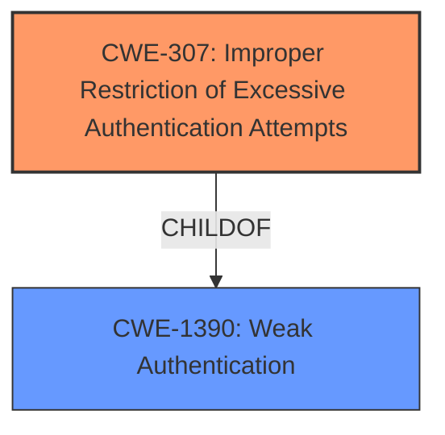

# Analysis Report for CVE-2025-47275

# Vulnerability Analysis Report: CVE-2025-47275

## Description

Auth0-PHP provides the PHP SDK for Auth0 Authentication and Management APIs. Starting in version 8.0.0-BETA1 and prior to version 8.14.0, session cookies of applications using the Auth0-PHP SDK configured with CookieStore have authentication tags that can be brute forced, which may result in unauthorized access. Certain pre-conditions are required to be vulnerable to this issue Applications using the Auth0-PHP SDK, or the Auth0/symfony, Auth0/laravel-auth0, and Auth0/wordpress SDKs that rely on the Auth0-PHP SDK and session storage configured with CookieStore. Upgrade Auth0/Auth0-PHP to v8.14.0 to receive a patch. As an additional precautionary measure, rotating cookie encryption keys is recommended. Note that once updated, any previous session cookies will be rejected.

## Vulnerability Description Key Phrases

- **Component:** session cookies
- **Rootcause:** authentication tags can be brute forced
- **Product:** Auth0-PHP SDK, Auth0/symfony, Auth0/laravel-auth0, Auth0/wordpress SDKs
- **Impact:** unauthorized access
- **Version:** 8.0.0-BETA1 to 8.14.0

## Analysis (with Relationship Data)

# Summary
| CWE ID | CWE Name | Confidence | CWE Abstraction Level | CWE Vulnerability Mapping Label | CWE-Vulnerability Mapping Notes |
|---|---|---|---|---|---|
| CWE-307 | Improper Restriction of Excessive Authentication Attempts | 0.9 | Base | Primary | Allowed |
| CWE-1390 | Weak Authentication | 0.6 | Class | Secondary | Allowed-with-Review |

## Evidence and Confidence

*   **Confidence Score:** 0.8
*   **Evidence Strength:** HIGH

## Relationship Analysis
The primary CWE is CWE-307, which focuses on the specific issue of failing to restrict excessive authentication attempts, aligning with the **brute force** nature of the vulnerability. CWE-1390 is a broader Class-level CWE related to weak authentication mechanisms. While applicable, it is less specific than CWE-307.



## Vulnerability Chain
The vulnerability chain starts with the **weakness** that authentication tags can be **brute forced**. This leads to the impact of unauthorized access. The **root cause** is the **improper restriction of excessive authentication attempts**.

## Summary of Analysis
The analysis is based on the provided evidence, specifically the vulnerability description and the CVE reference links content summary. The key phrase "authentication tags can be **brute forced**" strongly suggests CWE-307 (Improper Restriction of Excessive Authentication Attempts). CWE-1390 (Weak Authentication) is considered as a secondary CWE, as it is a more general class encompassing the specific flaw.

The choice of CWE-307 is at the optimal level of specificity because it directly addresses the **root cause** of the vulnerability which is the susceptibility to **brute force** attacks due to the lack of proper restrictions on authentication attempts.

Relevant CWE Information:

# Enhanced Context (25 CWEs)
The following CWEs were identified as potentially relevant to this vulnerability:

## Vulnerability Description
Auth0-PHP provides the PHP SDK for Auth0 Authentication and Management APIs. Starting in version 8.0.0-BETA1 and prior to version 8.14.0, session cookies of applications using the Auth0-PHP SDK configured with CookieStore have authentication tags that can be **brute forced**, which may result in unauthorized access. Certain pre-conditions are required to be vulnerable to this issue Applications using the Auth0-PHP SDK, or the Auth0/symfony, Auth0/laravel-auth0, and Auth0/wordpress SDKs that rely on the Auth0-PHP SDK and session storage configured with CookieStore. Upgrade Auth0/Auth0-PHP to v8.14.0 to receive a patch. As an additional precautionary measure, rotating cookie encryption keys is recommended. Note that once updated, any previous session cookies will be rejected.

### Vulnerability Description Key Phrases
- **component:** session cookies
- **rootcause:** authentication tags can be **brute forced**
- **product:** Auth0-PHP SDK, Auth0/symfony, Auth0/laravel-auth0, Auth0/wordpress SDKs
- **impact:** unauthorized access
- **version:** 8.0.0-BETA1 to 8.14.0

## CVE Reference Links Content Summary
```
Root cause of vulnerability:
Session cookies of applications using the Auth0-PHP SDK (and related SDKs like Auth0/symfony, Auth0/laravel-auth0, Auth0/wordpress) configured with CookieStore have authentication tags that can be **brute forced**.

Weaknesses/vulnerabilities present:
- **Brute force** vulnerability in authentication tags of session cookies.

Impact of exploitation:
Unauthorized access to applications.

Attack vectors:
- Network-based attack.

Required attacker capabilities/position:
- No privileges required.
- No user interaction required.

Mitigation or fix:
- Upgrade Auth0/Auth0-PHP to v8.14.0.
- Rotate cookie encryption keys.
- Upgrade Auth0/laravel-auth0 to v7.17.0
- Upgrade Auth0/symfony to v5.4.0
- Upgrade Auth0/wordpress plugin to v5.3.0
```

CWE-307: Improper Restriction of Excessive Authentication Attempts
The product allows an attacker to make repeated authentication attempts, which can lead to account lockout bypass, **brute force** attacks, or denial of service.

CWE-1390: Weak Authentication
The product uses an authentication mechanism to restrict access to specific users or identities, but the mechanism does not sufficiently prove that the claimed identity is correct.

The phrase "authentication tags can be **brute forced**" from the vulnerability description and the CVE reference links content summary aligns perfectly with the definition of CWE-307. This indicates a failure to properly restrict excessive authentication attempts, allowing an attacker to potentially gain unauthorized access through **brute force**. While CWE-1390 is relevant due to the authentication context, CWE-307 provides a more precise classification of the vulnerability.

The retriever results include CWE-799 (Improper Control of Interaction Frequency), CWE-1390 (Weak Authentication), and CWE-863 (Incorrect Authorization). However, CWE-799 is a Class-level CWE and less specific than CWE-307. CWE-1390, as discussed, is a broader category. CWE-863 doesn't fully capture the **brute force** aspect of the vulnerability.

CWE-287 (Improper Authentication) was considered but not used because the core issue isn't the authentication process itself being flawed, but rather the lack of restrictions on the number of attempts, which is better represented by CWE-307.

CWE-330 (Use of Insufficiently Random Values) could be related if the authentication tags used predictable values, but there is no specific information in the vulnerability description to support this.


## CWE Relationship Analysis

Current CWEs represent these abstraction levels: .


### Vulnerability Chain Analysis

**Chain starting from CWE-1390:**
- 1390 (Weak Authentication) - ROOT


**Chain starting from CWE-863:**
- 863 (Incorrect Authorization) - ROOT


### CWE Relationship Diagram

```mermaid
graph TD
    classDef primary fill:#f96,stroke:#333,stroke-width:2px
    classDef secondary fill:#69f,stroke:#333
    classDef tertiary fill:#9e9,stroke:#333
```


*Report generated on 2025-07-15 01:53:31*
