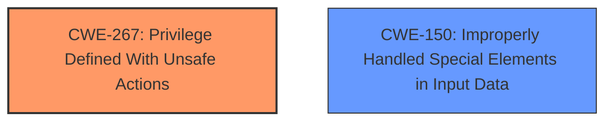

# Raw Analyzer Response for CVE-2025-47284

# Summary
| CWE ID | CWE Name | Confidence | CWE Abstraction Level | CWE Vulnerability Mapping Label | CWE-Vulnerability Mapping Notes |
|---|---|---|---|---|---|
| CWE-267 | Privilege Defined With Unsafe Actions | 0.8 | Base | Allowed | Primary CWE. The vulnerability allows a user with administrative privileges to perform actions that were not intended, leading to control over the seed cluster(s). |
| CWE-150 | Improperly Handled Special Elements in Input Data | 0.6 | Base | Allowed | Secondary CWE. The CVE Reference Link mentions that this CWE is present in the vulnerability. |

## Evidence and Confidence

*   **Confidence Score:** 0.7
*   **Evidence Strength:** MEDIUM

## Relationship Analysis
The primary CWE, CWE-267, is a Base level CWE, which is a preferred level of abstraction. The retriever results list several Class level CWEs like CWE-863, CWE-285, and CWE-269. These were not selected as the evidence is more specific and better aligns with the base CWE. There are no significant parent-child relationships to influence the primary selection. There is a secondary CWE, CWE-150, which is a Base level CWE.

## Vulnerability Chain
The vulnerability chain starts with metadata injection leading to privilege escalation due to **CWE-267 Privilege Defined With Unsafe Actions**. This leads to the impact of a user with administrative privileges gaining control over the seed cluster. The CVE Reference Link mentions that **CWE-150 Improperly Handled Special Elements in Input Data** is also present.

## Summary of Analysis
The initial assessment considered several CWEs from the Retriever Results, especially those related to authorization and privileges. However, the evidence from the vulnerability description and CVE reference links pointed towards **CWE-267 Privilege Defined With Unsafe Actions** as the most accurate primary mapping. This is because the vulnerability allows a user with administrative privileges to perform actions that were not intended, leading to control over the seed cluster(s). The inclusion of **CWE-150 Improperly Handled Special Elements in Input Data** from the CVE Reference Link adds another aspect to the analysis.

Relevant CWE Information:

# Enhanced Context (25 CWEs)
The following CWEs were identified as potentially relevant to this vulnerability:

## CWE-267: Privilege Defined With Unsafe Actions
**Abstraction Level**: Base
**Similarity Score**: 0.81
**Source**: dense

**Description**:
A particular privilege, role, capability, or right can be used to perform unsafe actions that were not intended, even when it is assigned to the correct entity.

**Mapping Guidance**:
- Usage: Allowed
- Rationale: This CWE entry is at the Base level of abstraction, which is a preferred level of abstraction for mapping to the root causes of vulnerabilities.