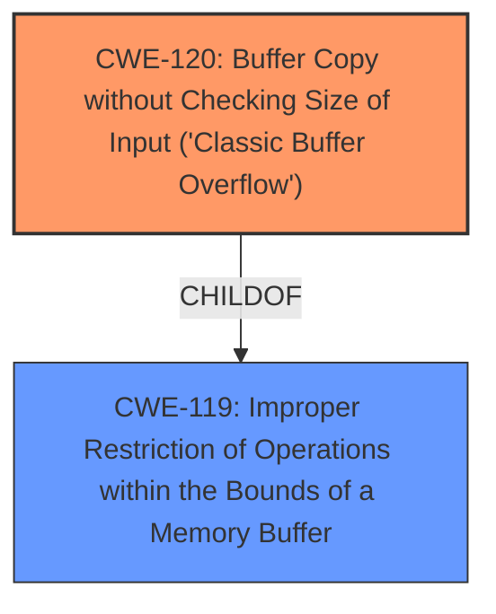

# Analysis for CVE-2025-4730

# Summary

| CWE ID  | CWE Name                                                                             | Confidence | CWE Abstraction Level | CWE Vulnerability Mapping Label | CWE-Vulnerability Mapping Notes |
| ------- | ------------------------------------------------------------------------------------ | ---------- | --------------------- | ------------------------------- | ------------------------------- |
| CWE-120 | Buffer Copy without Checking Size of Input ('Classic Buffer Overflow')                  | 0.9        | Base                  | Primary                         | Allowed-with-Review             |
| CWE-119 | Improper Restriction of Operations within the Bounds of a Memory Buffer                | 0.7        | Class                 | Secondary                       | Discouraged                   |

## Evidence and Confidence

*   **Confidence Score:** 0.8
*   **Evidence Strength:** MEDIUM

## Relationship Analysis

The primary CWE is CWE-120, which is a base-level CWE. It is a specific type of buffer overflow where the size of the input is not checked before copying it to a buffer. CWE-119 is a broader class that encompasses all buffer overflows, but CWE-120 is more specific to the vulnerability. CWE-120 can precede CWE-456, CWE-416, CWE-231, and CWE-170.

## Vulnerability Chain

The vulnerability chain starts with the **buffer overflow** due to the **missing check of the input size**. This leads to memory corruption and potentially allows an attacker to execute arbitrary code.

## Summary of Analysis

The vulnerability description clearly indicates a **buffer overflow** condition when manipulating the argument `devicemac1` in the `/boafrm/formMapDel` component of the HTTP POST Request Handler. The description states that the **buffer overflow** is the root cause.

CWE-120 (Buffer Copy without Checking Size of Input ('Classic Buffer Overflow')) is the most appropriate primary CWE because the vulnerability involves a buffer copy operation where the size of the input is not checked before copying it into the buffer. This aligns perfectly with the CWE-120 description. The usage is "Allowed-with-Review" but given the details provided, it is an acceptable match.

CWE-119 (Improper Restriction of Operations within the Bounds of a Memory Buffer) is a related, more general CWE. Since CWE-120 provides a more precise description of the vulnerability, it is preferred. The usage is "Discouraged", which supports this decision.

Other CWEs considered but not used:

*   CWE-190 (Integer Overflow or Wraparound): This CWE is not relevant because the vulnerability is not related to integer overflows.
*   CWE-89 (Improper Neutralization of Special Elements used in an SQL Command ('SQL Injection')): This CWE is not relevant because the vulnerability is not related to SQL injection.
*   CWE-79 (Improper Neutralization of Input During Web Page Generation ('Cross-site Scripting')): This CWE is not relevant because the vulnerability is not related to Cross-site scripting.
*   CWE-121 (Stack-based Buffer Overflow): While this is a buffer overflow, the description doesn't specify that it is stack-based. CWE-120 is a better fit.
*   CWE-125 (Out-of-bounds Read): This CWE is about reading out of bounds, while this vulnerability is about writing out of bounds.
*   CWE-78 (Improper Neutralization of Special Elements used in an OS Command ('OS Command Injection')): This CWE is not relevant because the vulnerability is not related to OS command injection.
*   CWE-128 (Wrap-around Error): This CWE is not relevant because the vulnerability is not related to wrap-around errors.