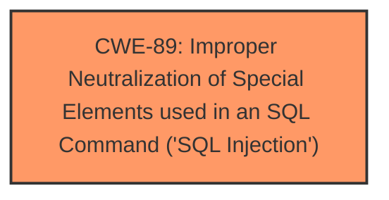

# Analysis Report for CVE-2025-4746

# Vulnerability Analysis Report: CVE-2025-4746

## Description

A vulnerability has been found in Campcodes Sales and Inventory System 1.0 and classified as critical. This vulnerability affects unknown code of the file /pages/purchase_delete.php. The manipulation of the argument pr_id leads to **sql injection**. The attack can be initiated remotely. The exploit has been disclosed to the public and may be used.

## Vulnerability Description Key Phrases

- **Weakness:** sql injection
- **Product:** Campcodes Sales and Inventory System
- **Version:** 1.0
- **Component:** /pages/purchase_delete.php

## Analysis (with Relationship Data)

# Summary
| CWE ID | CWE Name | Confidence | CWE Abstraction Level | CWE Vulnerability Mapping Label | CWE-Vulnerability Mapping Notes |
|---|---|---|---|---|---|
| CWE-89 | Improper Neutralization of Special Elements used in an SQL Command ('SQL Injection') | 1.0 | Base | Allowed | Primary CWE |

## Evidence and Confidence

*   **Confidence Score:** 1.0
*   **Evidence Strength:** HIGH

## Relationship Analysis
The primary relationship that influenced my decision was the direct match of the vulnerability description to the CWE-89 definition. There are no child or parent relationships relevant in this specific instance as the description directly maps to the base CWE.



## Vulnerability Chain
The vulnerability chain consists of a single step: the **improper neutralization** of input leading directly to **SQL injection**.

## Summary of Analysis
The analysis is based on the provided evidence, which clearly states that the vulnerability is due to **SQL injection** in the `/pages/purchase_delete.php` file, specifically through the `pr_id` parameter. The CVE Reference Links Content Summary reinforces this by mentioning the **insufficient user input validation** of the `pr_id` parameter, allowing attackers to inject malicious SQL queries.

The retriever results strongly support CWE-89 as the primary CWE with a score of 1.0. The description of CWE-89 perfectly matches the vulnerability, which involves **improper neutralization** of special elements used in an SQL command.

The selection of CWE-89 is at the optimal level of specificity because it directly addresses the root cause of the vulnerability, which is the **improper neutralization** leading to **SQL injection**.

Relevant CWE Information:

# Enhanced Context (25 CWEs)
The following CWEs were identified as potentially relevant to this vulnerability:

## CWE-89: Improper Neutralization of Special Elements used in an SQL Command ('SQL Injection')
**Abstraction Level**: Base
**Similarity Score**: 1.0
**Source**: dense

**Description**:
The product constructs all or part of an SQL command using externally-influenced input from an upstream component, but it does not neutralize or incorrectly neutralizes special elements that could modify the intended SQL command when it is sent to a downstream component. Without sufficient removal or quoting of SQL syntax in user-controllable inputs, the generated SQL query can cause those inputs to be interpreted as SQL instead of ordinary user data.

**Mapping Guidance**:
- Usage: Allowed
- Rationale: This CWE entry is at the Base level of abstraction, which is a preferred level of abstraction for mapping to the root causes of vulnerabilities.


## CWE Relationship Analysis

Current CWEs represent these abstraction levels: .


### Vulnerability Chain Analysis

**Chain starting from CWE-89:**
- 89 (Improper Neutralization of Special Elements used in an SQL Command ('SQL Injection')) - ROOT


### CWE Relationship Diagram

```mermaid
graph TD
    classDef primary fill:#f96,stroke:#333,stroke-width:2px
    classDef secondary fill:#69f,stroke:#333
    classDef tertiary fill:#9e9,stroke:#333
```


*Report generated on 2025-07-15 02:00:53*
