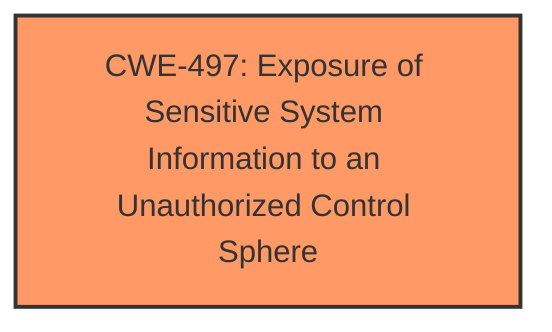

# Analysis Report for CVE-2025-4750

# Vulnerability Analysis Report: CVE-2025-4750

## Description

A vulnerability, which was classified as problematic, has been found in D-Link DI-7003GV2 24.04.18D1 R(68125). This issue affects some unknown processing of the file /H5/get_version.data of the component Configuration Handler. The manipulation leads to information disclosure. The attack may be initiated remotely. The exploit has been disclosed to the public and may be used.

## Vulnerability Description Key Phrases

- **Impact:** information disclosure
- **Product:** D-Link DI-7003GV2
- **Version:** 24.04.18D1 R(68125)
- **Component:** Configuration Handler

## Analysis (with Relationship Data)

# Summary
| CWE ID | CWE Name | Confidence | CWE Abstraction Level | CWE Vulnerability Mapping Label | CWE-Vulnerability Mapping Notes |
|---|---|---|---|---|---|
| CWE-497 | Exposure of Sensitive System Information to an Unauthorized Control Sphere | 0.7 | Base | Primary | Allowed |

## Evidence and Confidence

*   **Confidence Score:** 0.7
*   **Evidence Strength:** LOW

## Relationship Analysis
The primary relationship considered was that CWE-497 is a base level CWE and fits the description of information disclosure. No child or parent relationships influenced this decision due to the lack of sufficient evidence.



## Vulnerability Chain
The vulnerability chain is simple: **improper** handling of configuration data leads to information disclosure. The description indicates that a remote attacker can access `/H5/get_version.data` and obtain sensitive information.

## Summary of Analysis
The initial assessment focused on identifying the root cause of the information disclosure vulnerability. Given the limited information, the best fit is CWE-497, "Exposure of Sensitive System Information to an Unauthorized Control Sphere". This CWE accurately describes the scenario where sensitive system information is exposed to unauthorized actors due to **improper** access controls or handling of the data.

The "Vulnerability Description Key Phrases" indicate the **impact** is "information disclosure" due to some **improper** processing of `/H5/get_version.data`. The CVE Reference Links Content Summary is "UNRELATED", so there is no more information.

CWE-497 is a base level CWE, which aligns with the goal of selecting the most specific CWE possible.

Other CWEs Considered and Rejected:

*   CWE-79, CWE-89, CWE-117, CWE-78, CWE-93: These CWEs relate to injection vulnerabilities, which are not indicated in the description. There is no mention of input being improperly neutralized.
*   CWE-266: Incorrect Privilege Assignment. While related to security, there is nothing indicating incorrect privilege assignment.
*   CWE-425: Direct Request ('Forced Browsing'). Although this could be a contributing factor, it doesn't precisely capture the **root cause**, which is the exposure of sensitive information.
*   CWE-755: Improper Handling of Exceptional Conditions is too generic.
*   CWE-790: Improper Filtering of Special Elements is not appropriate, since there is no filtering occurring.

I am overriding the Retriever Results because the description indicates information disclosure is the end result and there is no evidence of injection.


## CWE Relationship Analysis

Current CWEs represent these abstraction levels: .


### Vulnerability Chain Analysis

**Chain starting from CWE-89:**
- 89 (Improper Neutralization of Special Elements used in an SQL Command ('SQL Injection')) - ROOT


**Chain starting from CWE-93:**
- 93 (Improper Neutralization of CRLF Sequences ('CRLF Injection')) - ROOT


### CWE Relationship Diagram

```mermaid
graph TD
    classDef primary fill:#f96,stroke:#333,stroke-width:2px
    classDef secondary fill:#69f,stroke:#333
    classDef tertiary fill:#9e9,stroke:#333
```


*Report generated on 2025-07-15 02:01:49*
