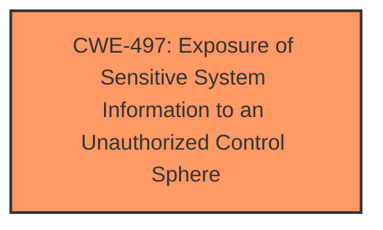

# Enhanced Analysis for CVE-2025-4751

# Summary
| CWE ID | CWE Name | Confidence | CWE Abstraction Level | CWE Vulnerability Mapping Label | CWE-Vulnerability Mapping Notes |
|---|---|---|---|---|---|
| CWE-497 | Exposure of Sensitive System Information to an Unauthorized Control Sphere | 0.7 | Base | Allowed | Primary CWE |

## Evidence and Confidence

*   **Confidence Score:** 0.7
*   **Evidence Strength:** LOW

## Relationship Analysis
The primary identified weakness is CWE-497 **Exposure of Sensitive System Information to an Unauthorized Control Sphere**. This is a base level CWE. There are no direct parent or child relationships identified that would suggest a more specific or general classification is warranted based on the limited information.



## Vulnerability Chain
The vulnerability chain starts with the **exposure of sensitive system information** (CWE-497). The vulnerability description indicates that the manipulation of `/index.data` leads to information disclosure.

## Summary of Analysis
The vulnerability description indicates that manipulating the file `/index.data` leads to **information disclosure**. The best fit from the provided CWEs is CWE-497 **Exposure of Sensitive System Information to an Unauthorized Control Sphere**.

Other CWEs were considered but ultimately deemed less suitable:

*   CWE-79, CWE-89, CWE-78, CWE-80: These relate to injection vulnerabilities and require improper neutralization of input, which is not mentioned in the description.
*   CWE-425: Direct Request ('Forced Browsing'): This is related to authorization issues, but the description focuses on **information disclosure** rather than unauthorized access.
*   CWE-755: Improper Handling of Exceptional Conditions: This is a very general CWE and not specific to information disclosure.

The evidence is weak because there is no "CVE Reference Links Content Summary" section to show rootcause and weakness mechanisms and the "Vulnerability Description Key Phrases" only shows the impact and not the rootcause or weakness.

Relevant CWE Information:

# Enhanced Context (25 CWEs)
The following CWEs were identified as potentially relevant to this vulnerability:

## CWE-497: Exposure of Sensitive System Information to an Unauthorized Control Sphere
**Abstraction Level**: Base
**Similarity Score**: 0.77
**Source**: dense

**Description**:
The product does not properly prevent sensitive system-level information from being accessed by unauthorized actors who do not have the same level of access to the underlying system as the product does.

**Mapping Guidance**:
- Usage: Allowed
- Rationale: This CWE entry is at the Base level of abstraction, which is a preferred level of abstraction for mapping to the root causes of vulnerabilities.


## CWE Relationship Analysis

Current CWEs represent these abstraction levels: .


### Vulnerability Chain Analysis

**Chain starting from CWE-89:**
- 89 (Improper Neutralization of Special Elements used in an SQL Command ('SQL Injection')) - ROOT


**Chain starting from CWE-80:**
- 80 (Improper Neutralization of Script-Related HTML Tags in a Web Page (Basic XSS)) - ROOT


### CWE Relationship Diagram

```mermaid
graph TD
    classDef primary fill:#f96,stroke:#333,stroke-width:2px
    classDef secondary fill:#69f,stroke:#333
    classDef tertiary fill:#9e9,stroke:#333
```