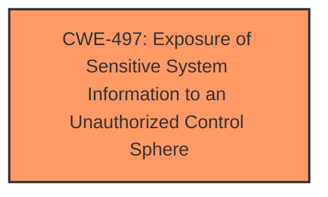

# Analysis Report for CVE-2025-4753

# Vulnerability Analysis Report: CVE-2025-4753

## Description

A vulnerability was found in D-Link DI-7003GV2 24.04.18D1 R(68125) and classified as problematic. Affected by this issue is some unknown functionality of the file /login.data. The manipulation leads to information disclosure. The attack may be launched remotely. The exploit has been disclosed to the public and may be used.

## Vulnerability Description Key Phrases

- **Impact:** information disclosure
- **Product:** D-Link DI-7003GV2
- **Version:** 24.04.18D1 R(68125)
- **Component:** /login.data

## Analysis (with Relationship Data)

# Summary
| CWE ID | CWE Name | Confidence | CWE Abstraction Level | CWE Vulnerability Mapping Label | CWE-Vulnerability Mapping Notes |
|---|---|---|---|---|---|
| CWE-497 | Exposure of Sensitive System Information to an Unauthorized Control Sphere | 0.7 | Base | Allowed | Primary CWE |

## Evidence and Confidence

*   **Confidence Score:** 0.7
*   **Evidence Strength:** LOW

## Relationship Analysis
The primary relationship considered was that of CWE-497 as a Base level weakness that directly addresses the **information disclosure** impact described in the vulnerability. No other relationships significantly influenced the decision due to lack of detailed information.



## Vulnerability Chain
The vulnerability chain starts with an unspecified **weakness** in the `/login.data` component that leads directly to **information disclosure**.

## Summary of Analysis
The analysis is based primarily on the provided vulnerability description, which indicates **information disclosure** due to manipulation of the `/login.data` file. The lack of detail regarding the specific vulnerability mechanism limits the ability to identify a more precise CWE.

CWE-497 (Exposure of Sensitive System Information to an Unauthorized Control Sphere) is selected as the primary CWE because it directly reflects the stated **impact** of the vulnerability.

Other CWEs were considered but not selected because the provided information does not contain any of the following:
*   SQL commands or SQL injection (`CWE-89`)
*   Web page generation or cross-site scripting (`CWE-79`)
*   OS commands or OS command injection (`CWE-78`)
*   Input validation issues like incomplete lists (`CWE-184`)

Relevant CWE Information:

# Enhanced Context (25 CWEs)
The following CWEs were identified as potentially relevant to this vulnerability:

## CWE-497: Exposure of Sensitive System Information to an Unauthorized Control Sphere
**Abstraction Level**: Base
**Similarity Score**: 0.76
**Source**: dense

**Description**:
The product does not properly prevent sensitive system-level information from being accessed by unauthorized actors who do not have the same level of access to the underlying system as the product does.

**Mapping Guidance**:
- Usage: Allowed
- Rationale: This CWE entry is at the Base level of abstraction, which is a preferred level of abstraction for mapping to the root causes of vulnerabilities.


## CWE Relationship Analysis

Current CWEs represent these abstraction levels: .


### Vulnerability Chain Analysis

**Chain starting from CWE-89:**
- 89 (Improper Neutralization of Special Elements used in an SQL Command ('SQL Injection')) - ROOT


**Chain starting from CWE-79:**
- 79 (Improper Neutralization of Input During Web Page Generation ('Cross-site Scripting')) - ROOT


### CWE Relationship Diagram

```mermaid
graph TD
    classDef primary fill:#f96,stroke:#333,stroke-width:2px
    classDef secondary fill:#69f,stroke:#333
    classDef tertiary fill:#9e9,stroke:#333
```


*Report generated on 2025-07-15 02:03:22*
