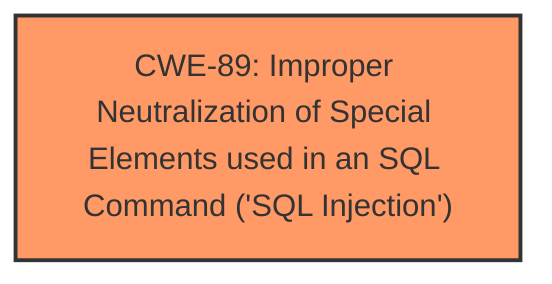

# Raw Analyzer Response for CVE-2025-4761

# Summary
| CWE ID | CWE Name | Confidence | CWE Abstraction Level | CWE Vulnerability Mapping Label | CWE-Vulnerability Mapping Notes |
|---|---|---|---|---|---|
| CWE-89 | Improper Neutralization of Special Elements used in an SQL Command ('SQL Injection') | 1.0 | Base | Allowed | Primary CWE |

## Evidence and Confidence

*   **Confidence Score:** 1.0
*   **Evidence Strength:** HIGH

## Relationship Analysis
The primary relationship influencing the CWE selection is the direct match between the vulnerability description and the definition of CWE-89. The vulnerability description explicitly states "**sql injection**" due to improper handling of the `mobilenumber` argument. This aligns perfectly with the base-level definition of CWE-89, which focuses on the improper neutralization of special elements used in an SQL command. The high retriever score and explicit mention of SQL injection further reinforces this selection.

## Vulnerability Chain
The vulnerability chain starts with the **improper neutralization** of the `mobilenumber` parameter, leading directly to the possibility of **SQL injection**. This injection can then lead to unauthorized data access, data tampering, or even complete system control.

## Summary of Analysis
The analysis is based heavily on the provided evidence, specifically the clear statement of "**sql injection**" and the description of the vulnerable parameter (`mobilenumber`). The retriever results strongly support this, with CWE-89 being the top match with a score of 1.0. The CWE definition aligns perfectly with the vulnerability, as it's a direct result of **improper neutralization** of input used in an SQL command.

Other CWEs considered but not used:
*   CWE-79 (Improper Neutralization of Input During Web Page Generation ('Cross-site Scripting')): While neutralization is a general theme, the vulnerability specifically involves SQL commands, making CWE-89 a more precise fit.
*   CWE-434 (Unrestricted Upload of File with Dangerous Type): This is irrelevant as the vulnerability does not involve file uploads.
*   CWE-1336 (Improper Neutralization of Special Elements Used in a Template Engine): This is irrelevant as the vulnerability does not involve a template engine.
*   CWE-117 (Improper Output Neutralization for Logs): This is irrelevant as the vulnerability does not involve log outputs.
*   CWE-425 (Direct Request ('Forced Browsing')): While the vulnerability is exploitable without authentication, the root cause is the SQL Injection, not the missing authorization.

The selected CWE is at the optimal level of specificity because it directly addresses the **root cause** of the vulnerability: the lack of proper sanitization leading to SQL injection.