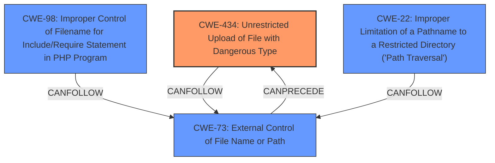

# Analysis for CVE-2025-4768

# Summary

| CWE ID  | CWE Name                                                                                    | Confidence | CWE Abstraction Level | CWE Vulnerability Mapping Label | CWE-Vulnerability Mapping Notes |
| :-------- | :------------------------------------------------------------------------------------------ | :--------- | :-------------------- | :------------------------------ | :-------------------------------- |
| CWE-434 | Unrestricted Upload of File with Dangerous Type | 1          | Base                  | Allowed                       | Primary CWE                     |
| CWE-434 | Unrestricted Upload of File with Dangerous Type | 0.75       | Base                  | Allowed                       | Secondary Candidate             |
| CWE-73  | External Control of File Name or Path                                                        | 0.60       | Base                  | Allowed                       | Secondary Candidate             |
| CWE-98  | Improper Control of Filename for Include/Require Statement in PHP Program ('PHP Remote File Inclusion')         | 0.50       | Variant                | Allowed                       | Secondary Candidate             |
| CWE-22  | Improper Limitation of a Pathname to a Restricted Directory ('Path Traversal')                                                        | 0.50       | Base                  | Allowed                       | Secondary Candidate             |

## Evidence and Confidence

*   **Confidence Score:** 0.85
*   **Evidence Strength:** HIGH

## Relationship Analysis

The primary weakness is **unrestricted upload**, which directly corresponds to CWE-434. CWE-73 is related because the file name or path is externally controlled, which is a prerequisite for CWE-434. CWE-98 (PHP Remote File Inclusion) and CWE-22 (Path Traversal) are possible consequences or related weaknesses that can occur if the uploaded file is mishandled or if path traversal is possible. However, the provided information focuses on the unrestricted upload itself, making CWE-434 the most direct and relevant classification.

## Vulnerability Chain

The vulnerability chain starts with the **unrestricted upload** (CWE-434), where the application fails to validate file types or content. This can lead to the attacker uploading a malicious file. If the file name or path is externally controlled (CWE-73), it can further enable the attacker to execute arbitrary code on the server. This may also lead to Path Traversal (CWE-22) or PHP Remote File Inclusion (CWE-98) if the application improperly handles the uploaded file.

## Summary of Analysis

The primary focus is on the **unrestricted upload** of dangerous file types, making CWE-434 the most appropriate primary classification. The evidence clearly indicates that the application lacks proper validation of uploaded files, allowing for the potential upload of malicious files.

The vulnerability description includes the key phrase "**unrestricted upload**" and the analysis of CVE-2025-4768 confirms "**Unrestricted File Upload:** The application allows uploading files without proper validation of their type or content.". The suggested mitigation of implementing a whitelist for allowed file suffixes during upload further supports this classification.

Other CWEs were considered but ultimately deemed less relevant as the primary weakness. While CWE-73 (External Control of File Name or Path), CWE-98, and CWE-22 could be involved, they are secondary to the initial **unrestricted upload** issue.

The selected CWE is at the optimal level of specificity, representing the core weakness in the application.
# Enhanced Context (25 CWEs)
The following CWEs were identified as potentially relevant to this vulnerability:

## CWE-434: Unrestricted Upload of File with Dangerous Type
**Abstraction Level**: Base
**Similarity Score**: 0.82
**Source**: dense

**Description**:
The product allows the upload or transfer of dangerous file types that are automatically processed within its environment.

**Mapping Guidance**:
- Usage: Allowed
- Rationale: This CWE entry is at the Base level of abstraction, which is a preferred level of abstraction for mapping to the root causes of vulnerabilities.

## CWE-425: Direct Request ('Forced Browsing')
**Abstraction Level**: Base
**Similarity Score**: 0.76
**Source**: dense

**Description**:
The web application does not adequately enforce appropriate authorization on all restricted URLs, scripts, or files.

**Mapping Guidance**:
- Usage: Allowed
- Rationale: This CWE entry is at the Base level of abstraction, which is a preferred level of abstraction for mapping to the root causes of vulnerabilities.

## CWE-73: External Control of File Name or Path
**Abstraction Level**: Base
**Similarity Score**: 0.76
**Source**: dense

**Description**:
The product allows user input to control or influence paths or file names that are used in filesystem operations.

**Mapping Guidance**:
- Usage: Allowed
- Rationale: This CWE entry is at the Base level of abstraction, which is a preferred level of abstraction for mapping to the root causes of vulnerabilities.

## CWE-552: Files or Directories Accessible to External Parties
**Abstraction Level**: Base
**Similarity Score**: 0.76
**Source**: dense

**Description**:
The product makes files or directories accessible to unauthorized actors, even though they should not be.

**Mapping Guidance**:
- Usage: Allowed
- Rationale: This CWE entry is at the Base level of abstraction, which is a preferred level of abstraction for mapping to the root causes of vulnerabilities.

## CWE-116: Improper Encoding or Escaping of Output
**Abstraction Level**: Class
**Similarity Score**: 0.75
**Source**: dense

**Description**:
The product prepares a structured message for communication with another component, but encoding or escaping of the data is either missing or done incorrectly. As a result, the intended structure of the message is not preserved.

**Mapping Guidance**:
- Usage: Allowed-with-Review
- Rationale: This CWE entry is a Class and might have Base-level children that would be more appropriate

## CWE-497: Exposure of Sensitive System Information to an Unauthorized Control Sphere
**Abstraction Level**: Base
**Similarity Score**: 0.75
**Source**: dense

**Description**:
The product does not properly prevent sensitive system-level information from being accessed by unauthorized actors who do not have the same level of access to the underlying system as the product does.

**Mapping Guidance**:
- Usage: Allowed
- Rationale: This CWE entry is at the Base level of abstraction, which is a preferred level of abstraction for mapping to the root causes of vulnerabilities.

## CWE-74: Improper Neutralization of Special Elements in Output Used by a Downstream Component ('Injection')
**Abstraction Level**: Class
**Similarity Score**: 0.75
**Source**: dense

**Description**:
The product constructs all or part of a command, data structure, or record using externally-influenced input from an upstream component, but it does not neutralize or incorrectly neutralizes special elements that could modify how it is parsed or interpreted when it is sent to a downstream component.

**Mapping Guidance**:
- Usage: Discouraged
- Rationale: CWE-74 is high-level and often misused when lower-level weaknesses are more appropriate.

## CWE-23: Relative Path Traversal
**Abstraction Level**: Base
**Similarity Score**: 0.75
**Source**: dense

**Description**:
The product uses external input to construct a pathname that should be within a restricted directory, but it does not properly neutralize sequences such as ".." that can resolve to a location that is outside of that directory.

**Mapping Guidance**:
- Usage: Allowed
- Rationale: This CWE entry is at the Base level of abstraction, which is a preferred level of abstraction for mapping to the root causes of vulnerabilities.

## CWE-538: Insertion of Sensitive Information into Externally-Accessible File or Directory
**Abstraction Level**: Base
**Similarity Score**: 0.75
**Source**: dense

**Description**:
The product places sensitive information into files or directories that are accessible to actors who are allowed to have access to the files, but not to the sensitive information.

**Mapping Guidance**:
- Usage: Allowed
- Rationale: This CWE entry is at the Base level of abstraction, which is a preferred level of abstraction for mapping to the root causes of vulnerabilities.

## CWE-472: External Control of Assumed-Immutable Web Parameter
**Abstraction Level**: Base
**Similarity Score**: 0.75
**Source**: dense

**Description**:
The web application does not