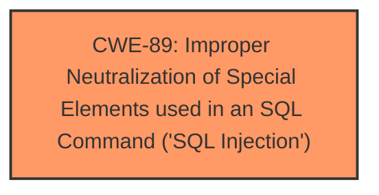

# Raw Analyzer Response for CVE-2025-4770

# Summary
| CWE ID | CWE Name | Confidence | CWE Abstraction Level | CWE Vulnerability Mapping Label | CWE-Vulnerability Mapping Notes |
|---|---|---|---|---|---|
| CWE-89 | Improper Neutralization of Special Elements used in an SQL Command ('SQL Injection') | 1.0 | Base | Allowed | Primary CWE: The **SQL injection** vulnerability due to **improper neutralization** of the viewid parameter. |

## Evidence and Confidence

*   **Confidence Score:** 1.0
*   **Evidence Strength:** HIGH

## Relationship Analysis
The primary relationship identified is that CWE-89 stands as the root cause. There are no specified parent-child or chain relationships directly relevant to this single CWE within the provided data. The abstraction level of "Base" is suitable as it directly represents the specific **SQL injection** vulnerability.

## Vulnerability Chain
The vulnerability chain consists of:
1.  **Root Cause:** **Improper neutralization** of the `viewid` parameter in `/view-normal-ticket.php`, leading to CWE-89 (**SQL Injection**).
2.  **Impact:** Unauthorized access to the database, sensitive data leakage, data tampering, complete control over the system, and service disruption.

## Summary of Analysis
The primary focus is on identifying the root cause of the vulnerability, which is the **SQL injection** resulting from **improper neutralization** of input.

The vulnerability description clearly states: "The manipulation of the argument viewid leads to **sql injection**." The CVE Reference Links Content Summary confirms this: "The root cause lies in the fact that attackers can inject malicious code via the parameter "viewid". This input is then directly utilized in SQL queries without undergoing proper sanitization or validation processes."

CWE-89 (Improper Neutralization of Special Elements used in an SQL Command ('SQL Injection')) is the most appropriate CWE. It's a Base level CWE, aligning with the specific weakness and the retriever results confirm this with a score of 1.0.

Other CWEs Considered:

*   CWE-79 (Improper Neutralization of Input During Web Page Generation ('Cross-site Scripting')): While neutralization is a general theme, the specific vulnerability is **SQL injection**, not XSS.
*   CWE-74 (Improper Neutralization of Special Elements in Output Used by a Downstream Component ('Injection')): This is a class-level CWE and is too generic. CWE-89 provides a more specific classification.
*   CWE-1336 (Improper Neutralization of Special Elements Used in a Template Engine): This is not relevant because the vulnerability is directly related to **SQL injection**, not template engine usage.

The selection of CWE-89 is at the optimal level of specificity, as it directly addresses the **SQL injection** vulnerability caused by **improper neutralization** of the `viewid` parameter.