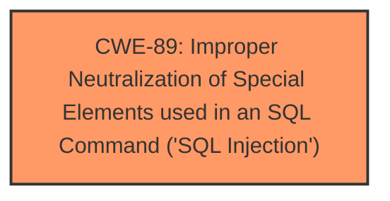

# Analysis for CVE-2025-4772

# Summary
| CWE ID | CWE Name | Confidence | CWE Abstraction Level | CWE Vulnerability Mapping Label | CWE-Vulnerability Mapping Notes |
|---|---|---|---|---|---|
| CWE-89 | Improper Neutralization of Special Elements used in an SQL Command ('SQL Injection') | 1.0 | Base | Allowed | Primary CWE. The vulnerability description explicitly states that the manipulation of the argument 'department' leads to **SQL Injection**. |

## Evidence and Confidence

*   **Confidence Score:** 1.0
*   **Evidence Strength:** HIGH

## Relationship Analysis
The primary relationship to consider here is the parent-child relationship. While there are child CWEs of CWE-89, the provided information doesn't offer enough specifics to narrow it down to a more specific variant. Therefore, sticking with the base CWE seems most appropriate.

## Vulnerability Chain
The vulnerability chain is quite straightforward:

1.  The **root cause** is the **improper neutralization of special elements** in the 'department' argument.
2.  This leads directly to **SQL injection**.

## Summary of Analysis
The vulnerability description clearly states the presence of an SQL injection vulnerability in PHPGurukul Online Course Registration 3.1 within the `/admin/department.php` file, specifically triggered by manipulating the 'department' argument.

The Retriever Results strongly support CWE-89 as the primary candidate, with a score of 1.0. The description of CWE-89 aligns perfectly with the vulnerability, as it involves the construction of an SQL command using externally-influenced input without proper neutralization.

Other CWEs such as CWE-79 (Cross-Site Scripting) and CWE-434 (Unrestricted Upload of File with Dangerous Type) were considered due to their presence in the Retriever Results but were ultimately deemed less relevant. There is no mention of web page generation or file uploads.

The decision to assign CWE-89 is based on the explicit mention of SQL injection in the vulnerability description and the strong match with the CWE's definition. The evidence is sufficient and directly supports this classification.