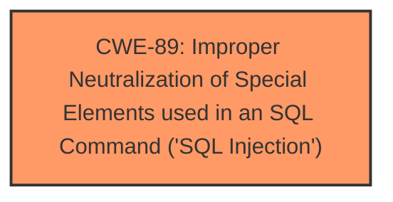

# Analysis Report for CVE-2025-4781

# Vulnerability Analysis Report: CVE-2025-4781

## Description

A vulnerability classified as critical has been found in PHPGurukul Park Ticketing Management System 2.0. Affected is an unknown function of the file /forgot-password.php. The manipulation of the argument email/contactno leads to **sql injection**. It is possible to launch the attack remotely. The exploit has been disclosed to the public and may be used.

## Vulnerability Description Key Phrases

- **Weakness:** sql injection
- **Vector:** manipulation of email/contactno argument
- **Product:** PHPGurukul Park Ticketing Management System
- **Version:** 2
- **Component:** /forgot-password.php

## Analysis (with Relationship Data)

# Summary
| CWE ID | CWE Name | Confidence | CWE Abstraction Level | CWE Vulnerability Mapping Label | CWE-Vulnerability Mapping Notes |
|---|---|---|---|---|---|
| CWE-89 | Improper Neutralization of Special Elements used in an SQL Command ('SQL Injection') | 1.0 | Base | Allowed | Primary CWE |

## Evidence and Confidence

*   **Confidence Score:** 1.0
*   **Evidence Strength:** HIGH

## Relationship Analysis
The primary relationship that influenced the decision was the direct match of the vulnerability description to the definition of CWE-89. There are no parent-child or chain relationships explored, as the description clearly points to SQL Injection as the root cause.



## Vulnerability Chain
The vulnerability chain consists of:
1.  **Root Cause:** **Improper Neutralization of Special Elements used in an SQL Command ('SQL Injection')** (CWE-89) due to insufficient input validation of the `email/contactno` parameter.
2.  **Impact:** Unauthorized access to the database, data modification/deletion, sensitive information leakage, and potential system compromise.

## Summary of Analysis
The initial analysis and final conclusion both strongly support CWE-89 as the primary weakness. The evidence directly states "**sql injection**" due to the "**manipulation of email/contactno argument**" which confirms the root cause. The "CVE Reference Links Content Summary" section explicitly identifies "**Weaknesses/vulnerabilities present: SQL injection**" and "**Root cause of vulnerability: The root cause lies in the fact that attackers can inject malicious code via the parameter \"email\". This input is then directly utilized in SQL queries without undergoing proper sanitization or validation processes.**". This provides unambiguous evidence supporting the selection of CWE-89. The selected CWE is at the optimal level of specificity (Base) as it directly addresses the **improper neutralization** leading to **SQL injection**.

Relevant CWE Information:

# Enhanced Context (25 CWEs)
The following CWEs were identified as potentially relevant to this vulnerability:

## CWE-89: Improper Neutralization of Special Elements used in an SQL Command ('SQL Injection')
**Abstraction Level**: Base
**Similarity Score**: 0.78
**Source**: dense

**Description**:
The product constructs all or part of an SQL command using externally-influenced input from an upstream component, but it does not neutralize or incorrectly neutralizes special elements that could modify the intended SQL command when it is sent to a downstream component. Without sufficient removal or quoting of SQL syntax in user-controllable inputs, the generated SQL query can cause those inputs to be interpreted as SQL instead of ordinary user data.

**Mapping Guidance**:
- Usage: Allowed
- Rationale: This CWE entry is at the Base level of abstraction, which is a preferred level of abstraction for mapping to the root causes of vulnerabilities.

## CWE-79: Improper Neutralization of Input During Web Page Generation ('Cross-site Scripting')
**Abstraction Level**: Base
**Similarity Score**: 2.98
**Source**: graph

**Description**:
The product does not neutralize or incorrectly neutralizes user-controllable input before it is placed in output that is used as a web page that is served to other users.

**Mapping Guidance**:
- Usage: Allowed
- Rationale: This CWE entry is at the Base level of abstraction, which is a preferred level of abstraction for mapping to the root causes of vulnerabilities.

**Relationships**:
- PARENTOF -> CWE-87
- PARENTOF -> CWE-86
- PARENTOF -> CWE-85
- PARENTOF -> CWE-84
- PARENTOF -> CWE-83

## CWE-434: Unrestricted Upload of File with Dangerous Type
**Abstraction Level**: Base
**Similarity Score**: 2.90
**Source**: graph

**Description**:
The product allows the upload or transfer of dangerous file types that are automatically processed within its environment.

**Mapping Guidance**:
- Usage: Allowed
- Rationale: This CWE entry is at the Base level of abstraction, which is a preferred level of abstraction for mapping to the root causes of vulnerabilities.

**Relationships**:
- CANFOLLOW -> CWE-73
- CANFOLLOW -> CWE-184
- CANFOLLOW -> CWE-183
- PEEROF -> CWE-430
- PEEROF -> CWE-436

### Other Considered CWEs:

*   **CWE-79 Improper Neutralization of Input During Web Page Generation ('Cross-site Scripting')**: While input is involved, the vulnerability is explicitly SQL Injection, not Cross-Site Scripting.
*   **CWE-434 Unrestricted Upload of File with Dangerous Type**: This is not related to file uploads.
*   **CWE-74 Improper Neutralization of Special Elements in Output Used by a Downstream Component ('Injection')**: This is a more general class of injection vulnerabilities. Since the specific vulnerability is SQL Injection, CWE-89 is a better choice.
*   **CWE-1336 Improper Neutralization of Special Elements Used in a Template Engine**: This vulnerability is not related to template engines.
*   **CWE-472 External Control of Assumed-Immutable Web Parameter**: This CWE is not as specific as CWE-89.
*   **CWE-73 External Control of File Name or Path**: This is not related to file names or paths.


## CWE Relationship Analysis

Current CWEs represent these abstraction levels: .


### Vulnerability Chain Analysis

**Chain starting from CWE-87:**
- 87 (Improper Neutralization of Alternate XSS Syntax) - ROOT


**Chain starting from CWE-89:**
- 89 (Improper Neutralization of Special Elements used in an SQL Command ('SQL Injection')) - ROOT


### CWE Relationship Diagram

```mermaid
graph TD
    classDef primary fill:#f96,stroke:#333,stroke-width:2px
    classDef secondary fill:#69f,stroke:#333
    classDef tertiary fill:#9e9,stroke:#333
```


*Report generated on 2025-07-15 02:13:08*
