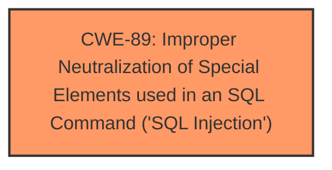

# Analysis Report for CVE-2025-4782

# Vulnerability Analysis Report: CVE-2025-4782

## Description

A vulnerability has been found in SourceCodester/oretnom23 Stock Management System 1.0 and classified as critical. This vulnerability affects unknown code of the file /sms/admin/?page=receiving/view_receiving&id=1. The manipulation of the argument ID leads to **sql injection**. The attack can be initiated remotely. The exploit has been disclosed to the public and may be used.

## Vulnerability Description Key Phrases

- **Weakness:** sql injection
- **Product:** SourceCodester/oretnom23 Stock Management System
- **Version:** 1.0
- **Component:** /sms/admin/?page=receiving/view_receiving&id=1

## Analysis (with Relationship Data)

# Summary
| CWE ID | CWE Name | Confidence | CWE Abstraction Level | CWE Vulnerability Mapping Label | CWE-Vulnerability Mapping Notes |
|---|---|---|---|---|---|
| CWE-89 | Improper Neutralization of Special Elements used in an SQL Command ('SQL Injection') | 1.0 | Base | Allowed | Primary CWE |

## Evidence and Confidence

*   **Confidence Score:** 1.0
*   **Evidence Strength:** HIGH

## Relationship Analysis
The primary identified weakness is CWE-89, which stands alone as the root cause. No other CWEs are needed to explain the vulnerability based on the current evidence. CWE-89 is a base level weakness, which is the preferred level of abstraction.



## Vulnerability Chain
The vulnerability chain consists of a single step:
1.  The application fails to neutralize special elements in an SQL command. This is the **root cause** and is represented by CWE-89.

## Summary of Analysis
The vulnerability description clearly states that the manipulation of the argument ID leads to **sql injection**. The Retriever Results lists CWE-89 as the top candidate with a score of 1.0. The description of CWE-89 aligns perfectly with the vulnerability description: "The product constructs all or part of an SQL command using externally-influenced input from an upstream component, but it does not neutralize or incorrectly neutralizes special elements that could modify the intended SQL command when it is sent to a downstream component." Therefore, CWE-89 is the most appropriate CWE.

All other CWEs were considered but not selected because they did not directly address the root cause of the vulnerability, which is the **improper neutralization** of special elements in an SQL command. While some of the other CWEs, like CWE-79 (Cross-Site Scripting) or CWE-434 (Unrestricted Upload of File with Dangerous Type), might be present in other parts of the application, they are not relevant to the specific vulnerability described.


## CWE Relationship Analysis

Current CWEs represent these abstraction levels: .


### Vulnerability Chain Analysis

**Chain starting from CWE-89:**
- 89 (Improper Neutralization of Special Elements used in an SQL Command ('SQL Injection')) - ROOT


**Chain starting from CWE-79:**
- 79 (Improper Neutralization of Input During Web Page Generation ('Cross-site Scripting')) - ROOT


### CWE Relationship Diagram

```mermaid
graph TD
    classDef primary fill:#f96,stroke:#333,stroke-width:2px
    classDef secondary fill:#69f,stroke:#333
    classDef tertiary fill:#9e9,stroke:#333
```


*Report generated on 2025-07-15 02:13:20*
