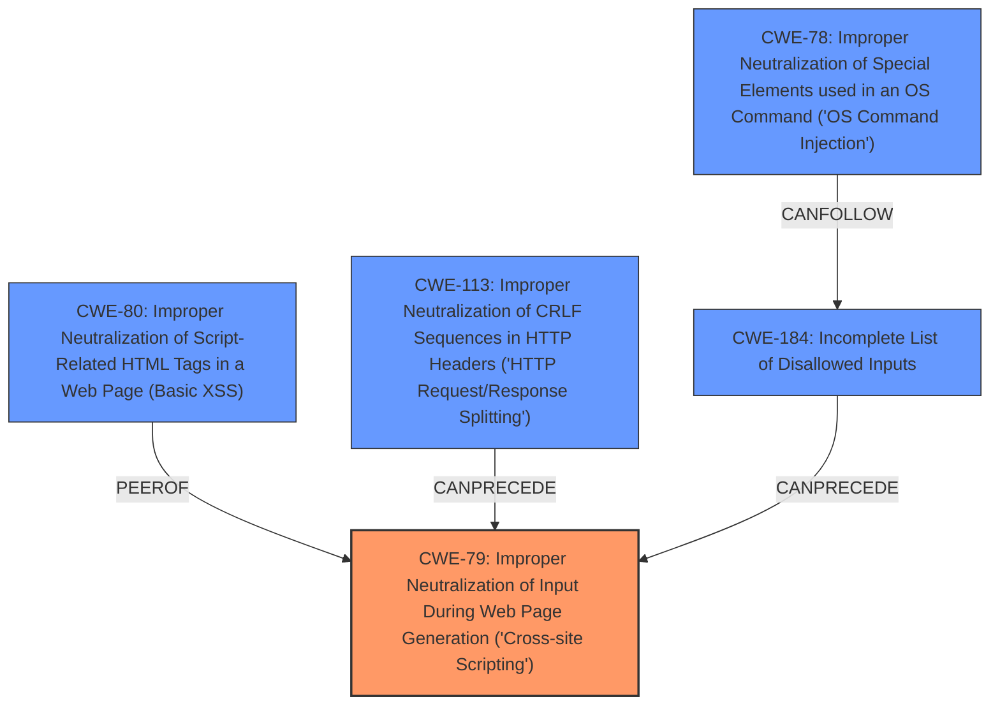

# Raw Analyzer Response for CVE-2025-47885

# Summary
| CWE ID | CWE Name | Confidence | CWE Abstraction Level | CWE Vulnerability Mapping Label | CWE-Vulnerability Mapping Notes |
|---|---|---|---|---|---|
| CWE-79 | Improper Neutralization of Input During Web Page Generation ('Cross-site Scripting') | 1.0 | Base | Allowed | Primary CWE. The **root cause** is that the product **does not escape responses from the Jenkins Health Advisor server**, leading to a **cross-site scripting** (XSS) vulnerability. |

## Evidence and Confidence

*   **Confidence Score:** 1.0
*   **Evidence Strength:** HIGH

## Relationship Analysis
The primary CWE is CWE-79, which is a Base level CWE. The retriever results provided several candidate CWEs. CWE-79 is the best fit.

## Vulnerability Chain
The vulnerability chain starts with the **failure to escape responses** from the Jenkins Health Advisor server. This leads directly to the **cross-site scripting vulnerability**.

## Summary of Analysis
The vulnerability description clearly states that the Jenkins Health Advisor by CloudBees Plugin **does not escape responses** from the Jenkins Health Advisor server, which results in a stored **cross-site scripting** (XSS) vulnerability. This aligns perfectly with CWE-79, "Improper Neutralization of Input During Web Page Generation ('Cross-site Scripting')".

The retriever results listed several potential CWEs, including:

*   CWE-862 (Missing Authorization): This is not relevant, as the vulnerability is due to improper output handling, not a missing authorization check.
*   CWE-116 (Improper Encoding or Escaping of Output): This is a class-level CWE. Since the vulnerability leads to XSS, CWE-79 is a more specific and appropriate choice.
*   CWE-838 (Inappropriate Encoding for Output Context): Similar to CWE-116, this is a more general CWE and less specific than CWE-79.
*   CWE-522 (Insufficiently Protected Credentials) and CWE-256 (Plaintext Storage of a Password): These are unrelated to the XSS vulnerability.
*   CWE-352 (Cross-Site Request Forgery (CSRF)): This is not relevant, as the vulnerability is not related to CSRF.
*   CWE-613 (Insufficient Session Expiration): This is not relevant to the described vulnerability.
*   CWE-80 (Improper Neutralization of Script-Related HTML Tags in a Web Page (Basic XSS)): CWE-80 is a variant of XSS. CWE-79 is more general and describes the overall vulnerability.
*   CWE-184 (Incomplete List of Disallowed Inputs): While input validation is important, the **root cause** here is the **lack of output escaping**, making CWE-79 a better fit.

Therefore, based on the provided evidence, CWE-79 is the most accurate and specific representation of the vulnerability.