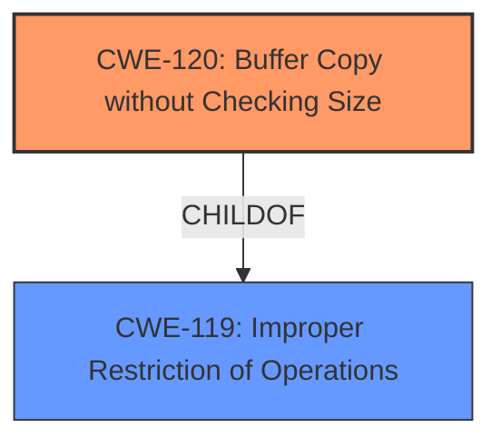

# Raw Analyzer Response for CVE-2025-4789

# Summary

| CWE ID  | CWE Name                                                                        | Confidence | CWE Abstraction Level | CWE Vulnerability Mapping Label | CWE-Vulnerability Mapping Notes |
| :-------- | :------------------------------------------------------------------------------ | :--------- | :---------------------- | :------------------------------ | :------------------------------ |
| CWE-120   | Buffer Copy without Checking Size of Input ('Classic Buffer Overflow') | 0.9        | Base                    | Primary                         | Allowed-with-Review          |
| CWE-119   | Improper Restriction of Operations within the Bounds of a Memory Buffer      | 0.7        | Class                   | Secondary                       | Discouraged                  |

## Evidence and Confidence

*   **Confidence Score:** 0.9
*   **Evidence Strength:** HIGH

## Relationship Analysis

The primary CWE selected is CWE-120, which is a base-level CWE and a more specific instance of the class-level CWE-119. The vulnerability involves a buffer overflow due to copying data without checking the input size, aligning directly with CWE-120's description. The relationship between CWE-120 and CWE-119 is a parent-child one, with CWE-120 being a specific type of CWE-119.

## Vulnerability Chain

The vulnerability chain starts with the **buffer overflow** due to the lack of input size validation when copying data to a buffer using the LCD command handler in the FreeFloat FTP server. This leads to the ability to overwrite memory, potentially allowing for arbitrary code execution.

## Summary of Analysis

Based on the vulnerability description and the provided evidence, the primary weakness is CWE-120, Buffer Copy without Checking Size of Input ('Classic Buffer Overflow'). This is because the vulnerability involves a buffer overflow caused by copying data to a buffer without proper size validation. The evidence explicitly mentions a buffer overflow in the LCD command handler due to manipulation.

The retriever results also list CWE-120 as a potential candidate, further supporting this classification. While CWE-119 is a broader category, CWE-120 provides a more specific and accurate description of the vulnerability.

The official MITRE mapping guidance for CWE-120 suggests "Allowed-with-Review" because this CWE entry might be misused and selected simply because it mentions "buffer overflow". However, the description aligns well with the vulnerability, making CWE-120 the most appropriate choice.

The decision is based on the provided evidence, including the vulnerability description and the retriever results. The selected CWEs are at the optimal level of specificity, accurately representing the vulnerability and its root cause.

Relevant CWE Information:

# Enhanced Context (25 CWEs)
The following CWEs were identified as potentially relevant to this vulnerability:

## CWE-434: Unrestricted Upload of File with Dangerous Type
**Abstraction Level**: Base
**Similarity Score**: 0.73
**Source**: dense

**Description**:
The product allows the upload or transfer of dangerous file types that are automatically processed within its environment.

**Mapping Guidance**:
- Usage: Allowed
- Rationale: This CWE entry is at the Base level of abstraction, which is a preferred level of abstraction for mapping to the root causes of vulnerabilities.

NOT USED: This CWE is not relevant, as the vulnerability is not related to file uploads.

## CWE-134: Use of Externally-Controlled Format String
**Abstraction Level**: Base
**Similarity Score**: 0.73
**Source**: dense

**Description**:
The product uses a function that accepts a format string as an argument, but the format string originates from an external source.

**Mapping Guidance**:
- Usage: Allowed
- Rationale: This CWE entry is at the Base level of abstraction, which is a preferred level of abstraction for mapping to the root causes of vulnerabilities.

NOT USED: This CWE is not relevant, as the vulnerability is not related to format string usage.

## CWE-131: Incorrect Calculation of Buffer Size
**Abstraction Level**: Base
**Similarity Score**: 0.73
**Source**: dense

**Description**:
The product does not correctly calculate the size to be used when allocating a buffer, which could lead to a buffer overflow.

**Mapping Guidance**:
- Usage: Allowed
- Rationale: This CWE entry is at the Base level of abstraction, which is a preferred level of abstraction for mapping to the root causes of vulnerabilities.

NOT USED: While this could be a contributing factor, the primary issue is the lack of checking the size of the input before copying it into the buffer, making CWE-120 a more direct match.

## CWE-193: Off-by-one Error
**Abstraction Level**: Base
**Similarity Score**: 0.72
**Source**: dense

**Description**:
A product calculates or uses an incorrect maximum or minimum value that is 1 more, or 1 less, than the correct value.

**Mapping Guidance**:
- Usage: Allowed
- Rationale: This CWE entry is at the Base level of abstraction, which is a preferred level of abstraction for mapping to the root causes of vulnerabilities.

NOT USED: This CWE is not relevant, as the vulnerability is not specifically related to an off-by-one error.

## CWE-125: Out-of-bounds Read
**Abstraction Level**: Base
**Similarity Score**: 0.72
**Source**: dense

**Description**:
The product reads data past the end, or before the beginning, of the intended buffer.

**Mapping Guidance**:
- Usage: Allowed
- Rationale: This CWE entry is at the Base level of abstraction, which is a preferred level of abstraction for mapping to the root causes of vulnerabilities.

NOT USED: The vulnerability is primarily about writing past the buffer, not reading.

## CWE-191: Integer Underflow (Wrap or Wraparound)
**Abstraction Level**: Base
**Similarity Score**: 0.72
**Source**: dense

**Description**:
The product subtracts one value from another, such that the result is less than the minimum allowable integer value, which produces a value that is not equal to the correct result.

**Mapping Guidance**:
- Usage: Allowed
- Rationale: This CWE entry is at the Base level of abstraction, which is a preferred level of abstraction for mapping to the root causes of vulnerabilities.

NOT USED: This CWE is not relevant as the vulnerability is not related to integer underflow.

## CWE-824: Access of Uninitialized Pointer
**Abstraction Level**: Base
**Similarity Score**: 0.71
**Source**: dense

**Description**:
The product accesses or uses a pointer that has not been initialized.

**Mapping Guidance**:
- Usage: Allowed
- Rationale: This CWE entry is at the Base level of abstraction, which is a preferred level of abstraction for mapping to the root causes of vulnerabilities.

NOT USED: This CWE is not relevant as the vulnerability is not related to uninitialized pointers.

## CWE-346: Origin Validation Error
**Abstraction Level**: Class
**Similarity Score**: 0.71
**Source**: dense

**Description**:
The product does not properly verify that the source of data or communication is valid.

**Mapping Guidance**:
- Usage: Allowed-with-Review
- Rationale: This CWE entry is a Class and might have Base-level children that would be more appropriate

NOT USED: This CWE is not relevant as the vulnerability is not related to origin validation.

## CWE-789: Memory Allocation with Excessive Size Value
**Abstraction Level**: Variant
**Similarity Score**: 0.71
**Source**: dense

**Description**:
The product allocates memory based on an untrusted, large size value, but it does not ensure that the size is within expected limits, allowing arbitrary amounts of memory to be allocated.

**Mapping Guidance**:
- Usage: Allowed
- Rationale: This CWE entry is at the Variant level of abstraction, which is a preferred level of abstraction for mapping to the root causes of vulnerabilities.

NOT USED: This CWE is not directly relevant as the vulnerability is due to not checking the size when copying, not during memory allocation.

## CWE-617: Reachable Assertion
**Abstraction Level**: Base
**Similarity Score**: 0.71
**Source**: dense

**Description**:
The product contains an assert() or similar statement that can be triggered by an attacker, which leads to an application exit or other behavior that is more severe than necessary.

**Mapping Guidance**:
- Usage: Allowed
- Rationale: This CWE entry is at the Base level of abstraction, which is a preferred level of abstraction for mapping to the root causes of vulnerabilities.

NOT USED: This CWE is not relevant as the vulnerability is not related to assertions.

## CWE-190: Integer Overflow or Wraparound
**Abstraction Level**: Base
**Similarity Score**: 1186.92
**Source**: sparse

**Description**:
The product performs a calculation that can