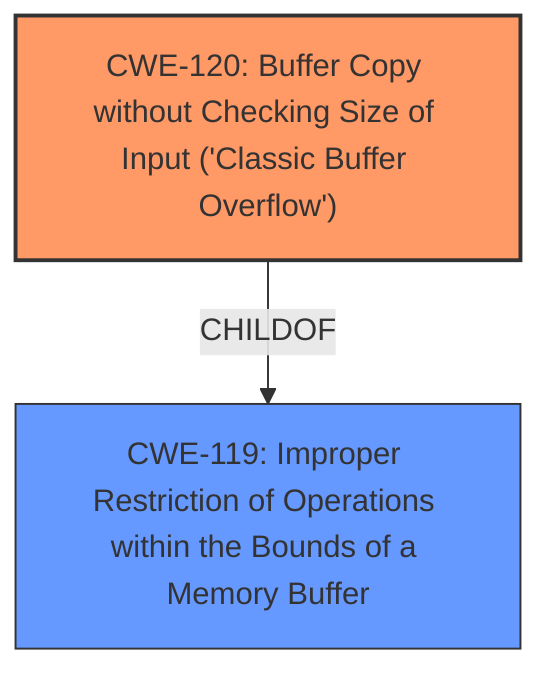

# Raw Analyzer Response for CVE-2025-4792

# Summary
| CWE ID | CWE Name | Confidence | CWE Abstraction Level | CWE Vulnerability Mapping Label | CWE-Vulnerability Mapping Notes |
|---|---|---|---|---|---|
| CWE-120 | Buffer Copy without Checking Size of Input ('Classic Buffer Overflow') | 1.0 | Base | Primary | Allowed-with-Review |
| CWE-119 | Improper Restriction of Operations within the Bounds of a Memory Buffer | 0.7 | Class | Secondary | Discouraged |

## Evidence and Confidence

*   **Confidence Score:** 0.9
*   **Evidence Strength:** HIGH

## Relationship Analysis
The primary CWE is CWE-120, a base-level CWE that directly describes the buffer overflow due to missing size checking. CWE-119 is a broader class that encompasses CWE-120, but is discouraged for use when more specific CWEs exist. The parent-child relationship between CWE-120 and CWE-119 influenced the choice of CWE-120 as the primary mapping due to its greater specificity.

## Vulnerability Chain
The vulnerability chain starts with the lack of input size validation, leading to a buffer copy operation that overflows the buffer, potentially allowing for arbitrary code execution.
  - **Root Cause:** **Missing input size validation**
  - **Weakness:** Buffer Overflow due to unchecked copy
  - **Impact:** Arbitrary code execution

## Summary of Analysis
The analysis indicates a classic buffer overflow vulnerability in FreeFloat FTP Server 1.0 due to the **MDELETE** command handler not validating the size of the input. The key evidence is the explicit mention of a **buffer overflow** in the vulnerability description and the CVE reference summary explicitly stating "**The server does not properly validate the length of the input provided to this command, allowing an attacker to overwrite memory regions.**"

CWE-120 (Buffer Copy without Checking Size of Input ('Classic Buffer Overflow')) accurately captures this vulnerability because it represents the scenario where data is copied to a buffer without proper size validation, which leads to writing past the buffer's boundaries. The mapping guidance for CWE-120 is "Allowed-with-Review", noting that it's only appropriate for "Buffer Copy" operations where there is no "Checking [the] Size of Input". This aligns perfectly with the vulnerability description.

CWE-119 (Improper Restriction of Operations within the Bounds of a Memory Buffer) was considered but ultimately deemed less specific. While CWE-119 is a parent of CWE-120, the description explicitly states a buffer copy operation without checking size, making CWE-120 the more appropriate choice. The retriever results listed CWE-119 as number 1, but that is because the alternate terms matched "buffer overflow" in general.

CWE-190 (Integer Overflow or Wraparound) was considered due to potential integer handling issues when calculating buffer sizes, but the primary issue is the missing size check, not an integer overflow.

CWE-125 (Out-of-bounds Read) was also considered, however, the vulnerability described is a **buffer overflow** (write) and not a read.

The choice of CWE-120 is based on the evidence of a buffer copy operation without size validation, leading to a buffer overflow. The confidence is high (0.9) because the evidence directly supports this classification.

Relevant CWE Information: