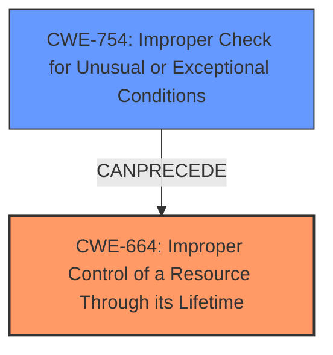

# Analysis for CVE-2025-48066

# Summary
| CWE ID  | CWE Name                                                                                                 | Confidence | CWE Abstraction Level | CWE Vulnerability Mapping Label | CWE-Vulnerability Mapping Notes |
| :-------- | :--------------------------------------------------------------------------------------------------------- | :--------- | :---------------------- | :------------------------------ | :------------------------------ |
| CWE-664   | Improper Control of a Resource Through its Lifetime \[CWE Description: The program does not properly control the creation, usage, transfer, or destruction of a system resource.\] | 0.85       | Class                   | Primary                           | Allowed-with-Review           |
| CWE-754   | Improper Check for Unusual or Exceptional Conditions \[CWE Description: The software does not check for unusual or exceptional conditions.\]                                        | 0.75       | Base                      | Secondary                         | Allowed                     |

## Evidence and Confidence

*   **Confidence Score:** 0.80
*   **Evidence Strength:** MEDIUM

## Relationship Analysis

The primary selection is CWE-664, a Class-level CWE indicating a general failure to manage resources properly. While broad, it encapsulates the core issue. A more specific Base CWE is not evident from the description. CWE-754 is related as the **bug fix caused a regression**, implying a failure to properly handle exceptional conditions during the logout and data deletion process. This suggests a chain where **improper error handling** (CWE-754) leads to **improper resource management** (CWE-664), but these details cannot be precisely mapped based on the available evidence.

## Vulnerability Chain

The vulnerability chain starts with a **bug fix causing a regression** (likely related to error handling during the fix). This **regression** results in a failure to delete local data upon logout. The chain can be described as:

1.  **ROOTCAUSE:** Bug fix introduces regression (likely CWE-754)
2.  **WEAKNESS:** Failure to delete local data (CWE-664)
3.  **IMPACT:** Sensitive data remains on the device after logout

## Summary of Analysis

The primary CWE is CWE-664 because the vulnerability results in the client not deleting local data, which is a failure to control the resource (local data) through its lifetime. The evidence from the "Vulnerability Description" indicates: "Instructing the client to delete its local database on user logout does not result in deletion." This directly relates to **improper resource control** as the data is not being deleted as expected. The "**bug fix caused a regression**" indicates that an **exceptional condition** during the fix was not properly handled which then led to the resource control issue.

The retriever results suggested several CWEs. CWE-201 (Insertion of Sensitive Information Into Sent Data) was considered but rejected as the vulnerability isn't about sending sensitive data, but rather failing to delete it. CWE-1390 (Weak Authentication) and CWE-863 (Incorrect Authorization) were also considered, but the issue is not directly related to authentication or authorization mechanisms. The focus is on the failure to properly delete local data, making CWE-664 a more appropriate fit. CWE-367 (Time-of-check Time-of-use (TOCTOU) Race Condition) and CWE-22 (Improper Limitation of a Pathname to a Restricted Directory ('Path Traversal')) were not relevant based on the vulnerability description.

The selection of CWE-664 is at the Class level because there isn't enough evidence to pinpoint a more specific Base or Variant CWE related to resource management. The evidence supports the general failure to manage the resource's lifetime.