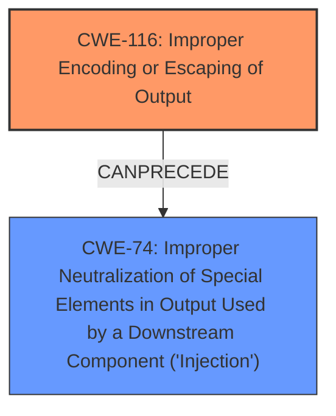

# Raw Analyzer Response for CVE-2025-48069

# Summary
| CWE ID  | CWE Name                                                                                             | Confidence | CWE Abstraction Level | CWE Vulnerability Mapping Label | CWE-Vulnerability Mapping Notes |
| :-------- | :----------------------------------------------------------------------------------------------------- | :--------- | :---------------------- | :------------------------------ | :------------------------------ |
| CWE-116   | Improper Encoding or Escaping of Output                                                              | 0.9        | Class                   | Primary                         | Allowed-with-Review           |
| CWE-74    | Improper Neutralization of Special Elements in Output Used by a Downstream Component ('Injection')   | 0.7        | Class                   | Secondary                       | Discouraged                   |

## Evidence and Confidence

*   **Confidence Score:** 0.8
*   **Evidence Strength:** HIGH

## Relationship Analysis

The primary relationship influencing the selection was the parent-child relationship between CWE-74 and more specific injection CWEs, and the high retriever scores for CWE-116. While CWE-74 is a valid high-level classification, CWE-116 more precisely describes the **root cause** of the vulnerability. The evidence points towards a failure to properly encode or escape output, leading to potential command injection, but the immediate cause is the encoding issue.

## Vulnerability Chain

The vulnerability chain starts with **inadequate output sanitization** (CWE-116), which leads to the possibility of **command injection** (CWE-74), ultimately resulting in the ability to **execute arbitrary commands** on the host system.

## Summary of Analysis

The initial analysis considered the high retriever scores for CWE-116 and CWE-74. The description explicitly mentions **inadequate output sanitization**, which aligns perfectly with CWE-116's description of **improper encoding or escaping of output**. The resulting **command injection** is a consequence of this **improper sanitization**, making CWE-74 a secondary consideration.

The selection is based on the evidence from the vulnerability description: "However, due to **inadequate output sanitization**, there is a potential risk where variable names or values may include malicious content, resulting in additional unintended commands being output to `stdout`. If this output is improperly utilized in further command execution, it could lead to **command injection**, allowing an attacker to execute arbitrary commands on the host system."

CWE-116 is chosen as the primary CWE because it represents the most immediate and fundamental weakness: the **failure to properly encode or escape output**. This failure directly leads to the possibility of injecting unintended commands. While command injection is a significant consequence, it's a secondary effect of the initial **improper output handling**.

The selected CWEs are at the optimal level of specificity. CWE-116 is a Class-level CWE, but it accurately reflects the nature of the weakness, and there isn't a more specific Base or Variant CWE that would be more appropriate.

Relevant CWE Information:

CWE-116: Improper Encoding or Escaping of Output

*   **Technical Explanation:** The `ejson2env` tool **fails to properly encode or escape** special characters or sequences in the output that it writes to `stdout`. This allows an attacker to inject arbitrary commands into the output, which can then be executed by a downstream component that processes the output.
*   **Security Implications:** This can lead to arbitrary command execution on the host system, potentially allowing an attacker to gain complete control of the system.
*   **Relationship Analysis:** CWE-116 can precede CWE-74 (Improper Neutralization of Special Elements in Output Used by a Downstream Component ('Injection')), as the **improper encoding or escaping** is often a prerequisite for successful injection attacks.
*   **Mapping Guidance Influence:** Usage: Allowed-with-Review. This CWE entry is a Class and might have Base-level children that would be more appropriate. No base-level children were suitable.
*   **Primary/Secondary:** Primary

CWE-74: Improper Neutralization of Special Elements in Output Used by a Downstream Component ('Injection')

*   **Technical Explanation:** The `ejson2env` tool constructs output by including external input (variable names and values) without proper neutralization. This allows an attacker to inject special elements that can modify how the output is interpreted by a downstream component, leading to command execution.
*   **Security Implications:** This can lead to arbitrary command execution on the host system, potentially allowing an attacker to gain complete control of the system.
*   **Relationship Analysis:** This is a consequence of the **improper encoding or escaping** (CWE-116).
*   **Mapping Guidance Influence:** Usage: Discouraged. CWE-74 is high-level and often misused when lower-level weaknesses are more appropriate. Since CWE-116 is also high-level, and no more specific CWEs are available, this is a valid secondary classification.
*   **Primary/Secondary:** Secondary

CWEs Considered but Not Used:

*   CWE-138: Improper Neutralization of Special Elements: While related to neutralization, it is too broad and doesn't specifically address the output encoding/escaping issue.
*   CWE-214: Invocation of Process Using Visible Sensitive Information: This is not the primary issue, as the vulnerability is about the **improper handling of output**, not the visibility of sensitive information.
*   CWE-22: Improper Limitation of a Pathname to a Restricted Directory ('Path Traversal'): This is not relevant, as the vulnerability doesn't involve path manipulation.
*   CWE-1336: Improper Neutralization of Special Elements Used in a Template Engine: Not relevant as the application doesn't use template engine.
*   CWE-95: Improper Neutralization of Directives in Dynamically Evaluated Code ('Eval Injection'): Not relevant as the application doesn't use eval.